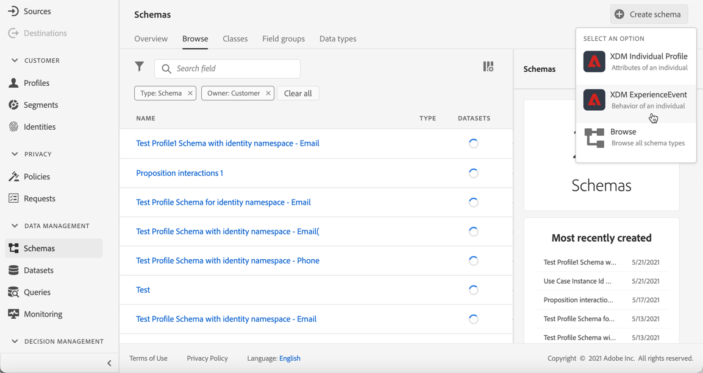

# 人工智能排名 {#ai-rankings}

## AI排名入门

<!--If you are an [Adobe Experience Platform](https://experienceleague.adobe.com/docs/experience-platform/landing/home.html){target="_blank"} user leveraging the **Offer Decisioning** application service,-->You can use an trained model system that ranks offers to display for a given profile.

>[!CAUTION]
>
>目前，只能对选定用户提前访问AI排名。

此功能允许您根据业务目标创建不同的&#x200B;**排名策略**。 在决策（以前称为选件活动）中使用这些不同的基于目标的策略，经过培训的模型系统将帮助您了解不同的排名策略对您的目标有何影响。

例如，您可以为电子邮件渠道选择一个排名策略，为推送渠道选择另一个排名策略。 对于每个渠道，经过培训的模型系统将利用多个数据点来确定在给定位置应首先显示哪个选件，而不是考虑选件的优先级得分或[排名公式](create-ranking-formulas.md)。

<!--This feature is not enabled by default. To be able to use it, reach out to your Adobe contact.-->

创建排名策略后，将其分配给决策中的版面。 请参阅[在决策中配置选件选择](../offer-activities/configure-offer-selection.md)，以了解更多信息。

## 创建排名策略 {#create-ranking-strategy}

要创建排名策略，请执行以下步骤：

1. 访问&#x200B;**[!UICONTROL Components]**&#x200B;菜单，然后选择&#x200B;**[!UICONTROL AI rankings]**&#x200B;选项卡。

   

   列出了迄今为止创建的所有排名策略。

1. 单击 **[!UICONTROL Create strategy]** 按钮。

1. 填写以下字段：

   

   * **[!UICONTROL Name]**:必须提供的唯一名称。

   * **[!UICONTROL Model type]**:目前唯一支持的模型类型 **[!UICONTROL Auto-optimization]**&#x200B;是。<!--More will be supported in the future so the drop-down list will be enabled.-->

   * **[!UICONTROL Optimization metric]**：

      此选项允许营销人员选择如何构建和培训机器学习模型：根据显示的选件、在电子邮件中单击的选件和/或在Web上单击的选件。

      >[!NOTE]
      >
      >您可以根据需要选择所有量度类型。

      优化量度有两种类型：
      * **[!UICONTROL Impression]**:当前展示事件与显示的所有选件相对应。
      * **[!UICONTROL Conversion]**:转化事件与通过电子邮件或Web进行点击的所有选件相对应。

      所有选定的展示事件和/或转化事件都将使用已提供的Web SDK或Mobile SDK自动捕获。 在[Adobe Experience Platform Web SDK概述](https://experienceleague.adobe.com/docs/experience-platform/edge/home.html?lang=zh-Hans)中了解有关此内容的更多信息。

   * **[!UICONTROL Dataset ID]**:对于转化，您需要提供一个数据集，通过从下拉列表中选择该数据集来收集事件。了解如何在[此部分](#create-dataset)中创建此类数据集。 <!--This dataset needs to be associated with a schema that must have the **[!UICONTROL Proposition Interactions]** field group (previously known as mixin) associated with it.-->

   

   >[!CAUTION]
   >
   >只有从与&#x200B;**[!UICONTROL Experience Event - Proposition Interactions]**&#x200B;字段组（以前称为mixin）关联的架构创建的数据集才会显示在下拉列表中。

1. 保存并激活排名策略。

   

现在，它可用于对符合条件的选件进行版面排名的决策。 在[此部分](../offer-activities/configure-offer-selection.md#use-ranking-strategy)中了解更多信息。<!--TBC?-->

## 创建数据集以收集事件 {#create-dataset}

您需要创建一个数据集，以收集转化事件。 首先，创建将在数据集中使用的架构：

1. 从&#x200B;**[!UICONTROL Data Management]**&#x200B;菜单中，选择&#x200B;**[!UICONTROL Schema]**，转到&#x200B;**[!UICONTROL Browse]**&#x200B;选项卡，然后单击&#x200B;**[!UICONTROL Create schema]**。

   

1. 选择&#x200B;**[!UICONTROL XDM ExperienceEvent]**。

   

   >[!NOTE]
   >
   >    在[XDM系统概述文档](https://experienceleague.adobe.com/docs/experience-platform/xdm/home.html?lang=zh-Hans)中了解有关XDM架构和字段组的更多信息。

1. 在&#x200B;**[!UICONTROL Search]**&#x200B;字段中，键入“命题交互”并选择&#x200B;**[!UICONTROL Experience Event - Proposition Interactions]**&#x200B;字段组。

   

   >[!CAUTION]
   >
   >    将在数据集中使用的架构必须与其关联&#x200B;**[!UICONTROL Experience Event - Proposition Interactions]**&#x200B;字段组。 否则，您将无法在排名策略中使用它。

1. 单击 **[!UICONTROL Add field groups]**。

   

   >[!NOTE]
   >字段组以前称为mixin。

1. 键入名称并保存架构。<!--How do you edit the fields in this new schema? Examples?-->

>[!NOTE]
>
>    了解有关在[架构组合基础知识](https://experienceleague.adobe.com/docs/experience-platform/xdm/schema/composition.html?lang=en#understanding-schemas)中构建架构的更多信息。

现在，您可以使用此架构创建数据集。 为此，请执行以下步骤：

1. 从&#x200B;**[!UICONTROL Data Management]**&#x200B;菜单中，选择&#x200B;**[!UICONTROL Datasets]**，转到&#x200B;**[!UICONTROL Browse]**&#x200B;选项卡，然后单击&#x200B;**[!UICONTROL Create dataset]**。

   

1. 选择 **[!UICONTROL Create dataset from schema]**。

   

1. 从列表中选择之前创建的架构。

   

1. 单击 **[!UICONTROL Next]**。

1. 在&#x200B;**[!UICONTROL Name]**&#x200B;字段中为数据集提供唯一名称，然后单击&#x200B;**[!UICONTROL Finish]**。

   

当[创建排名策略](#create-ranking-strategy)时，现在可以选择数据集来收集转化事件。

<!--## Using a ranking strategy {#using-ranking}

To use the ranking strategy you created above, follow the steps below:

Once a ranking strategy has been created, you can assign it to a placement in a decision (previously known as offer activity). For more on this, see [Configure offers selection in decisions](../offer-activities/configure-offer-selection.md).

1. Create a decision.
1. Add a placement.
1. Add a collection.
1. Choose to rank offers by AI ranking (select it from the drop-down list).
1. Click Add ranking.
1. Select the ranking strategy that you created. All the details of the ranking strategy are displayed.
1. Click Next to confirm.
1. Save your decision.

It is now ready to be used in a decision to rank eligible offers for a placement (see [Configure offers selection in decisions](../offer-activities/configure-offer-selection.md)).-->

