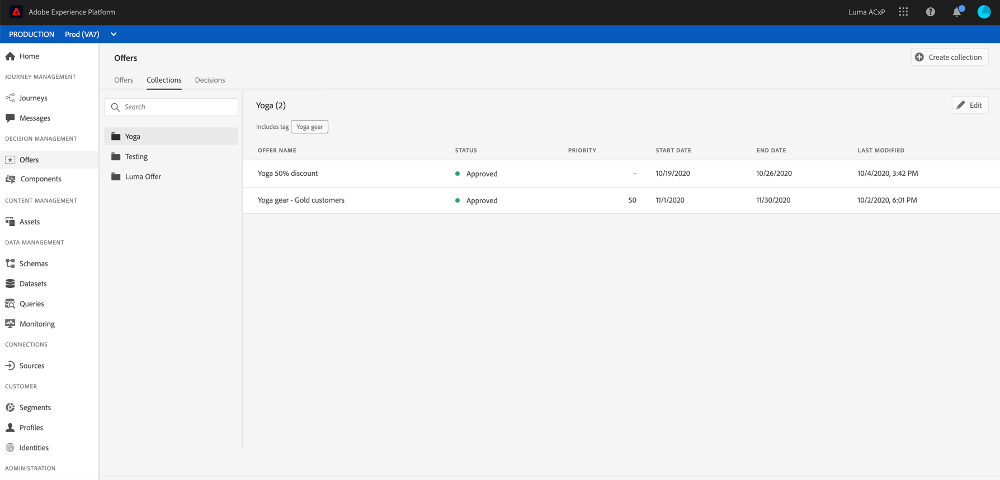

# 创建收藏集 {#creating-collections}

集合允许您通过将优惠重新分组到所选类别来组织这些。 例如，您可以创建仅包含与体育相关的优惠的“sport”集合。

 [在视频中发现此功能](#video)

可在&#x200B;**[!UICONTROL Offers]**&#x200B;菜单中访问优惠集的列表。

您可以创建两种类型的收藏集：

* **动态** 集合是基于标记的优惠集合。这些集合会自动更新。 例如，如果使用所选标记创建了新优惠，则会自动将其添加到集合。

* **静态** 集合是通过手动选择要包含在集合中的各个优惠来构建的集合。只能通过手动方式将更多优惠添加到集合来更新集合。

要创建收藏集，请执行以下步骤：

1. 转到&#x200B;**[!UICONTROL Collections]**&#x200B;选项卡，然后单击&#x200B;**[!UICONTROL Create collection]**。

1. 指定要创建的集合的名称和类型。

   

1. 要创建动态收藏集，请使用左窗格选择要添加到收藏集的优惠的标记，然后单击&#x200B;**[!UICONTROL Save]**。 包含选定标记的所有优惠将保存在集合中。

   有关创建标记的详细信息，请参阅[创建标记](../offer-library/creating-tags.md)。

   

1. 要创建静态集合，请使用左窗格筛选优惠列表(状态、标签、日期、渠道、内容类型)，然后选择要添加到集合的优惠。

   

   >[!NOTE]
   >
   >静态集合不会自动更新。 要向静态集合添加优惠，您需要编辑该集合并手动添加它们。

1. 创建集合后，该集合会显示在列表中。 您可以选择它来编辑或删除它。

   

## 教程视频{#video}

>[!NOTE]
>
>此视频适用于在Adobe Experience Platform上构建的Offer Decisioning应用程序服务。 但是，它提供了在Journey Optimizer环境中使用优惠的通用指导。

>[!VIDEO](https://video.tv.adobe.com/v/329376?quality=12)
