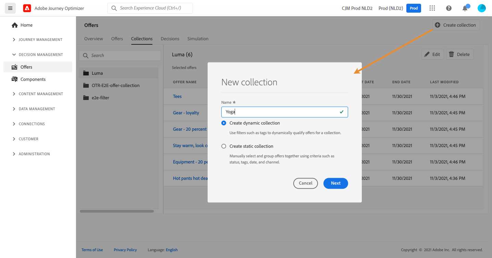

# 创建收藏集 {#create-collections}

>[!CONTEXTUALHELP]
>id="ajo_decisioning_decision_collection"
>title="关于选件收藏集"
>abstract="使用选件集，您可以通过将选件重组到所选的类别来组织选件。"

收藏集允许您通过将选件重组为所选的类别来组织选件。 例如，您可以创建一个“体育”收藏集，该收藏集仅包含与体育相关的选件。

➡️ [在视频中发现此功能](#video)

可在 **[!UICONTROL Offers]** 菜单。

您可以创建两种类型的收藏集：

* **动态收藏集** 是基于标记的选件集合。 这些收藏集会自动更新。 例如，如果使用所选标记创建了新选件，则该选件将自动添加到收藏集。

* **静态收藏集** 是指通过手动选择要包含在收藏集中的单个选件来构建的收藏集。 只能通过手动向收藏集添加更多选件来更新收藏集。

要创建收藏集，请执行以下步骤：

1. 转到 **[!UICONTROL Collections]** ，然后单击 **[!UICONTROL Create collection]**.

1. 指定要创建的集合的名称和类型。

   

1. 要创建动态收藏集，请使用左窗格选择要添加到收藏集的选件的标记，然后单击 **[!UICONTROL Save]**. 所有具有选定标记的选件都将保存在收藏集中。

   有关标记创建的更多信息，请参阅 [创建标记](../offer-library/creating-tags.md).

   

1. 要创建静态收藏集，请使用左窗格筛选选件列表（状态、标记、日期、渠道、内容类型），然后选择要添加到收藏集的选件。

   

   >[!NOTE]
   >
   >静态收藏集不会自动更新。 要向静态收藏集添加选件，您需要编辑选件并手动添加它们。

1. 创建集合后，该集合会显示在列表中。 您可以选择它以编辑或删除它。

   

## 操作方法视频 {#video}

>[!VIDEO](https://video.tv.adobe.com/v/329376?quality=12)

