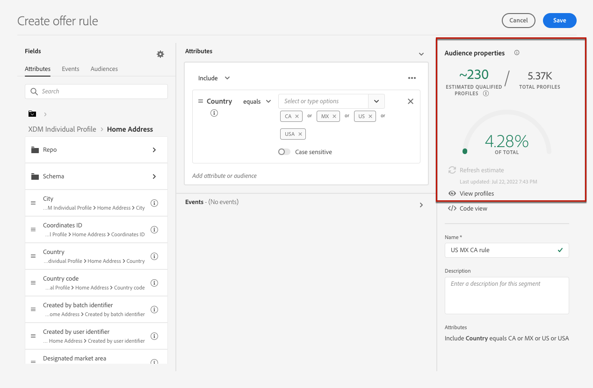

# 创建决策规则 {#create-decision-rules}

您可以根据Adobe Experience Platform中的可用数据创建优惠决策规则。 决策规则确定可向谁显示优惠。

例如，您可以指定当（性别=“女性”）和（地区=“东北”）时仅显示“女士冬装选件”。

➡️ [在视频中发现此功能](#video)

创建的决策规则列表可在 **[!UICONTROL 组件]** 菜单。

要创建决策规则，请执行以下步骤：

1. 转到 **[!UICONTROL 规则]** 选项卡，然后单击 **[!UICONTROL 创建规则]**.

   

1. 命名规则并提供说明，然后根据需要配置规则。

   为此，请使用Adobe Experience Platform **区段生成器** 可用于帮助您构建规则的条件。 [了解如何构建区段定义](../../audience/creating-a-segment-definition.md)

   <!--In this example, the rule will target customers that have the "Gold" loyalty level.-->

   

   >[!NOTE]
   >
   >与用于创建决策规则的区段生成器相比，该区段生成器具有一些特殊性 **[!UICONTROL 分段]** 服务。 但是，中所述的全局过程 [区段生成器](../../audience/creating-a-segment-definition.md) 文档仍可用于构建优惠决策规则。 请参阅 [Adobe Experience Platform 分段服务文档](https://experienceleague.adobe.com/docs/experience-platform/segmentation/ui/segment-builder.html)以了解详情。

1. 当您在工作区中添加和配置新字段时， **[!UICONTROL 受众属性]** 窗格显示有关属于受众的预计用户档案的信息。 单击 **[!UICONTROL 刷新估计]** 以更新数据。

   

   >[!NOTE]
   >
   >当规则参数包含不在配置文件中的数据（如上下文数据）时，配置文件估计不可用。 例如，资格规则要求当前天气为≥80度。

1. 单击 **[!UICONTROL 保存]** 以确认。

1. 创建规则后，该规则将显示在 **[!UICONTROL 规则]** 列表。 您可以选择它以显示其属性，并对其进行编辑或删除。

   

>[!CAUTION]
>
>中当前不支持基于事件的优惠 [!DNL Journey Optimizer]. 如果您根据以下内容创建决策规则： [事件](https://experienceleague.adobe.com/docs/experience-platform/segmentation/ui/segment-builder.html#events){target="_blank"}，您将无法在选件中利用它。

## 教程视频 {#video}

>[!VIDEO](https://video.tv.adobe.com/v/329373?quality=12)
