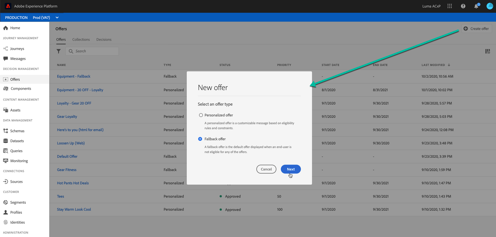
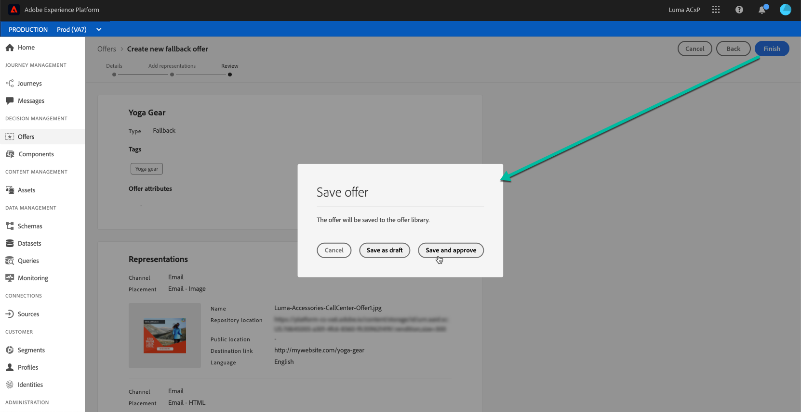

# 创建后备优惠 {#creating-fallback-offers}

如果客户不符合其他优惠的资格，则会向客户发送回退优惠。 创建回退优惠的步骤包括创建一个或多个表示，如创建优惠时。

 [在视频中发现此功能](#video)

可在&#x200B;**[!UICONTROL Offers]**&#x200B;菜单中访问回退优惠的列表。

要创建回退优惠，请执行以下步骤：

>[!NOTE]
>
>请注意，与个性化优惠不同，备用优惠没有合格规则和约束参数，因为它们是作为没有条件的最后一个度假村提供给客户的。

1. 单击&#x200B;**[!UICONTROL Create offer]**，然后选择&#x200B;**[!UICONTROL Fallback offer]**。

   

1. 指定回退优惠的名称。 您还可以将一个或多个现有标记与其关联，以便更轻松地搜索和组织优惠库。

   

1. 为回退优惠创建一个或多个表示形式。 为此，请从左侧窗格拖放版面，如创建个性化优惠时。 请参阅[创建个性化优惠](../offer-library/creating-personalized-offers.md)。

   

1. 添加回退优惠的表示后，将显示摘要。 如果所有内容配置正确，且您的备用优惠已准备好向客户显示，请单击&#x200B;**[!UICONTROL Finish]**，然后选择&#x200B;**[!UICONTROL Save and approve]**。

   您还可以将回退优惠另存为草稿，以便稍后编辑和批准它。

   

1. 回退优惠显示在列表中，状态为&#x200B;**[!UICONTROL Live]**&#x200B;或&#x200B;**[!UICONTROL Draft]**，具体取决于您在上一步中是否批准。

   现在，它已准备好交付给客户。 您可以选择它以显示其属性并对其进行编辑。<!-- no suppression? -->

   

## 教程视频{#video}

>[!NOTE]
>
>此视频适用于在Adobe Experience Platform上构建的Offer Decisioning应用程序服务。 但是，它提供了在Journey Optimizer环境中使用优惠的通用指导。

>[!VIDEO](https://video.tv.adobe.com/v/329383?quality=12)
