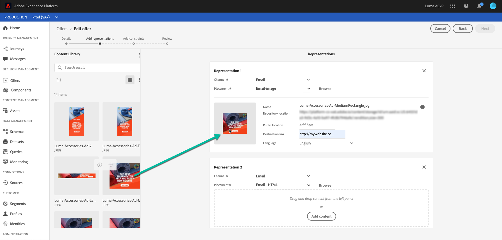

# 创建个性化优惠 {#creating-personalized-offers}

在创建选件之前，请确保已创建：

* 将显示选件的&#x200B;**版面**。 请参阅[创建版面](../offer-library/creating-placements.md)
* 一个&#x200B;**决策规则**，该规则将定义将显示选件的条件。 请参阅[创建决策规则](../offer-library/creating-decision-rules.md)。
* 要与选件关联的一个或多个&#x200B;**标记**。 请参阅[创建标记](../offer-library/creating-tags.md)。

➡️ [在视频中发现此功能](#video)

可在&#x200B;**[!UICONTROL Offers]**&#x200B;菜单中访问个性化选件列表。

## 创建选件 {#create-offer}

要创建&#x200B;**选件**，请执行以下步骤：

1. 单击&#x200B;**[!UICONTROL Create offer]**，然后选择&#x200B;**[!UICONTROL Personalized offer]**。

   

1. 指定选件的名称以及其开始和结束日期和时间。 您还可以将一个或多个现有标记与选件关联，从而更轻松地搜索和组织选件库。

   

   >[!NOTE]
   >
   >**[!UICONTROL Offer attributes]**&#x200B;部分允许您将键值对与选件关联，以便用于报告和分析。

## 配置选件的表示形式 {#representations}

1. 使用&#x200B;**[!UICONTROL Add representation]**&#x200B;按钮为选件添加一个或多个表示形式。

   >[!NOTE]
   >
   >选件可以显示在消息中的不同位置：在顶部横幅中显示图像、段落中的文本、html块等。 选件表示的越多，在不同版面环境中使用该选件的机会就越多。

1. 对于每个表示法，指定将显示选件的&#x200B;**[!UICONTROL Channel]**&#x200B;和&#x200B;**[!UICONTROL Placement]**。

   

   通过&#x200B;**[!UICONTROL Browse]**&#x200B;按钮，可筛选可用版面并根据其渠道和/或内容类型进行筛选。

   

1. 向来自Adobe Experience Cloud Assets库或外部公共位置的每个演示添加内容。

   * 要从Adobe Experience Cloud Assets库添加内容，请将左侧窗格中的内容拖放到表示区域，然后在&#x200B;**[!UICONTROL Destination link]**&#x200B;字段中指定要与内容关联的URL。

      >[!NOTE]
      >
      >只能从左侧面板的资产选取器中拖放内容。 只有与版面内容类型对应的内容才可供使用。

      

   * 要从外部公共位置添加内容，请单击&#x200B;**[!UICONTROL Add content]**&#x200B;按钮，然后指定要添加内容的名称、URL和目标链接。

      确保要添加的内容与所选版面的内容类型相对应。

      

   * 您还可以插入文本类型内容。 为此，请单击&#x200B;**[!UICONTROL Add content]**&#x200B;按钮，然后选择&#x200B;**[!UICONTROL Custom text]**&#x200B;选项。 在&#x200B;**[!UICONTROL Text]**&#x200B;字段中，键入要在选件中显示的文本。

      >[!NOTE]
      >
      >此选项不适用于图像类型放置。

      

## 添加资格规则和约束 {#eligibility}

资格规则和限制允许您定义显示选件的条件。

1. 配置&#x200B;**[!UICONTROL Offer eligibility]**。 默认情况下，会选择&#x200B;**[!UICONTROL All visitors]**&#x200B;决策规则选项，这意味着任何用户档案都有资格向用户展示选件。

   您可以将选件的显示方式限制为一个或多个Adobe Experience Platform区段的成员。 为此，请激活&#x200B;**[!UICONTROL Visitors who fall into one or multiple segments]**&#x200B;选项，然后从左窗格添加一个或多个区段，并使用&#x200B;**[!UICONTROL And]** / **[!UICONTROL Or]**&#x200B;逻辑运算符组合它们。

   有关如何使用区段的更多信息，请参阅[此页面](../../segment/about-segments.md)。

   

   如果要将特定决策规则与选件关联，请选择&#x200B;**[!UICONTROL By defined decision rule]**，然后将所需规则从左侧窗格拖至&#x200B;**[!UICONTROL Decision rule]**&#x200B;区域。 有关如何创建决策规则的更多信息，请参阅[此部分](../offer-library/creating-decision-rules.md)。

   

   >[!CAUTION]
   >
   >[!DNL Journey Optimizer]当前不支持基于事件的选件。 如果您基于[event](https://experienceleague.adobe.com/docs/experience-platform/segmentation/ui/segment-builder.html?lang=en#events){target=&quot;_blank&quot;}创建决策规则，则无法在选件中利用该规则。

1. 如果用户符合多个选件的条件，则定义选件的&#x200B;**[!UICONTROL Priority]**&#x200B;与其他选件相比。 优惠的优先级越高，与其他选件相比，优先级越高。

1. 指定选件的&#x200B;**[!UICONTROL Capping]**，这表示该选件在所有用户中的显示总次数。 如果已在所有用户中按您在此字段中指定的次数交付选件，则其交付将停止。

   >[!NOTE]
   >
   >在准备电子邮件时计算建议使用选件的次数。 例如，如果您准备发送一封包含大量选件的电子邮件，则无论是否发送了这封电子邮件，这些数量都将计入您的最大上限。
   >
   >如果删除了电子邮件投放，或者在发送之前再次进行准备，则选件的上限值会自动更新。

   

   在以上示例中：

   * 选件的优先级设置为“50”，这意味着选件将在优先级为1到49的选件之前和优先级为至少51的选件之后显示。
   * 仅对与“金牌忠诚度客户”决策规则匹配的用户考虑选件。
   * 该选件将仅针对每个用户显示一次。

## 查看选件 {#review}

定义资格规则和约束后，将显示选件属性的摘要。

1. 确保已正确配置所有内容。

1. 当您的选件已准备好向用户显示时，单击&#x200B;**[!UICONTROL Finish]**。

1. 选择 **[!UICONTROL Save and approve]**。

   

   您还可以将选件另存为草稿，以便稍后进行编辑和批准。

选件会以&#x200B;**[!UICONTROL Approved]**&#x200B;或&#x200B;**[!UICONTROL Draft]**&#x200B;状态显示在列表中，具体取决于您在上一步中是否批准了该选件。

现在，它已准备好交付给用户。

## 选件列表 {#offer-list}

从选件列表中，您可以选择选件以显示其属性。 您还可以编辑选件、更改其状态（**草稿**、**已批准**、**已存档**）、复制选件或将其删除。

选择&#x200B;**[!UICONTROL Edit]**&#x200B;按钮以返回到选件编辑模式，在该模式下，您可以修改选件的[details](#create-offer)、[表示](#representations)，以及编辑[资格规则和约束](#eligibility)。

选择已批准的选件，然后单击&#x200B;**[!UICONTROL Undo approve]**&#x200B;将选件状态重新设置为&#x200B;**[!UICONTROL Draft]**。

要再次将状态设置为&#x200B;**[!UICONTROL Approved]**，请选择现在显示的相应按钮。

**[!UICONTROL More actions]**&#x200B;按钮可启用下述操作。

* **[!UICONTROL Duplicate]**:创建具有相同属性、表示、资格规则和约束的选件。默认情况下，新选件的状态为&#x200B;**[!UICONTROL Draft]**。
* **[!UICONTROL Delete]**:从列表中删除选件。

   >[!CAUTION]
   >
   >该选件及其内容将无法再访问。 此操作无法撤消。
   >
   >如果选件在收藏集或决策中使用，则无法删除它。 必须先从任何对象中删除选件。

* **[!UICONTROL Archive]**:将选件状态设置为 **[!UICONTROL Archived]**。该选件仍可从列表中获取，但您无法将其状态重新设置为&#x200B;**[!UICONTROL Draft]**&#x200B;或&#x200B;**[!UICONTROL Approved]**。 您只能复制或删除它。

您还可以通过选中相应的复选框来同时删除或更改多个选件的状态。

如果要更改多个状态不同的选件的状态，则只会更改相关状态。

创建选件后，您可以从列表中单击其名称。

这样，您就可以访问该选件的详细信息。 选择&#x200B;**[!UICONTROL Change log]**&#x200B;选项卡以[监视对选件所做的所有更改](../get-started/user-interface.md#monitoring-changes)。

## 教程视频 {#video}

>[!NOTE]
>
>此视频适用于基于Adobe Experience Platform构建的Offer decisioning应用程序服务。 但是，它为在Journey Optimizer上下文中使用选件提供了通用指导。

>[!VIDEO](https://video.tv.adobe.com/v/329375?quality=12)
