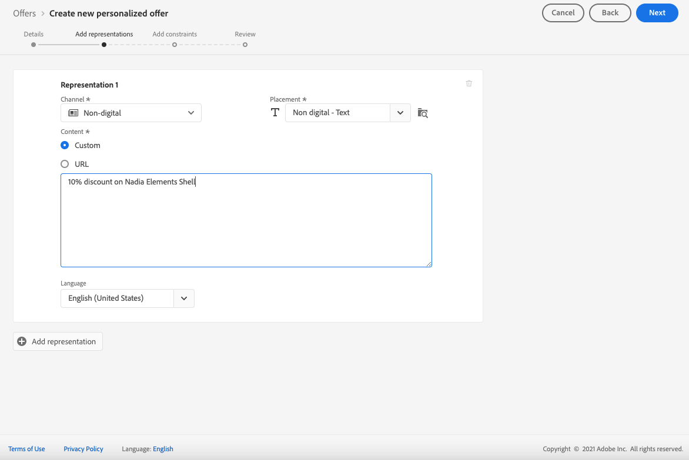

# 创建个性化优惠 {#creating-personalized-offers}

在创建选件之前，请确保已创建：

* 将显示选件的&#x200B;**版面**。 请参阅[创建版面](../offer-library/creating-placements.md)
* 如果要添加资格条件：**决策规则**，该规则将定义显示选件的条件。 请参阅[创建决策规则](../offer-library/creating-decision-rules.md)。
* 一个或多个要与选件关联的&#x200B;**标记**。 请参阅[创建标记](../offer-library/creating-tags.md)。

➡️ [在视频中发现此功能](#video)

可在&#x200B;**[!UICONTROL Offers]**&#x200B;菜单中访问个性化选件列表。

## 创建选件 {#create-offer}

要创建&#x200B;**选件**，请执行以下步骤：

1. 单击&#x200B;**[!UICONTROL Create offer]**，然后选择&#x200B;**[!UICONTROL Personalized offer]**。

   

1. 指定选件的名称以及其开始和结束日期和时间。 您还可以将一个或多个现有标记与选件关联，从而更轻松地搜索和组织选件库。

   

   >[!NOTE]
   >
   >**[!UICONTROL Offer attributes]**&#x200B;部分允许您将键值对与选件关联，以便用于报告和分析。

## 配置选件的表示形式 {#representations}

选件可以显示在消息中的不同位置：在顶部横幅中显示图像、段落中的文本、HTML块等。 选件表示的越多，在不同版面环境中使用该选件的机会就越多。

要向选件添加一个或多个表示形式并配置它们，请执行以下步骤。

1. 对于第一种表示法，首先选择将使用的&#x200B;**[!UICONTROL Channel]**。

   

   >[!NOTE]
   >
   >**[!UICONTROL Placement]**&#x200B;下拉列表中仅显示所选渠道的可用位置。

1. 从列表中选择版面。

   您还可以使用&#x200B;**[!UICONTROL Placement]**&#x200B;下拉列表旁边的按钮浏览所有版面。

   

   您仍然可以根据其渠道和/或内容类型筛选版面。 选择版面并单击&#x200B;**[!UICONTROL Select]**。

   

1. 向您的演示文稿中添加内容。 在[此部分](#content)中了解如何操作。

1. 添加图像或URL等内容时，可以指定&#x200B;**[!UICONTROL Destination link]**:单击选件的用户将被定向到相应的页面。

   

1. 最后，选择您选择的语言，以帮助识别和管理要向用户显示的内容。

1. 要添加其他表示法，请使用&#x200B;**[!UICONTROL Add representation]**&#x200B;按钮并根据需要添加任意数量的表示法。

   

1. 添加所有表示形式后，选择&#x200B;**[!UICONTROL Next]**。

## 定义表示的内容 {#content}

您可以向表示中添加不同类型的内容。

>[!NOTE]
>
>只有与版面内容类型对应的内容才可供使用。

### 添加图像

如果所选版面是图像类型，则可以添加来自&#x200B;**Adobe Experience Cloud Asset**&#x200B;库的内容，该库是[!DNL Adobe Experience Manager Assets Essentials]提供的集中资产存储库。

>[!NOTE]
>
> 要使用[Adobe Experience Manager Assets Essentials](https://experienceleague.adobe.com/docs/experience-manager-assets-essentials/help/introduction.html?lang=en){target=&quot;_blank&quot;}，您需要为贵组织部署[!DNL Assets Essentials]，并确保用户是&#x200B;**Assets Essentials消费者用户**&#x200B;或/和&#x200B;**Assets Essentials用户**&#x200B;产品配置文件的一部分。 有关[此页面](https://experienceleague.adobe.com/docs/experience-manager-assets-essentials/help/deploy-administer.html){target=&quot;_blank&quot;}的详细信息。

1. 选择 **[!UICONTROL Asset library]** 选项。

1. 选择 **[!UICONTROL Browse]**。

   

1. 浏览资产以选择您选择的图像

1. 单击 **[!UICONTROL Select]**。

   

### 添加URL

要从外部公共位置添加内容，请选择&#x200B;**[!UICONTROL URL]**，然后输入要添加内容的URL地址。

### 添加自定义文本 {#custom-text}

您还可以在选择兼容的版面时插入文本类型内容。

1. 选择 **[!UICONTROL Custom]** 选项。

   >[!NOTE]
   >
   >此选项不适用于图像类型放置。

1. 在专用区域键入将在选件中显示的文本。

   

## 添加资格规则和约束 {#eligibility}

资格规则和约束允许您定义显示选件的条件。

1. 配置&#x200B;**[!UICONTROL Offer eligibility]**。

   * 默认情况下，会选择&#x200B;**[!UICONTROL All visitors]**&#x200B;决策规则选项，这意味着任何用户档案都有资格向用户展示选件。

   * 您可以将选件的显示方式限制为一个或多个Adobe Experience Platform区段的成员。 为此，请激活&#x200B;**[!UICONTROL Visitors who fall into one or multiple segments]**&#x200B;选项，然后从左窗格添加一个或多个区段，并使用&#x200B;**[!UICONTROL And]** / **[!UICONTROL Or]**&#x200B;逻辑运算符组合它们。

      有关如何使用区段的更多信息，请参阅[此页面](../../segment/about-segments.md)。

      

   * 如果要将特定决策规则与选件关联，请选择&#x200B;**[!UICONTROL By defined decision rule]**，然后将所需规则从左侧窗格拖至&#x200B;**[!UICONTROL Decision rule]**&#x200B;区域。 有关如何创建决策规则的更多信息，请参阅[此部分](../offer-library/creating-decision-rules.md)。

      

      >[!CAUTION]
      >
      >[!DNL Journey Optimizer]当前不支持基于事件的选件。 如果您基于[event](https://experienceleague.adobe.com/docs/experience-platform/segmentation/ui/segment-builder.html?lang=en#events){target=&quot;_blank&quot;}创建决策规则，则无法在选件中利用该规则。
   在[此部分](../offer-activities/create-offer-activities.md#segments-vs-decision-rules)中了解有关使用区段与决策规则的更多信息。

1. 如果用户符合多个选件的条件，则定义选件的&#x200B;**[!UICONTROL Priority]**&#x200B;与其他选件相比。 优惠的优先级越高，与其他选件相比，优先级越高。

1. 指定选件的&#x200B;**[!UICONTROL Capping]**，这表示该选件在所有用户中的显示总次数。 如果已在所有用户中按您在此字段中指定的次数交付选件，则其交付将停止。

   >[!NOTE]
   >
   >在准备电子邮件时计算建议使用选件的次数。 例如，如果您准备发送一封包含大量选件的电子邮件，则无论是否发送了这封电子邮件，这些数量都将计入您的最大上限。
   >
   >如果删除了电子邮件投放，或者在发送之前再次进行准备，则选件的上限值会自动更新。

   

   在以上示例中：

   * 选件的优先级设置为“50”，这意味着选件将在优先级为1到49的选件之前和优先级为至少51的选件之后显示。
   * 仅对与“金牌忠诚度客户”决策规则匹配的用户考虑选件。
   * 该选件将仅针对每个用户显示一次。

## 查看选件 {#review}

定义资格规则和约束后，将显示选件属性的摘要。

1. 确保已正确配置所有内容。

1. 当您的选件已准备好向用户显示时，单击&#x200B;**[!UICONTROL Finish]**。

1. 选择 **[!UICONTROL Save and approve]**。

   

   您还可以将选件另存为草稿，以便稍后进行编辑和批准。

选件会以&#x200B;**[!UICONTROL Approved]**&#x200B;或&#x200B;**[!UICONTROL Draft]**&#x200B;状态显示在列表中，具体取决于您在上一步中是否批准了该选件。

现在，它已准备好交付给用户。

## 优惠列表 {#offer-list}

从选件列表中，您可以选择选件以显示其属性。 您还可以编辑选件、更改其状态（**草稿**、**已批准**、**已存档**）、复制选件或将其删除。

选择&#x200B;**[!UICONTROL Edit]**&#x200B;按钮以返回到选件编辑模式，在该模式下，您可以修改选件的[details](#create-offer)、[表示](#representations)，以及编辑[资格规则和约束](#eligibility)。

选择已批准的选件，然后单击&#x200B;**[!UICONTROL Undo approve]**&#x200B;将选件状态重新设置为&#x200B;**[!UICONTROL Draft]**。

要再次将状态设置为&#x200B;**[!UICONTROL Approved]**，请选择现在显示的相应按钮。

**[!UICONTROL More actions]**&#x200B;按钮可启用下述操作。

* **[!UICONTROL Duplicate]**:创建具有相同属性、表示、资格规则和约束的选件。默认情况下，新选件的状态为&#x200B;**[!UICONTROL Draft]**。
* **[!UICONTROL Delete]**:从列表中删除选件。

   >[!CAUTION]
   >
   >该选件及其内容将无法再访问。 此操作无法撤消。
   >
   >如果选件在收藏集或决策中使用，则无法删除它。 必须先从任何对象中删除选件。

* **[!UICONTROL Archive]**:将选件状态设置为 **[!UICONTROL Archived]**。该选件仍可从列表中获取，但您无法将其状态重新设置为&#x200B;**[!UICONTROL Draft]**&#x200B;或&#x200B;**[!UICONTROL Approved]**。 您只能复制或删除它。

您还可以通过选中相应的复选框来同时删除或更改多个选件的状态。

如果要更改多个状态不同的选件的状态，则只会更改相关状态。

创建选件后，您可以从列表中单击其名称。

这样，您就可以访问该选件的详细信息。 选择&#x200B;**[!UICONTROL Change log]**&#x200B;选项卡以[监视对选件所做的所有更改](../get-started/user-interface.md#monitoring-changes)。

## 教程视频 {#video}

>[!NOTE]
>
>此视频适用于基于Adobe Experience Platform构建的Offer decisioning应用程序服务。 但是，它为在Journey Optimizer上下文中使用选件提供了通用指导。

>[!VIDEO](https://video.tv.adobe.com/v/329375?quality=12)
