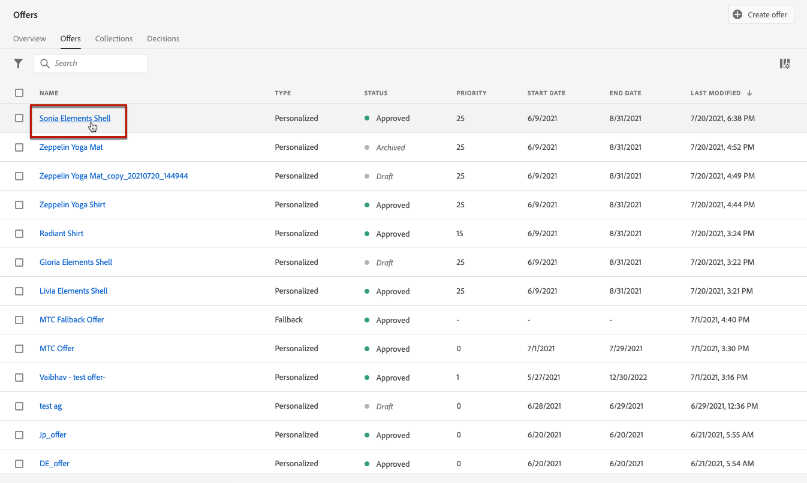

# 创建个性化优惠 {#create-personalized-offers}

在创建选件之前，请确保已创建：

* A **投放** 中显示选件。 请参阅 [创建版面](../offer-library/creating-placements.md)
* 如果要添加资格条件：a **决策规则** 定义显示选件的条件。 请参阅 [创建决策规则](../offer-library/creating-decision-rules.md).
* 一个或多个 **标记** 您可能希望与选件关联的选件。 请参阅 [创建标记](../offer-library/creating-tags.md).

➡️ [在视频中发现此功能](#video)

可在 **[!UICONTROL Offers]** 菜单。

## 创建选件 {#create-offer}

>[!CONTEXTUALHELP]
>id="od_offer_attributes"
>title="关于选件属性"
>abstract="使用选件属性，您可以将键值对与选件关联，以便进行报告和分析。"

>[!CONTEXTUALHELP]
>id="ajo_decisioning_offer_attributes"
>title="选件属性"
>abstract="使用选件属性，您可以将键值对与选件关联，以便进行报告和分析。"

创建 **选件**，请执行以下步骤：

1. 单击 **[!UICONTROL Create offer]**，然后选择 **[!UICONTROL Personalized offer]**.

   

1. 指定选件的名称以及其开始和结束日期和时间。 在这些日期之外，决策引擎将不会选择选件。

   

   >[!CAUTION]
   >
   >更新开始/结束日期可能会对上限产生影响。 [了解详情](add-constraints.md#capping-change-date)

1. 您还可以关联一个或多个现有 **[!UICONTROL tags]** 选件，以便您更轻松地搜索和组织选件库。 [了解详情](creating-tags.md)。

1. 的 **[!UICONTROL Offer attributes]** 部分，可将键值对与选件关联以用于报告和分析。

1. 添加表示法以定义选件在消息中的显示位置。 [了解详情](add-representations.md)

   

1. 添加约束以设置要显示的选件的条件。 [了解详情](add-constraints.md)

   

1. 查看并保存选件。 [了解详情](#review)

## 查看选件 {#review}

定义资格规则和约束后，将显示选件属性的摘要。

1. 确保已正确配置所有内容。

1. 当您的选件已准备好呈现给用户时，单击 **[!UICONTROL Finish]**.

1. 选择 **[!UICONTROL Save and approve]**。

   

   您还可以将选件另存为草稿，以便稍后进行编辑和批准。

该选件将显示在列表中，其中 **[!UICONTROL Approved]** 或 **[!UICONTROL Draft]** 状态，具体取决于您在上一步中是否批准了它。

现在，它已准备好交付给用户。

## 管理选件 {#offer-list}

从选件列表中，您可以选择选件以显示其属性。 您还可以编辑、更改其状态(**草稿**, **已批准**, **已存档**)、复制选件或将其删除。

选择 **[!UICONTROL Edit]** 按钮返回到选件编辑模式，在该模式中，您可以修改选件的 [详细信息](#create-offer), [表示](#representations)，以及编辑 [资格规则和限制](#eligibility).

选择已批准的选件并单击 **[!UICONTROL Undo approve]** 将选件状态设置回 **[!UICONTROL Draft]**.

再次将状态设置为 **[!UICONTROL Approved]**，则选择当前显示的相应按钮。

的 **[!UICONTROL More actions]** 按钮可启用下面描述的操作。

* **[!UICONTROL Duplicate]**:创建具有相同属性、表示、资格规则和约束的选件。 默认情况下，新选件具有 **[!UICONTROL Draft]** 状态。
* **[!UICONTROL Delete]**:从列表中删除选件。

   >[!CAUTION]
   >
   >该选件及其内容将无法再访问。 此操作无法撤消。
   >
   >如果选件在收藏集或决策中使用，则无法删除它。 必须先从任何对象中删除选件。

* **[!UICONTROL Archive]**:将选件状态设置为 **[!UICONTROL Archived]**. 该选件仍可从列表中获取，但您无法将其状态重新设置为 **[!UICONTROL Draft]** 或 **[!UICONTROL Approved]**. 您只能复制或删除它。

您还可以通过选中相应的复选框来同时删除或更改多个选件的状态。

如果要更改多个状态不同的选件的状态，则只会更改相关状态。

创建选件后，您可以从列表中单击其名称。

这样，您就可以访问该选件的详细信息。 选择 **[!UICONTROL Change log]** 选项卡 [监控所有更改](../get-started/user-interface.md#monitoring-changes) 已经提出了。

## 教程视频 {#video}

>[!NOTE]
>
>此视频适用于基于Adobe Experience Platform构建的Offer decisioning应用程序服务。 但是，它为在Journey Optimizer上下文中使用选件提供了通用指南。

>[!VIDEO](https://video.tv.adobe.com/v/329375?quality=12)
