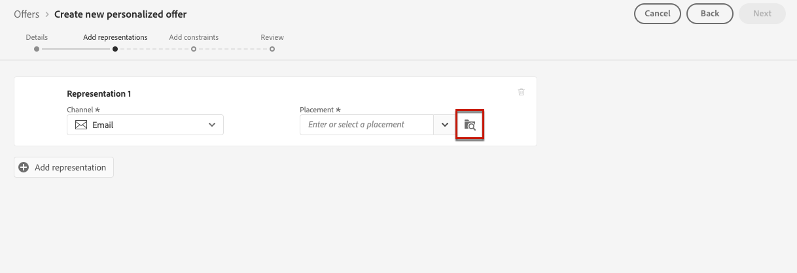
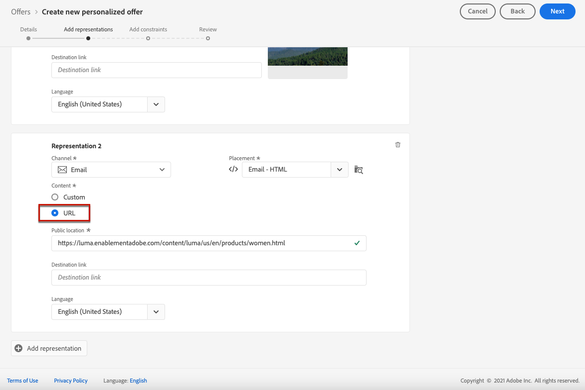

# 创建个性化优惠 {#creating-personalized-offers}

在创建选件之前，请确保已创建：

* A **投放** 中显示选件。 请参阅 [创建版面](../offer-library/creating-placements.md)
* 如果要添加资格条件：a **决策规则** 定义显示选件的条件。 请参阅 [创建决策规则](../offer-library/creating-decision-rules.md).
* 一个或多个 **标记** 您可能希望与选件关联的选件。 请参阅 [创建标记](../offer-library/creating-tags.md).

➡️ [在视频中发现此功能](#video)

可在 **[!UICONTROL Offers]** 菜单。

## 创建选件 {#create-offer}

创建 **选件**，请执行以下步骤：

1. 单击 **[!UICONTROL Create offer]**，然后选择 **[!UICONTROL Personalized offer]**.

   

1. 指定选件的名称以及其开始和结束日期和时间。 您还可以将一个或多个现有标记与选件关联，从而更轻松地搜索和组织选件库。

   

   >[!NOTE]
   >
   >的 **[!UICONTROL Offer attributes]** 部分，可将键值对与选件关联以用于报告和分析。

## 配置选件的表示形式 {#representations}

选件可以显示在消息中的不同位置：在顶部横幅中显示图像、段落中的文本、HTML块等。 选件表示的越多，在不同版面环境中使用该选件的机会就越多。

要向选件添加一个或多个表示形式并配置它们，请执行以下步骤。

1. 对于第一个表示，首先选择 **[!UICONTROL Channel]** 将使用的URL。

   

   >[!NOTE]
   >
   >只有所选渠道的可用版面会显示在 **[!UICONTROL Placement]** 下拉列表。

1. 从列表中选择版面。

   您还可以使用 **[!UICONTROL Placement]** 下拉列表以浏览所有版面。

   

   您仍然可以根据其渠道和/或内容类型筛选版面。 选择版面并单击 **[!UICONTROL Select]**.

   

1. 向您的演示文稿中添加内容。 了解 [此部分](#content).

1. 添加图像或URL等内容时，您可以指定 **[!UICONTROL Destination link]**:单击选件的用户将被定向到相应的页面。

   

1. 最后，选择您选择的语言，以帮助识别和管理要向用户显示的内容。

1. 要添加其他表示形式，请使用 **[!UICONTROL Add representation]** 按钮，并根据需要添加任意数量的表示形式。

   

1. 添加所有表示形式后，选择 **[!UICONTROL Next]**.

## 定义表示的内容 {#content}

您可以向表示中添加不同类型的内容。

>[!NOTE]
>
>只有与版面内容类型对应的内容才可供使用。

### 添加图像

如果所选版面是图像类型，则可以添加来自 **Adobe Experience Cloud Asset** 库，由提供的集中资产存储库 [!DNL Adobe Experience Manager Assets Essentials].

>[!NOTE]
>
> 使用 [Adobe Experience Manager Assets Essentials](https://experienceleague.adobe.com/docs/experience-manager-assets-essentials/help/introduction.html?lang=en){target=&quot;_blank&quot;}，您需要部署 [!DNL Assets Essentials] ，并确保用户是 **Assets Essentials消费者用户** 或/和 **Assets Essentials用户** 产品配置文件。 了解详情 [本页](https://experienceleague.adobe.com/docs/experience-manager-assets-essentials/help/deploy-administer.html){target=&quot;_blank&quot;}。

1. 选择 **[!UICONTROL Asset library]** 选项。

1. 选择 **[!UICONTROL Browse]**。

   

1. 浏览资产以选择您选择的图像

1. 单击 **[!UICONTROL Select]**。

   

### 添加URL

要从外部公共位置添加内容，请选择 **[!UICONTROL URL]**，然后输入要添加内容的URL地址。

### 添加自定义文本 {#custom-text}

您还可以在选择兼容的版面时插入文本类型内容。

1. 选择 **[!UICONTROL Custom]** 选项并单击 **[!UICONTROL Add content]**.

   

   >[!NOTE]
   >
   >此选项不适用于图像类型放置。

1. 键入将在选件中显示的文本。

   

   您可以使用表达式编辑器将内容个性化。 了解详情 [个性化](../../personalization/personalize.md#use-expression-editor).

   

   >[!NOTE]
   >
   >仅 **[!UICONTROL Profile attributes]**, **[!UICONTROL Segment memberships]** 和 **[!UICONTROL Helper functions]** 源可用于决策管理。

## 添加资格规则和约束 {#eligibility}

资格规则和约束允许您定义显示选件的条件。

1. 配置 **[!UICONTROL Offer eligibility]**.

   * 默认情况下， **[!UICONTROL All visitors]** 决策规则选项，这意味着任何用户档案都有资格获得该选件。

   * 您可以将选件的显示方式限制为一个或多个Adobe Experience Platform区段的成员。 为此，请激活 **[!UICONTROL Visitors who fall into one or multiple segments]** 选项，然后从左侧窗格添加一个或多个区段，并使用 **[!UICONTROL And]** / **[!UICONTROL Or]** 逻辑运算符。

      有关如何使用区段的更多信息，请参阅 [本页](../../segment/about-segments.md).

      

   * 如果要将特定决策规则与选件关联，请选择 **[!UICONTROL By defined decision rule]**，然后将所需的规则从左侧窗格拖入 **[!UICONTROL Decision rule]** 的上界。 有关如何创建决策规则的更多信息，请参阅 [此部分](../offer-library/creating-decision-rules.md).

      

      >[!CAUTION]
      >
      >中当前不支持基于事件的选件 [!DNL Journey Optimizer]. 如果您根据 [事件](https://experienceleague.adobe.com/docs/experience-platform/segmentation/ui/segment-builder.html?lang=en#events){target=&quot;_blank&quot;}，您将无法在选件中利用它。
   了解有关在中使用区段与决策规则的更多信息 [此部分](../offer-activities/create-offer-activities.md#segments-vs-decision-rules).

1. 定义 **[!UICONTROL Priority]** 选件（如果用户符合多个选件的条件）。 优惠的优先级越高，与其他选件相比，优先级越高。

1. 指定选件的 **[!UICONTROL Capping]**，表示选件在所有用户中显示的总次数。 如果已在所有用户中按您在此字段中指定的次数交付选件，则其交付将停止。

   >[!NOTE]
   >
   >在准备电子邮件时计算建议使用选件的次数。 例如，如果您准备发送一封包含大量选件的电子邮件，则无论是否发送了这封电子邮件，这些数量都将计入您的最大上限。
   >
   >如果删除了电子邮件投放，或者在发送之前再次进行准备，则选件的上限值会自动更新。

   

   在以上示例中：

   * 选件的优先级设置为“50”，这意味着选件将在优先级为1到49的选件之前和优先级为至少51的选件之后显示。
   * 仅对与“金牌忠诚度客户”决策规则匹配的用户考虑选件。
   * 该选件将仅针对每个用户显示一次。

## 查看选件 {#review}

定义资格规则和约束后，将显示选件属性的摘要。

1. 确保已正确配置所有内容。

1. 当您的选件已准备好呈现给用户时，单击 **[!UICONTROL Finish]**.

1. 选择 **[!UICONTROL Save and approve]**。

   

   您还可以将选件另存为草稿，以便稍后进行编辑和批准。

该选件将显示在列表中，其中 **[!UICONTROL Approved]** 或 **[!UICONTROL Draft]** 状态，具体取决于您在上一步中是否批准了它。

现在，它已准备好交付给用户。

## 优惠列表 {#offer-list}

从选件列表中，您可以选择选件以显示其属性。 您还可以编辑、更改其状态(**草稿**, **已批准**, **已存档**)、复制选件或将其删除。

选择 **[!UICONTROL Edit]** 按钮返回到选件编辑模式，在该模式中，您可以修改选件的 [详细信息](#create-offer), [表示](#representations)，以及编辑 [资格规则和限制](#eligibility).

选择已批准的选件并单击 **[!UICONTROL Undo approve]** 将选件状态设置回 **[!UICONTROL Draft]**.

再次将状态设置为 **[!UICONTROL Approved]**，则选择当前显示的相应按钮。

的 **[!UICONTROL More actions]** 按钮可启用下面描述的操作。

* **[!UICONTROL Duplicate]**:创建具有相同属性、表示、资格规则和约束的选件。 默认情况下，新选件具有 **[!UICONTROL Draft]** 状态。
* **[!UICONTROL Delete]**:从列表中删除选件。

   >[!CAUTION]
   >
   >该选件及其内容将无法再访问。 此操作无法撤消。
   >
   >如果选件在收藏集或决策中使用，则无法删除它。 必须先从任何对象中删除选件。

* **[!UICONTROL Archive]**:将选件状态设置为 **[!UICONTROL Archived]**. 该选件仍可从列表中获取，但您无法将其状态重新设置为 **[!UICONTROL Draft]** 或 **[!UICONTROL Approved]**. 您只能复制或删除它。

您还可以通过选中相应的复选框来同时删除或更改多个选件的状态。

如果要更改多个状态不同的选件的状态，则只会更改相关状态。

创建选件后，您可以从列表中单击其名称。

这样，您就可以访问该选件的详细信息。 选择 **[!UICONTROL Change log]** 选项卡 [监控所有更改](../get-started/user-interface.md#monitoring-changes) 已经提出了。

## 教程视频 {#video}

>[!NOTE]
>
>此视频适用于基于Adobe Experience Platform构建的Offer decisioning应用程序服务。 但是，它为在Journey Optimizer上下文中使用选件提供了通用指导。

>[!VIDEO](https://video.tv.adobe.com/v/329375?quality=12)
