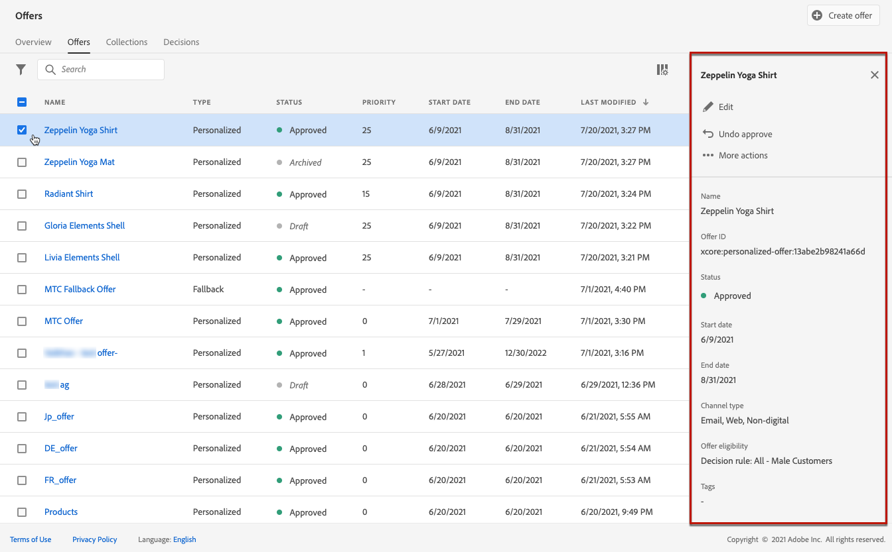

# 创建个性化优惠 {#creating-personalized-offers}

>[!CONTEXTUALHELP]
>id="od_offer_constraints"
>title="关于优惠约束"
>abstract="借助约束，您可以指定与其他优惠相比，如何对优惠进行优先排序并向用户显示。"
>additional-url="https://video.tv.adobe.com/v/329375?captions=chi_hans" text="观看演示视频"

>[!CONTEXTUALHELP]
>id="od_offer_eligibility"
>title="关于优惠资格"
>abstract="在本节中，您可以使用决策规则确定哪些用户有资格获得优惠。"
>additional-url="https://experienceleague.adobe.com/docs/offer-decisioning/using/managing-offers-in-the-offer-library/creating-decision-rules.html" text="创建决策规则"
>additional-url="https://video.tv.adobe.com/v/329373?captions=chi_hans" text="观看演示视频"

>[!CONTEXTUALHELP]
>id="od_offer_priority"
>title="关于优惠优先级"
>abstract="在此字段中，您可以指定优惠的优先级设置。 优先级是用于对满足所有约束（如资格、日期和上限）的优惠进行排名的数字。"
>additional-url="https://video.tv.adobe.com/v/329375" text="观看演示视频"

>[!CONTEXTUALHELP]
>id="od_offer_globalcap"
>title="关于优惠上限"
>abstract="在此字段中，您可以指定在所有用户中显示优惠的次数。"
>additional-url="https://video.tv.adobe.com/v/329375" text="观看演示视频"

>[!CONTEXTUALHELP]
>id="od_offer_attributes"
>title="关于优惠属性"
>abstract="使用优惠属性，您可以将键值对与优惠关联，以用于报告和分析。"
>additional-url="https://video.tv.adobe.com/v/329375" text="观看演示视频"

在创建优惠之前，请确保已创建：

* 将在其中显示优惠的&#x200B;**位置**。 请参阅[创建版面](../offer-library/creating-placements.md)
* 一个&#x200B;**决策规则**，它将定义显示优惠的条件。 请参阅[创建决策规则](../offer-library/creating-decision-rules.md)。
* 要与优惠关联的一个或多个&#x200B;**标记**。 请参阅[创建标记](../offer-library/creating-tags.md)。

 [在视频中发现此功能](#video)

可在&#x200B;**[!UICONTROL Offers]**&#x200B;菜单中访问个性化优惠的列表。

## 创建优惠{#create-offer}

要创建&#x200B;**优惠**，请执行以下步骤：

1. 单击&#x200B;**[!UICONTROL Create offer]**，然后选择&#x200B;**[!UICONTROL Personalized offer]**。

   

1. 指定优惠的名称及其开始和结束日期和时间。 您还可以将一个或多个现有标记关联到优惠，以便更轻松地搜索和组织优惠库。

   

   >[!NOTE]
   >
   >**[!UICONTROL Offer attributes]**&#x200B;部分允许您将键值对与优惠关联，以便进行报告和分析。

## 配置优惠的表示形式{#representations}

1. 使用&#x200B;**[!UICONTROL Add representation]**&#x200B;按钮为优惠添加一个或多个表示形式。

   >[!NOTE]
   >
   >优惠可以在消息中的不同位置显示：在带有图像的顶部横幅中，作为段落中的文本，作为html块等。 优惠拥有的表示越多，在不同放置上下文中使用优惠的机会就越多。

1. 对于每个表示法，指定将显示优惠的&#x200B;**[!UICONTROL Channel]**&#x200B;和&#x200B;**[!UICONTROL Placement]**。

   

   使用&#x200B;**[!UICONTROL Browse]**&#x200B;按钮可以筛选可用版面并根据其渠道和/或内容类型筛选这些版面。

   

1. 向来自Adobe Experience Cloud资源库或外部公共位置的每个演示添加内容。

   * 要从Adobe Experience Cloud资源库添加内容，请将其从左侧窗格拖放到表示区域，然后在&#x200B;**[!UICONTROL Destination link]**&#x200B;字段中指定要与内容关联的URL。

      >[!NOTE]
      >
      >只能从左侧面板的资产选取器中拖放内容。 只有与版面的内容类型对应的内容可供使用。

      

   * 要从外部公共位置添加内容，请单击&#x200B;**[!UICONTROL Add content]**&#x200B;按钮，然后指定要添加的内容的名称、URL和目标链接。

      确保所添加的内容与所选版面的内容类型相对应。

      

   * 您还可以插入文本类型内容。 要执行此操作，请单击&#x200B;**[!UICONTROL Add content]**&#x200B;按钮，然后选择&#x200B;**[!UICONTROL Custom text]**&#x200B;选项。 在&#x200B;**[!UICONTROL Text]**&#x200B;字段中，键入将在优惠中显示的文本。

      >[!NOTE]
      >
      >此选项不适用于图像类型版面。

      

## 添加合格规则和约束{#eligibility}

合格规则和限制允许您定义显示优惠的条件。

1. 配置&#x200B;**[!UICONTROL Offer eligibility]**。 默认情况下，将选择&#x200B;**[!UICONTROL All visitors]**&#x200B;决策规则选项，这意味着任何用户档案都有资格向优惠展示。

   您可以将优惠的显示限制为一个或多个Adobe Experience Platform区段的成员。 为此，请激活&#x200B;**[!UICONTROL Visitors who fall into one or multiple segments]**&#x200B;选项，然后从左侧窗格添加一个或多个区段，并使用&#x200B;**[!UICONTROL And]** / **[!UICONTROL Or]**&#x200B;逻辑运算符合并它们。

   有关如何使用区段的详细信息，请参阅[分段服务文档](https://experienceleague.adobe.com/docs/experience-platform/segmentation/home.html)。

   

   如果要将特定决策规则与优惠关联，请选择&#x200B;**[!UICONTROL By defined decision rule]**，然后将所需规则从左窗格拖至&#x200B;**[!UICONTROL Decision rule]**&#x200B;区域。 有关如何创建决策规则的详细信息，请参阅[本节](../offer-library/creating-decision-rules.md)。

   

1. 如果用户有资格获得多个优惠，则定义与其他优惠相比的的&#x200B;**[!UICONTROL Priority]**。 优惠的优先级最高，与其他优惠相比其优先级最高

1. 指定优惠的&#x200B;**[!UICONTROL Capping]**，即优惠在所有用户中的总显示次数。 如果优惠已在所有用户中传递您在此字段中指定的次数，则其投放将停止。

   >[!NOTE]
   >
   >在电子邮件准备时计算建议优惠的次数。 例如，如果您准备发送一封包含大量选件的电子邮件，则无论是否发送了这封电子邮件，这些数量都将计入您的最大上限。
   >
   >如果删除了电子邮件投放，或在发送前再次完成准备，则优惠的上限值会自动更新。

   

   在上例中：

   * 优惠的优先级设置为“50”，这意味着优惠将呈现给优惠，优先级介于1到49之间，优先级至少为51之后。
   * 优惠将仅针对符合“黄金忠诚度客户”决策规则的用户进行考虑。
   * 优惠将仅针对每个用户显示一次。

## 查看优惠{#review}

定义合格规则和约束后，将显示优惠属性的摘要。 如果所有内容配置正确，且优惠已准备好向用户显示，请单击&#x200B;**[!UICONTROL Finish]**，然后选择&#x200B;**[!UICONTROL Save and approve]**。

您还可以将优惠另存为草稿，以便稍后编辑和批准它。

该优惠显示在列表中，状态为&#x200B;**[!UICONTROL Live]**&#x200B;或&#x200B;**[!UICONTROL Draft]**，具体取决于您在上一步中是否批准了它。

现在，它已准备好交付给用户。 您可以选择它以显示其属性并编辑或隐藏它。

创建优惠后，您可以单击列表中的其名称以访问详细信息，并使用&#x200B;**[!UICONTROL Change log]**&#x200B;选项卡监视对其所做的所有更改(请参阅[监视优惠和决策的更改](../get-started/user-interface.md#monitoring-changes))。

## 教程视频{#video}

>[!NOTE]
>
>此视频适用于在Adobe Experience Platform上构建的Offer Decisioning应用程序服务。 但是，它提供了在Journey Optimizer环境中使用优惠的通用指导。

>[!VIDEO](https://video.tv.adobe.com/v/329375?quality=12)
