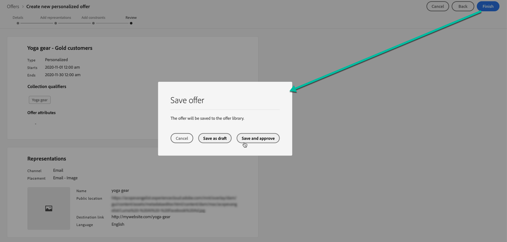

# 创建个性化优惠 {#create-personalized-offers}

在创建选件之前，请确保已创建：

* A **投放** 将在其中显示选件。 参见 [创建投放位置](../offer-library/creating-placements.md)
* 如果要添加资格条件：a **决策规则** 定义优惠的呈现条件。 参见 [创建决策规则](../offer-library/creating-decision-rules.md).
* 一个或多个 **收藏集限定符** （以前称为“标记”）来关联选件。 参见 [创建收藏集限定符](../offer-library/creating-tags.md).

➡️ [在视频中发现此功能](#video)

个性化优惠的列表可在 **[!UICONTROL 选件]** 菜单。

## 创建选件 {#create-offer}

>[!CONTEXTUALHELP]
>id="od_offer_attributes"
>title="关于优惠属性"
>abstract="借助选件属性，您可以将键值对与选件相关联，以用于报告和分析。"

>[!CONTEXTUALHELP]
>id="ajo_decisioning_offer_attributes"
>title="优惠属性"
>abstract="借助选件属性，您可以将键值对与选件相关联，以用于报告和分析。"

创建 **选件**，请按照以下步骤操作：

1. 单击 **[!UICONTROL 创建选件]**，然后选择 **[!UICONTROL 个性化优惠]**.

   

1. 指定优惠的名称及其开始和结束日期和时间。 在这些日期之外，决策引擎将不会选择选件。

   

   >[!CAUTION]
   >
   >更新开始/结束日期可能会影响上限。 [了解详情](add-constraints.md#capping-change-date)

1. 您还可以关联一个或多个现有的 **[!UICONTROL 收藏集限定符]** 选件库，使您能够更轻松地搜索和组织选件库。 [了解详情](creating-tags.md)。

1. 此 **[!UICONTROL 优惠属性]** 部分允许您将键值对与选件相关联，以用于报告和分析。

1. 要将自定义或核心数据使用标签分配给选件，请选择 **[!UICONTROL 管理访问权限]**. [了解有关对象级访问控制(OLAC)的更多信息](../../administration/object-based-access.md)

   

1. 添加呈现以定义优惠在消息中的显示位置。 [了解详情](add-representations.md)

   

1. 添加约束以设置要显示的选件的条件。 [了解详情](add-constraints.md)

   >[!NOTE]
   >
   >在选择区段或决策规则时，您可以查看有关预计的合格用户档案的信息。 单击 **[!UICONTROL 刷新]** 以更新数据。
   >
   >请注意，当规则参数包括不在配置文件中的数据（如上下文数据）时，配置文件估计不可用。 例如，一个资格规则，要求当前天气为≥80度。

   

1. 查看并保存选件。 [了解详情](#review)

## 查看选件 {#review}

定义资格规则和限制后，将显示优惠属性的摘要。

1. 确保正确配置所有内容。

1. 您可以显示有关预计的合格用户档案的信息。 单击 **[!UICONTROL 刷新]** 以更新数据。

   

1. 当您的选件已准备好呈现给用户时，请单击 **[!UICONTROL 完成]**.

1. 选择 **[!UICONTROL 保存并批准]**.

   

   您还可以将优惠另存为草稿，以便稍后进行编辑和批准。

选件会显示在列表中，并显示 **[!UICONTROL 已批准]** 或 **[!UICONTROL 草稿]** 状态，具体取决于您在上一步中是否批准了该设置。

它现在已准备好交付给用户。

## 管理优惠 {#offer-list}

从选件列表中，您可以选择要显示其属性的选件。 您还可以编辑和更改其状态(**草稿**， **已批准**， **已存档**)、复制选件或删除选件。

选择 **[!UICONTROL 编辑]** 按钮以返回选件版本模式，您可以在其中修改选件的 [详细信息](#create-offer)， [呈现](#representations)，并编辑 [资格规则和约束](#eligibility).

选择已批准的选件并单击 **[!UICONTROL 撤消审批]** 要将优惠状态设回，请执行以下操作 **[!UICONTROL 草稿]**.

要再次将状态设置为，请执行以下操作 **[!UICONTROL 已批准]**，选择现在显示的相应按钮。

此 **[!UICONTROL 更多操作]** 按钮可启用下面所述的操作。

* **[!UICONTROL 复制]**：创建具有相同属性、表示法、资格规则和约束的优惠。 默认情况下，新选件具有 **[!UICONTROL 草稿]** 状态。
* **[!UICONTROL 删除]**：从列表中删除选件。

   >[!CAUTION]
   >
   >将无法再访问选件及其内容。 此操作无法撤销。
   >
   >如果优惠用在收藏集或决策中，则无法删除该优惠。 必须先从任何对象中删除选件。

* **[!UICONTROL 存档]**：将选件状态设置为 **[!UICONTROL 已存档]**. 该优惠仍然可以从列表中获得，但您不能将其状态重新设置为 **[!UICONTROL 草稿]** 或 **[!UICONTROL 已批准]**. 您只能复制或删除它。

您还可以通过选中相应的复选框来同时删除或更改多个选件的状态。

如果要更改具有不同状态的多个选件的状态，则只会更改相关状态。

创建选件后，您可以从列表中单击其名称。

这使您能够访问该选件的详细信息。 选择 **[!UICONTROL 更改日志]** 按Tab键至 [监控所有更改](../get-started/user-interface.md#monitoring-changes) 已发出该优惠的电子邮件。

## 教程视频 {#video}

>[!VIDEO](https://video.tv.adobe.com/v/329375?quality=12)
