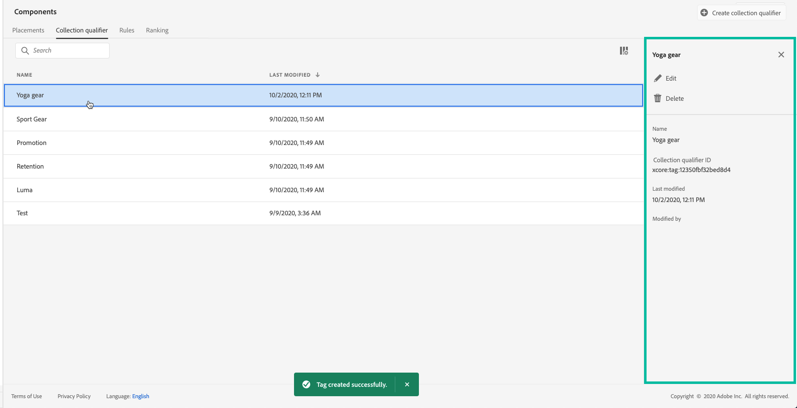

# 创建标记 {#creating-tags}

将标记关联到优惠可以更轻松地保持标记有序。 例如，您可以用“黑色星期五”标签来标记黑色星期五优惠。 然后，您可以使用优惠库中的搜索功能轻松找到带有该标签的所有优惠。

标记还可用于将优惠组合到优惠集合中。 请参阅[创建集合](../offer-library/creating-collections.md)。

 [在视频中发现此功能](#video)

可在&#x200B;**[!UICONTROL Components]**&#x200B;菜单中访问创建的标记的列表。

要创建标记，请执行以下步骤：

1. 转到&#x200B;**[!UICONTROL Tags]**&#x200B;选项卡，然后单击&#x200B;**[!UICONTROL Create tag]**。

1. 指定标记的名称，然后单击&#x200B;**[!UICONTROL Save]**。

   

1. 创建标记后，该标记会显示在列表中。 您可以选择它以显示其属性并编辑或隐藏它。

   

## 教程视频{#video}

>[!NOTE]
>
>此视频适用于在Adobe Experience Platform上构建的Offer Decisioning应用程序服务。 但是，它提供了在Journey Optimizer环境中使用优惠的通用指导。

>[!VIDEO](https://video.tv.adobe.com/v/329374?quality=12)
