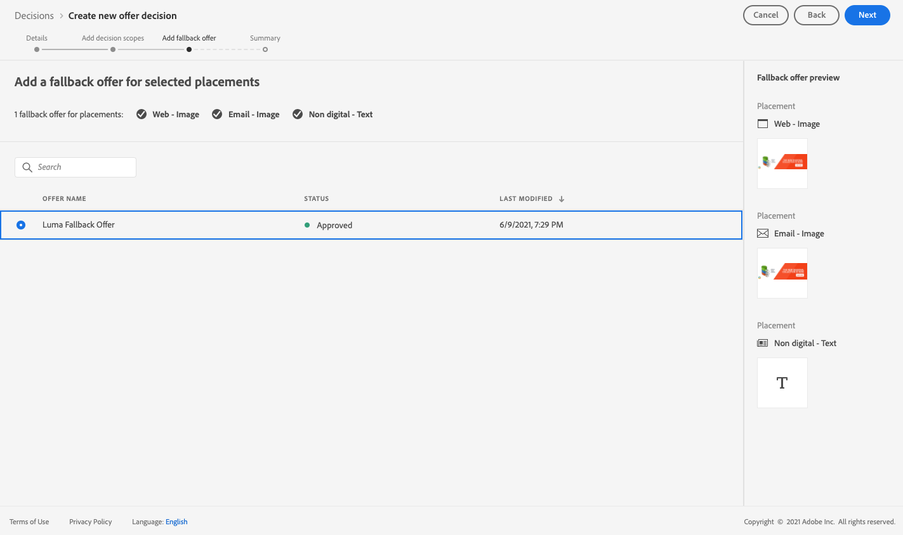
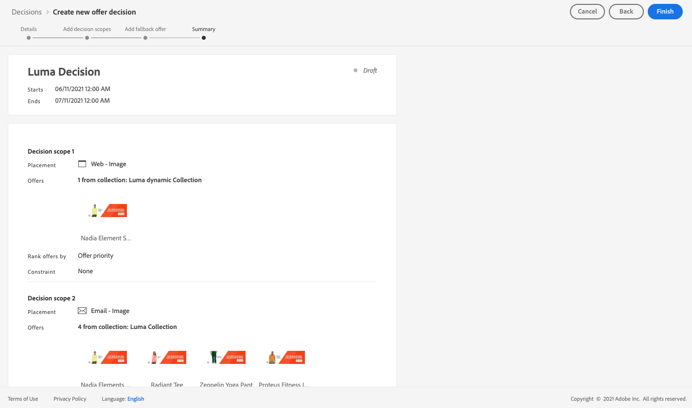

# 用例：配置个性化选件以在电子邮件{#configure-add-personalized-offers-email}中使用它们

此部分提供一个端到端示例，以展示如何根据您之前创建的决策，在电子邮件中配置和使用选件。

## 主要步骤

下面列出了配置选件、将其包含在决策中以及在电子邮件中利用此决策的关键步骤：

1. 在创建选件之前， [定义组件](#define-components)

   * 创建投放位置
   * 创建决策规则
   * 创建标记
   * 创建排名（可选）

1. [配置选件](#configure-offers)

   * 创建选件
   * 对于每个选件：

      * 创建表示法，并为每个表示法选择版面和资产
      * 为每个选件添加规则
      * 为每个选件定义优先级

1. [创建后备优惠](#create-fallback)

1. [创建收](#create-collection) 藏集以包含您创建的个性化选件

1. [配置决策](#configure-decision)

   * 创建决策
   * 选择您创建的版面
   * 对于每个版面，选择收藏集
   * 对于每个版面，选择一个排名（可选）
   * 选择回退

1. [在电子邮件中插入决策](#insert-decision-in-email)

   * 选择与您要显示的选件匹配的版面
   * 从与所选版面兼容的项目中选择决策
   * 预览选件

在电子邮件中使用选件的整个决策管理过程可描述如下：

## 定义组件{#define-components}

在开始创建选件之前，您必须定义要在选件中使用的多个组件。

您将在&#x200B;**[!UICONTROL Decision Management]** > **[!UICONTROL Components menu]**&#x200B;下找到它们。

1. 首先，为选件创建&#x200B;**投放**。

   在定义选件决策时，您将使用这些版面来定义将显示结果选件的位置。

   在此示例中，使用以下渠道和内容类型创建三个版面：

   * *Web — 图像*
   * *电子邮件 — 图像*
   * *非数字 — 文本*

   

   有关创建版面的详细步骤，请参见[此部分](../../using/offers/offer-library/creating-placements.md)。

1. 创建&#x200B;**决策规则**。

   决策规则将为Adobe Experience Platform中的用户档案提供最佳选件。

   使用&#x200B;**[!UICONTROL XDM Individual Profile > Person > Gender]**&#x200B;属性配置两个简单规则：

   * *女性客户*
   * *男性客户*

   

   有关创建规则的详细步骤，请参见[此部分](../../using/offers/offer-library/creating-decision-rules.md)。

1. 您还可以创建&#x200B;**标记**。

   然后，您可以将其与选件关联，并使用此标记将您的选件分组到一个收藏集中。

   在此示例中，创建&#x200B;*Yoga*&#x200B;标记。

   

   有关创建标记的详细步骤，请参见[此部分](../../using/offers/offer-library/creating-tags.md)。

1. 如果要定义规则以确定应首先为给定版面显示哪个选件（而不是考虑选件的优先级得分），则可以创建&#x200B;**排名公式**。

   有关创建排名公式的详细步骤，请参见[此部分](../../using/offers/offer-library/create-ranking-formulas.md#create-ranking-formula)。

   >[!NOTE]
   >
   >在本例中，我们将仅使用优先级得分。 了解有关[资格规则和约束的更多信息](../../using/offers/offer-library/creating-personalized-offers.md#eligibility)。

## 配置选件{#configure-offers}

您现在可以创建和配置选件。 在此示例中，您将创建四个选件，以根据每个特定的配置文件显示这些选件。

1. 创建选件. 在[此部分](../../using/offers/offer-library/creating-personalized-offers.md#create-offer)中了解详情。

1. 在此选件中，创建三个表示法。 每个表示形式必须是您之前创建的版面和资产的组合：

   * 对应于&#x200B;*Web — 图像*&#x200B;放置的一个
   * 对应于&#x200B;*Email - Image*&#x200B;位置的
   * 对应于&#x200B;*非数字 — 文本*&#x200B;放置的一个

   >[!NOTE]
   >
   >选件可以显示在消息中的不同位置，以创建更多机会，在不同的版面环境中使用该选件。

   了解有关[此部分](../../using/offers/offer-library/creating-personalized-offers.md#representations)中表示法的更多信息。

1. 为前两个位置选择适当的图像。 为&#x200B;*非数字 — 文本*&#x200B;版面输入自定义文本。

   

1. 在&#x200B;**[!UICONTROL Offer eligiblity]**&#x200B;部分中，选择&#x200B;**[!UICONTROL By defined decision rule]**&#x200B;并拖放您选择的规则。

   

1. 填写&#x200B;**[!UICONTROL Priority]**。 在此示例中，添加&#x200B;*25*。

1. 查看选件，然后单击&#x200B;**[!UICONTROL Save and approve]**。

   

1. 在此示例中，使用相同的表示法创建另外三个选件，但资产不同。 使用不同的规则和优先级分配它们，例如：

   * 第一个选件 — 决策规则：*女性客户*，优先级：*25*
   * 第二个选件 — 决策规则：*女性客户*，优先级：*15*
   * 第三个选件 — 决策规则：*Male Customers*，优先级：*25*
   * 第四个选件 — 决策规则：*Male Customers*，优先级：*15*

   

有关创建和配置选件的详细步骤，请参见[此部分](../../using/offers/offer-library/creating-personalized-offers.md)。

## 创建后备优惠 {#create-fallback}

1. 创建后备优惠.

1. 为选件定义与相同的表示形式，并使用相应的资产（它们应与选件中使用的资产不同）。

   每个表示形式必须是您之前创建的版面和资产的组合：

   * 对应于&#x200B;*Web — 图像*&#x200B;放置的一个
   * 对应于&#x200B;*Email - Image*&#x200B;位置的
   * 对应于&#x200B;*非数字 — 文本*&#x200B;放置的一个

   

1. 查看您的备用选件，然后单击&#x200B;**[!UICONTROL Save and approve]**。

您的备用选件现已准备就绪，可供在决策中使用。

有关创建和配置备用选件的详细步骤，请参见[此部分](../../using/offers/offer-library/creating-fallback-offers.md)。

## 创建收藏集 {#create-collection}

配置决策时，您需要将个性化选件添加到收藏集中。

1. 要加快决策过程，请创建动态集合。

1. 使用&#x200B;*Yoga*&#x200B;标记选择您之前创建的四个个性化选件。

   

有关创建集合的详细步骤，请参见[此部分](../../using/offers/offer-library/creating-collections.md)。

## 配置决策{#configure-decision}

现在，您必须创建一个决策，以将版面与您刚刚创建的个性化选件和备用选件结合使用。

offer decisioning引擎将使用此组合来查找特定用户档案的最佳选件：在本例中，它将基于您分配给每个选件的优先级和决策规则。

要创建和配置选件决策，请执行以下步骤：

1. 创建决策. 在[此部分](../../using/offers/offer-activities/create-offer-activities.md#create-activity)中了解详情。

1. 选择&#x200B;*Web - Image*、*电子邮件 — Image*&#x200B;和&#x200B;*非数字 — Text*&#x200B;版面。

   

1. 对于每个版面，添加您创建的收藏集。

   

1. 如果在[构建组件](#define-components)时定义了排名，则可以将其分配给决策中的版面。 如果多个选件符合在此版面中显示的条件，则决策将使用此公式计算要先交付的选件。

   [此部分](../../using/offers/offer-activities/configure-offer-selection.md#assign-ranking-formula)中介绍了将排名公式分配给版面的详细步骤。

1. 选择您创建的备用选件。 它将显示为三个选定版面的可用备用选件。

   

1. 查看您的决定，然后单击&#x200B;**[!UICONTROL Save and approve]**。

   

您的决策现已准备就绪，可用于提供优化的个性化优惠。

有关创建和配置决策的详细步骤，请参见[此部分](../../using/offers/offer-activities/create-offer-activities.md)。

## 在电子邮件{#insert-decision-in-email}中插入决策

现在，您的决策已开始实时，您可以将其插入电子邮件。 要实现此目的，请执行以下步骤：

1. 创建电子邮件，然后打开[Email Designer](../../using/design-emails.md)以配置其内容。

1. 从左侧面板添加结构组件。

1. 添加&#x200B;**[!UICONTROL Offer decision]**&#x200B;内容组件。 了解如何在[此部分](../../using/content-components.md)中使用内容组件。

   

1. 选择模式。在右侧面板中，单击&#x200B;**[!UICONTROL Select offer decision]**&#x200B;以添加决策。

   

1. 从&#x200B;**[!UICONTROL Placements]**&#x200B;下拉列表中选择与要显示的选件对应的版面。

   在本例中，在您之前作为本示例的一部分创建的版面中，只有&#x200B;**电子邮件 — 图像**&#x200B;版面可供您在电子邮件中使用决策。 了解有关[创建版面](../../using/offers/offer-library/creating-placements.md)的更多信息。

   

1. 将显示与&#x200B;**电子邮件 — 图像**&#x200B;位置匹配的决策。 选择要在内容组件中使用的决策，然后单击&#x200B;**[!UICONTROL Add]**。

   

   >[!NOTE]
   >
   >列表中仅显示与所选版面兼容的决策。

现在，您可以看到所有个性化选件和备用选件都在Email Designer中可视化。

使用&#x200B;**[!UICONTROL Offers]**&#x200B;部分或内容组件箭头（右箭头和左箭头）浏览数据。 您还可以通过客户用户档案显示决策中所包含的不同选件。 在[此部分](../../using/deliver-personalized-offers.md#preview-offers-in-email)中了解详情。

保存更改后并发布消息后，在历程中发送消息时，您的选件即可显示到相关用户档案。

**相关主题：**

* 了解如何在[此部分](../../using/preview.md#preview-your-messages)中查看消息预览。

* 了解如何在[此部分](../../using/publish-manage-message.md)中发布消息。

* 了解[此部分](../building-journeys/journey.md)中一个或多个历程如何触发消息。

