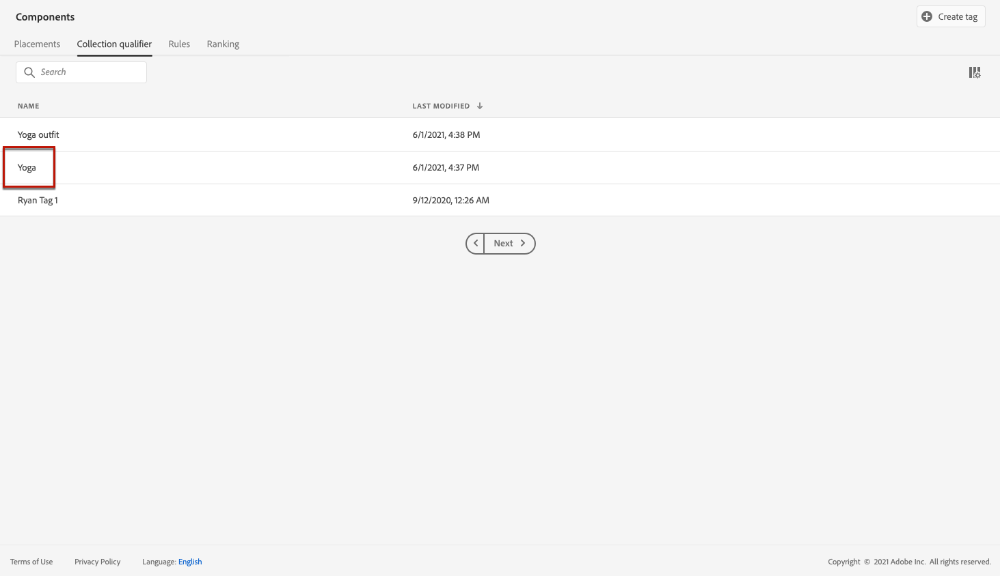

# 用例：配置个性化优惠并将其用在电子邮件中 {#configure-add-personalized-offers-email}

本节将提供一个端到端示例，说明如何根据您之前创建的决策配置优惠并在电子邮件中使用它们。

## 主要步骤 {#main-steps}

下面列出了配置优惠（在决策中包括优惠）并在电子邮件中利用此决策的关键步骤：

1. 在创建选件之前，[定义您的组件](#define-components)

   * 创建放置环境
   * 创建决策规则
   * 创建收藏集限定符（以前称为“标记”）
   * 创建排名（可选）

1. [配置优惠](#configure-offers)

   * 创建优惠
   * 对于每个选件：

      * 创建表示，并为每个表示选择版面和资产
      * 为每个选件添加规则
      * 定义每个优惠的优先级

1. [创建后备产品建议](#create-fallback)

1. [创建收藏集](#create-collection)以包含您创建的个性化优惠

1. [配置决策](#configure-decision)

   * 创建决策
   * 选择您创建的版面
   * 对于每个投放位置，选择收藏集
   * 对于每个投放位置，选择一个排名（可选）
   * 选择后备

1. [在电子邮件中插入决策](#insert-decision-in-email)

   * 选择与要显示的选件匹配的版面
   * 从与所选投放位置兼容的项目中选择决策
   * 预览优惠

在电子邮件中使用选件的整体决策管理过程可描述如下：

## 定义组件 {#define-components}

在开始创建选件之前，必须定义将在选件中使用的多个组件。

您将在&#x200B;**[!UICONTROL 决策管理]** > **[!UICONTROL 组件菜单]**&#x200B;下找到它们。

1. 首先，为您的选件创建&#x200B;**投放位置**。

   您将使用这些投放位置来定义在定义优惠决策时生成的优惠的显示位置。

   在此示例中，使用以下渠道和内容类型创建三个投放位置：

   * *Web — 图像*
   * *电子邮件 — 图像*
   * *非数字 — 文本*

   

   [此部分](../../using/offers/offer-library/creating-placements.md)中介绍了创建版面的详细步骤。

1. 创建&#x200B;**决策规则**。

   决策规则将为Adobe Experience Platform中的配置文件提供最佳优惠。

   使用&#x200B;**[!UICONTROL XDM Individual Profile > Person > Gender]**&#x200B;属性配置两个简单规则：

   * *女性客户*
   * *男性客户*

   

   [此部分](../../using/offers/offer-library/creating-decision-rules.md)中介绍了创建规则的详细步骤。

1. 您还可以创建&#x200B;**集合限定符**。

   然后，您可以将其与优惠相关联，并使用此收藏集限定符将优惠分组到一个收藏集中。

   在此示例中，创建&#x200B;*Yoga*&#x200B;集合限定符。

   

   [此部分](../../using/offers/offer-library/creating-tags.md)中介绍了创建集合限定符的详细步骤。

1. 如果要定义规则以确定在给定投放位置应首先显示哪个优惠（而不是考虑优惠的优先级分数），则可以创建&#x200B;**排名公式**。

   创建排名公式的详细步骤在[此部分](../../using/offers/ranking/create-ranking-formulas.md#create-ranking-formula)中进行了说明。

   >[!NOTE]
   >
   >在本例中，我们将仅使用优先级分数。 了解有关[资格规则和约束](../../using/offers/offer-library/creating-personalized-offers.md#eligibility)的更多信息。

## 配置优惠 {#configure-offers}

您现在可以创建并配置选件。 在此示例中，您将创建四个要根据每个特定配置文件显示的选件。

1. 创建选件。 有关详细信息，请参阅[此部分](../../using/offers/offer-library/creating-personalized-offers.md#create-offer)。

1. 在此优惠中，创建三个呈现。 每个表示都必须是您之前创建的版面和资源的组合：

   * 一个对应于&#x200B;*Web — 图像*&#x200B;位置
   * 一个对应于&#x200B;*电子邮件 — 图像*&#x200B;投放位置
   * 一个对应于&#x200B;*非数字 — 文本*&#x200B;投放位置

   >[!NOTE]
   >
   >选件可以显示在消息中的不同位置，从而创造更多机会在不同的投放位置上下文中使用选件。

   在[本节](../../using/offers/offer-library/creating-personalized-offers.md#representations)中了解有关呈现的详细信息。

1. 为前两个投放位置选择适当的图像。 为&#x200B;*非数字式 — 文本*&#x200B;位置输入自定义文本。

   

1. 在&#x200B;**[!UICONTROL 优惠资格]**&#x200B;部分中，选择&#x200B;**[!UICONTROL 根据定义的决策规则]**，然后拖放您选择的规则。

   

1. 填写&#x200B;**[!UICONTROL 优先级]**。 在此示例中，添加&#x200B;*25*。

1. 查看选件，然后单击&#x200B;**[!UICONTROL 保存并批准]**。

   

1. 在本例中，再创建三个具有相同表示但资源不同的选件。 为他们分配不同的规则和优先级，例如：

   * 第一个优惠 — 决策规则：*女性客户*，优先级：*25*
   * 第二个优惠 — 决策规则：*女性客户*，优先级：*15*
   * 第三个优惠 — 决策规则：*男性客户*，优先级：*25*
   * 第四个优惠 — 决策规则：*男性客户*，优先级：*15*

   

[此部分](../../using/offers/offer-library/creating-personalized-offers.md)中介绍了创建和配置优惠的详细步骤。

## 创建后备产品建议 {#create-fallback}

1. 创建后备优惠。

1. 定义与优惠相同的呈现方式，并赋予相应的资产（这些资产应与优惠中使用的资产不同）。

   每个表示都必须是您之前创建的版面和资源的组合：

   * 一个对应于&#x200B;*Web — 图像*&#x200B;位置
   * 一个对应于&#x200B;*电子邮件 — 图像*&#x200B;投放位置
   * 一个对应于&#x200B;*非数字 — 文本*&#x200B;投放位置

   

1. 查看您的后备优惠，然后单击&#x200B;**[!UICONTROL 保存并批准]**。

您的后备优惠现已准备就绪，可用于决策。

有关创建和配置后备优惠的详细步骤，请参见[此部分](../../using/offers/offer-library/creating-fallback-offers.md)。

## 创建收藏集 {#create-collection}

配置决策时，您需要将个性化优惠添加为收藏集的一部分。

1. 要加快决策过程，请创建动态收藏集。

1. 使用&#x200B;*瑜伽*&#x200B;收藏集限定符选择您之前创建的四个个性化优惠。

   

[此部分](../../using/offers/offer-library/creating-collections.md)中介绍了创建集合的详细步骤。

## 配置决策 {#configure-decision}

现在，您必须创建一个决策，以将投放位置与您刚刚创建的个性化优惠和备用优惠相结合。

决策引擎将使用此组合来查找特定用户档案的最佳优惠：在本例中，最佳优惠将基于您分配给每个优惠的优先级和决策规则。

要创建和配置优惠决策，请执行以下步骤：

1. 创建决策。 有关详细信息，请参阅[此部分](../../using/offers/offer-activities/create-offer-activities.md#create-activity)。

1. 选择&#x200B;*Web — 图像*、*电子邮件 — 图像*&#x200B;和&#x200B;*非数字 — 文本*&#x200B;位置。

   

1. 对于每个投放位置，添加您创建的收藏集。

   

1. 如果您在[构建组件](#define-components)时定义了排名，则可以将其分配给决策中的位置。 如果多个优惠符合在此投放位置中显示的条件，决策将使用此公式计算首先投放哪个优惠。

   [此部分](../../using/offers/offer-activities/configure-offer-selection.md#assign-ranking-formula)介绍了将排名公式分配给投放位置的详细步骤。

1. 选择您创建的后备优惠。 该选件将显示为三个选定投放位置的可用后备选件。

   

1. 查看您的决定，然后单击&#x200B;**[!UICONTROL 保存并批准]**。

   

您的决策现已准备就绪，可用于提供优化和个性化的优惠。

[此部分](../../using/offers/offer-activities/create-offer-activities.md)中介绍了创建和配置决策的详细步骤。

## 在电子邮件中插入决策 {#insert-decision-in-email}

现在，您的决策已上线，您可以将其插入到电子邮件中。 为此，请按照[此页面](../../using/email/add-offers-email.md)上详述的步骤操作。

