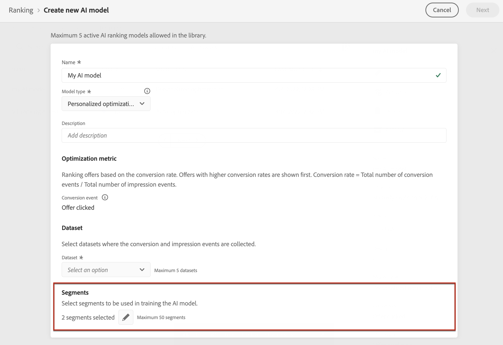

# 创建 AI 模型 {#ai-rankings}

[!DNL Journey Optimizer] 允许您创建 **AI模型** 根据您的业务目标对选件进行排名。

>[!CAUTION]
>
>要创建、编辑或删除AI模型，您必须具有 **管理排名策略** 权限。 [了解详情](../../administration/high-low-permissions.md#manage-ranking-strategies)

## 创建 AI 模型 {#create-ranking-strategy}

要创建AI模型，请执行以下步骤：

1. 在 **[!UICONTROL Components]** 菜单，访问 **[!UICONTROL Ranking]** 选项卡，然后选择 **[!UICONTROL AI models]**.

   

   迄今创建的所有AI模型都列出。

1. 单击 **[!UICONTROL Create AI model]** 按钮。

1. 为AI模型指定唯一名称和描述。

   <!--* **[!UICONTROL Auto-optimization]** optimizes offers based on past offer performance. [Learn more](auto-optimization-model.md)
    * **[!UICONTROL Personalized]** optimizes and personalizes offers based on segments and offer performance. [Learn more](personalized-optimization-model.md)-->

   

   >[!NOTE]
   >
   >的 **[!UICONTROL Optimization metric]** 部分提供有关AI模型用于计算选件排名的转化事件的信息。
   >
   >[!DNL Journey Optimizer] 根据 **转化率** （转化率=转化事件总数/展示事件总数）。 转化率使用两种类型的量度计算：
   >* **展示事件** （显示的选件）
   >* **转化事件** （通过电子邮件或web进行点击的选件）。

   >
   >这些事件是使用已提供的Web SDK或Mobile SDK自动捕获的。 在 [Adobe Experience Platform Web SDK概述](https://experienceleague.adobe.com/docs/experience-platform/edge/home.html?lang=en).

1. 选择收集转化和展示事件的数据集。 了解如何在 [此部分](#create-dataset). <!--This dataset needs to be associated with a schema that must have the **[!UICONTROL Proposition Interactions]** field group (previously known as mixin) associated with it.-->

   

   >[!CAUTION]
   >
   >仅从与 **[!UICONTROL Experience Event - Proposition Interactions]** 字段组（以前称为mixin）会显示在下拉列表中。

<!--1. If you are creating a **[!UICONTROL Personalization]** AI model, select the segment(s) to use to train the AI model.

    

    >[!NOTE]
    >
    >You can select up to 5 segments.-->

1. 保存并激活AI模型。

   
