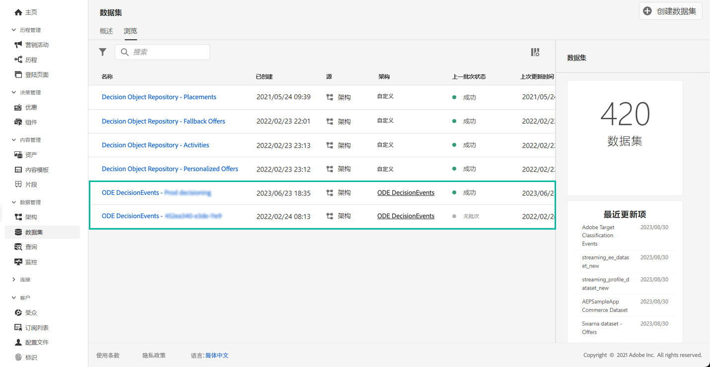

# 开始使用决策管理事件{#monitor-offer-events}

每次决策管理部门针对给定用户档案做出决策时，与这些事件相关的信息都会自动发送到Adobe Experience Platform。

因此您可以导出这些数据，然后将其导入您自己的报告系统中进行分析。您还可以将 Adobe Experience Platform [查询服务](https://experienceleague.adobe.com/docs/experience-platform/query/home.html?lang=zh-Hans)与其他工具结合使用，以增强分析和报告。

可以从Adobe Experience Platform **[!UICONTROL Datasets]**&#x200B;菜单访问包含决策管理事件的数据集。 在为每个实例进行预配时会自动创建一个数据集。

这些数据集基于&#x200B;**[!UICONTROL ODE DecisionEvents]**&#x200B;模式，该包含将信息从决策管理发送到Adobe Experience Platform所需的所有XDM字段。

>[!NOTE]
>
>请注意，ODE DecisionEvents 数据集是&#x200B;**非用户档案数据集**，这意味着它们不能被引入到 Experience Platform 中以供实时客户档案使用。

**相关主题：**

* [决策管理事件关键信息](../reports/key-information.md)
* [访问事件 XDM 字段](../reports/xdm-fields.md)
