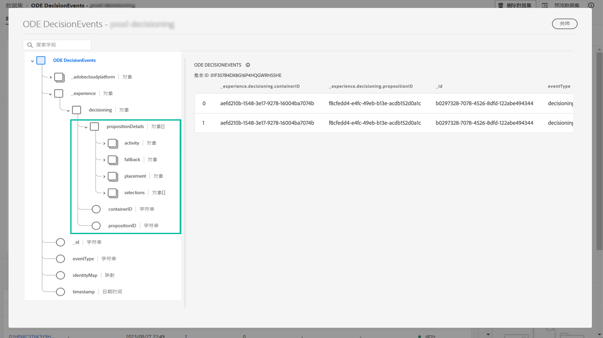
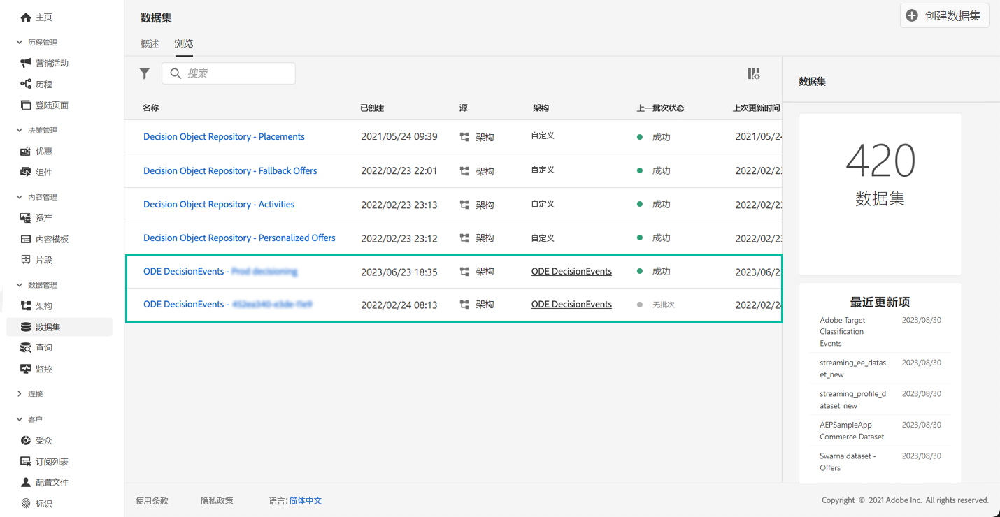

# 决策管理事件快速入门 {#monitor-offer-events}

>[!TIP]
>
>决策是 [!DNL Adobe Journey Optimizer] 的全新决策功能，现已通过基于代码的体验和电子邮件渠道提供！ [了解详情](../../experience-decisioning/gs-experience-decisioning.md)

每次使用“决策管理”为给定轮廓做出决策时，与这些事件相关的信息都会被自动发送到 Adobe Experience Platform。

这样，您就可以获得有关您的决策的洞察，例如，了解针对给定轮廓展示了哪个产品建议。 您可以将这些数据导出到自己的报告系统中进行分析，或结合利用 Adobe Experience Platform [查询服务](https://experienceleague.adobe.com/docs/experience-platform/query/home.html?lang=zh-Hans)和其他工具，以增强分析和报告功能。

## 数据集中的关键信息 {#key-information}

做出决策时发送的每个事件都包含四项关键数据点，您可以利用这些数据点进行分析和报告：

* **[!UICONTROL 后备]**：后备产品建议的名称和 ID（如果未选择个性化产品建议），
* **[!UICONTROL 放置环境]**：用于投放产品建议的放置环境的名称、ID 和渠道，
* **[!UICONTROL 选择]**：为轮廓选择的产品建议名称和 ID，
* **[!UICONTROL 活动]**：决策的名称和 ID。

此外，您还可以利用 **[!UICONTROL identityMap]** 和 **[!UICONTROL Timestamp]** 字段检索有关轮廓的信息和投放产品建议的时间。

有关随每项决策发送的所有 XDM 字段的更多信息，请参阅[此小节](xdm-fields.md)。

## 访问数据集 {#access-datasets}

可从 Adobe Experience Platform **[!UICONTROL 数据集]**&#x200B;菜单访问包含“决策管理”事件的数据集。 在为每个实例进行预配时会自动创建一个数据集。

这些数据集基于 **[!UICONTROL ODE DecisionEvents]** 架构，包含从“决策管理”向 Adobe Experience Platform 发送信息所需的所有 XDM 字段。

>[!NOTE]
>
>请注意，ODE DecisionEvents 数据集是&#x200B;**非个人资料数据集**，这意味着它们不能被引入到 Experience Platform 中以供 Real-time Customer Profile 使用。
