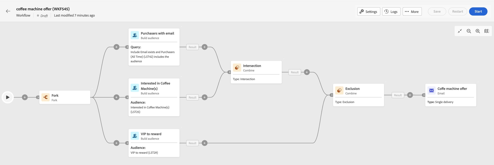

# 访问和管理编排的营销活动 {#orchestrated-campaign-creation}

>[!CONTEXTUALHELP]
>id="ajo_targeting_workflow_list"
>title="协同营销活动"
>abstract="在此屏幕中可访问协同营销活动的完整列表，查看其当前状态、上次/下次执行日期，并创建新的协同营销活动。"

+++ 目录

| 欢迎使用编排的营销活动 | 启动您的第一个编排的营销活动 | 查询数据库  | 编排的营销活动活动 |
|---|---|---|---|
| [开始使用编排的营销活动](gs-orchestrated-campaigns.md)  [配置步骤](configuration-steps.md)  <b>[访问和管理编排的营销活动](access-manage-orchestrated-campaigns.md)</b> | [创建协调营销活动的关键步骤](gs-campaign-creation.md)  [创建和配置营销活动](create-orchestrated-campaign.md)  [协调活动](orchestrate-activities.md)  [发送包含协调营销活动的消息](send-messages.md)  [开始并监视营销活动](start-monitor-campaigns.md)  [报告](reporting-campaigns.md) | [使用规则生成器](orchestrated-rule-builder.md)  [生成您的第一个查询](build-query.md)  [编辑表达式](edit-expressions.md) | [开始使用活动](activities/about-activities.md)  活动： [And-join](activities/and-join.md) - [生成受众](activities/build-audience.md) - [更改维度](activities/change-dimension.md) - [组合](activities/combine.md) - [重复数据删除](activities/deduplication.md) - [扩充](activities/enrichment.md) - [分支](activities/fork.md) - [协调](activities/reconciliation.md) - [拆分](activities/split.md) - [等待](activities/wait.md) |

{style="table-layout:fixed"}

+++

 

您可以将编排好的营销活动构建到可视画布中，以设计跨渠道流程，如分段、营销活动执行、文件处理。

## 访问编排的营销活动

在&#x200B;**[!UICONTROL 促销活动]**&#x200B;菜单中，浏览到“多步”选项卡以访问编排的促销活动的完整列表。

列表中的每个编排营销活动都显示有关其当前[状态](#status)、上次执行或修改该营销活动的时间，以及下一个计划执行日期和时间的信息。

可以通过单击列表右上角的&#x200B;**[!UICONTROL 为自定义版面配置列]**&#x200B;图标来自定义显示的列。这样，您就可以向列表中添加其他信息，例如每个编排活动出错的最后一个活动，或应用的定向维度。

此外，还可使用搜索栏和过滤器以便在列表中轻松搜索。例如，您可以筛选编排的促销活动，以仅显示属于某个促销活动的促销活动或在特定日期范围内处理的促销活动。

要复制或删除编排的营销活动，请单击省略号按钮，然后选择&#x200B;**[!UICONTROL 复制]**&#x200B;或&#x200B;**[!UICONTROL 删除]**。

>[!NOTE]
>
>当正在进行某个编排的活动时，您可以复制该活动，但无法删除它。

## 精心策划的活动包含哪些内容？ {#gs-ms-campaign-inside}

精心设计的竞选画布是预期结果的呈现。 它描述要执行的各种任务及其如何链接在一起。

{zoomable="yes"} {zoomable="yes"}

每个编排的活动都包含：

* **活动**：活动是要执行的任务。在图上用图标表示各种活动。每个活动都有特定属性和所有活动共有的其他属性。

  在编排的活动图表中，给定活动可以生成多个任务，尤其是存在循环或重复操作时。

* **过渡**：过渡将源活动链接到目标活动并定义它们的顺序。

* **工作表**：工作表包含了过渡所携带的所有信息。每个编排的活动都使用几个工作表。 这些表中传送的数据可在整个编排的促销活动生命周期中使用。

## 状态和生命周期 {#status}

营销活动可以具有多种状态：

* **[!UICONTROL 草稿]**：已创建并保存编排的营销活动。
* **[!UICONTROL 进行中]**：编排的活动当前正在运行。
* **[!UICONTROL 已完成]**：编排的活动执行已完成。
* **[!UICONTROL 已暂停]**：编排的活动已暂停。
* **[!UICONTROL 错误]**：编排的活动遇到错误。 打开编排的活动并访问日志和任务，以识别错误并加以解决。
