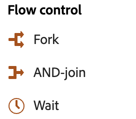

# 关于精心策划的营销活动 {#orchestrated-campaign-activities}

+++ 目录

| 欢迎使用编排的营销活动 | 启动第一个精心策划的营销活动 | 查询数据库 | 精心策划的营销活动 |
|---|---|---|---|
| [开始使用编排的营销活动](../gs-orchestrated-campaigns.md)  [配置步骤](../configuration-steps.md)  [创建编排的营销活动的关键步骤](../gs-campaign-creation.md) | [创建协调的营销活动](../create-orchestrated-campaign.md)  [协调活动](../orchestrate-activities.md)  [发送包含协调的营销活动的消息](../send-messages.md)  [开始并监视营销活动](../start-monitor-campaigns.md)  [报告](../reporting-campaigns.md) | [使用查询Modeler](../orchestrated-rule-builder.md)  [生成您的第一个查询](../build-query.md)  [编辑表达式](../edit-expressions.md) | [开始使用活动](about-activities.md)  活动： [And-join](and-join.md) - [生成受众](build-audience.md) - [更改维度](change-dimension.md) - [组合](combine.md) - [重复数据删除](deduplication.md) - [扩充](enrichment.md) - [分支](fork.md) - [协调](reconciliation.md) - [拆分](split.md) - [等待](wait.md) |

{style="table-layout:fixed"}

+++

 

编排的营销活动分为三类。 根据具体情况，可用的活动可能会有所不同。

以下各章节详细介绍了所有活动：

* [定位活动](#targeting)
* [渠道活动](#channel)
* [流量控制活动](#flow-control)

{width="80%" align="left"}

## 目标选择活动 {#targeting}

这些活动特定于定位。 利用这些活动，您可以通过定义受众并使用交集、并集或差集操作来拆分或合并这些受众，从而构建一个或多个目标。

{width="40%" align="left"}

* ：定义目标群体。 您可以选择现有受众，也可以使用查询建模器定义您自己的查询。
* [更改维度](change-dimension.md)：在构建编排的营销活动时更改定向维度。
* [合并](combine.md)：对入站群体执行分段。 您可以使用并集、交集或差集。
* [重复数据删除](deduplication.md)：删除集客活动结果中的重复项。
* [扩充](enrichment.md)：定义要在编排的营销活动中处理的附加数据。 通过此活动，您可以应用集客过渡并配置活动以使用附加数据填写输出过渡。
* [协调](reconciliation.md)：定义Journey Optimizer数据中的数据与工作表中的数据（例如从外部文件加载的数据）之间的链接。
* [拆分](split.md)：将传入的群体划分到多个子集中。

## 渠道活动 {#channel}

通过Adobe Journey Optimizer，您可以跨多个渠道自动执行营销活动。 您可以将渠道活动合并到画布中，以创建跨渠道编排的营销活动，从而根据客户行为触发操作。 以下&#x200B;**渠道**&#x200B;活动可用：电子邮件和短信。 [了解如何在编排的活动上下文中创建渠道操作](channels.md)。

## 流量控制活动 {#flow-control}

>[!CONTEXTUALHELP]
>id="ajo_orchestration_end"
>title="结束活动"
>abstract="您可以使用&#x200B;**结束**&#x200B;活动，以图形方式标记协同营销活动的结束。此活动无功能性影响，因此为可选活动。"

{width="30%" align="left"}

以下活动特定于组织和执行编排的营销活动。 这些活动的主要任务是协调其他活动：

* [And-join](and-join.md)：同步编排营销活动的多个执行分支。
* [分支](fork.md)：创建叫客过渡以同时启动多个活动。
* [等待](wait.md)：暂时暂停执行编排的营销活动的一部分。
  <!--* [Test](test.md): Enable transitions based on specified conditions.-->

>[!NOTE]
>**End**&#x200B;活动以图形方式标记编排营销活动的结尾。 此活动对功能没有影响，因此是可选的
