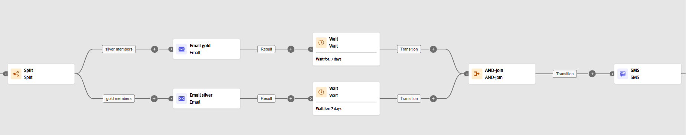

# AND-join {#join}

>[!CONTEXTUALHELP]
>id="ajo_orchestration_and-join"
>title="AND-join 活动"
>abstract="您可以使用 **And-join** 活动，同步协同营销活动的多个执行分支。一旦完成所有之前的活动，即会触发该活动。这样在继续执行协同营销活动之前，就可以确保某些活动已经完成。"

+++ 目录

| 欢迎了解精心策划的营销活动 | 启动第一个精心策划的营销活动 | 查询数据库 | 精心策划的营销活动 |
|---|---|---|---|
| [开始使用编排的营销活动](../gs-orchestrated-campaigns.md)  创建和管理关系架构和数据集：  <ul><li>[架构和数据集入门](../gs-schemas.md)</li><li>[手动架构](../manual-schema.md)</li><li>[文件上载架构](../file-upload-schema.md)</li><li>[摄取数据](../ingest-data.md)</li></ul>[访问和管理编排的营销活动](../access-manage-orchestrated-campaigns.md) | [创建精心策划的营销活动的关键步骤](../gs-campaign-creation.md)  [创建和计划营销活动](../create-orchestrated-campaign.md)  [精心策划活动](../orchestrate-activities.md)  [启动和监控营销活动](../start-monitor-campaigns.md)  [报告](../reporting-campaigns.md) | [使用规则生成器](../orchestrated-rule-builder.md)  [生成您的第一个查询](../build-query.md)  [编辑表达式](../edit-expressions.md)  [重定向](../retarget.md) | [活动快速入门](about-activities.md)  活动： <b>[并行汇聚](and-join.md)</b> - [生成受众](build-audience.md) - [更改维度](change-dimension.md) - [渠道活动](channels.md) - [合并](combine.md) - [重复数据删除](deduplication.md) - [扩充](enrichment.md) - [分叉](fork.md) - [协调](reconciliation.md) - [保存受众](save-audience.md) - [拆分](split.md) - [等待](wait.md) |

{style="table-layout:fixed"}

+++

 

>[!BEGINSHADEBOX]

 

此页面上的内容不是最终内容，可能会发生变化。

>[!ENDSHADEBOX]

**[!UICONTROL 并行汇聚]**&#x200B;活动是一种&#x200B;**[!UICONTROL 流程控制]**&#x200B;活动。您可以同步精心策划的营销活动的多个执行分支。

一旦激活所有入站过渡，换言之，一旦完成所有先行工作，此活动就会触发其所有出站过渡。这样在继续执行精心策划的营销活动之前，就可以确保某些活动已经完成。

## 配置 AND-join 活动{#and-join-configuration}

>[!CONTEXTUALHELP]
>id="ajo_orchestration_and-join_merging"
>title="合并选项"
>abstract="选择您要参加的活动。在&#x200B;**主要集合**&#x200B;下拉列表中，选择要保留的集客过渡群体。"

请按照以下步骤操作，配置&#x200B;**[!UICONTROL 并行汇聚]**&#x200B;活动：

1. 添加多项活动（例如渠道活动）以创建至少两个不同的执行分支。

1. 向任一分支插入一个&#x200B;**[!UICONTROL 并行汇聚]**&#x200B;活动。

1. 在&#x200B;**[!UICONTROL 合并选项]**&#x200B;部分下，选择要加入的所有先前活动。

1. 在&#x200B;**[!UICONTROL 主集]**&#x200B;下拉列表中，选择您要保留的入站过渡群体。

## 示例{#and-join-example}

此示例说明了两个协调的营销活动分支，每个分支均具有电子邮件投放，一个以黄金会员为目标选择，一个以白银会员为目标选择。一旦触发了两个传入的过渡，**[!UICONTROL 并行汇聚]**&#x200B;就会激活，并且仅在两个电子邮件投放完成后（延迟 7 天）才会发送短信。

{zoomable="yes"}
