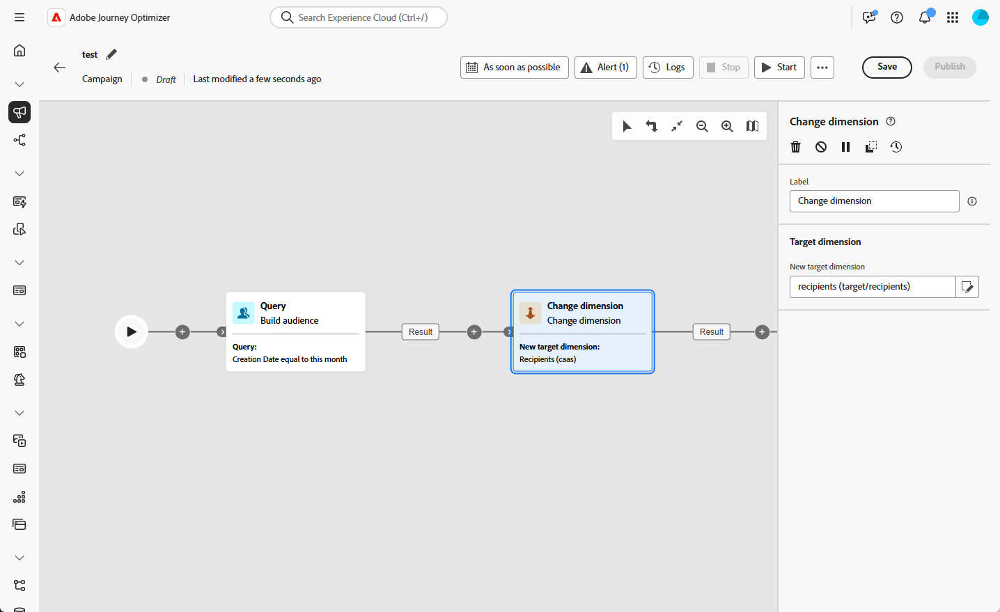

# 更改维度 {#change-dimension}

>[!BEGINSHADEBOX]

**在此页面上：**&#x200B;了解如何使用“更改”维度活动在编排的营销活动中转移定向维度，例如从愿望清单切换到与其链接的收件人。

>[!ENDSHADEBOX]

>[!CONTEXTUALHELP]
>id="ajo_orchestration_dimension_complement"
>title="生成补集"
>abstract="可使用剩余群体（已排除的重复项）生成额外的出站过渡。为此，请打开生成补集选项 为此，请打开&#x200B;**生成补集**&#x200B;选项。"

>[!CONTEXTUALHELP]
>id="ajo_orchestration_change_dimension"
>title="更改维度活动"
>abstract="通过此活动，可在生成受众时更改定位维度。 它根据数据模板和输入维度移动轴。 例如，您可以从“合同”维度切换到“客户”维度。"

作为营销人员，您可以通过在编排的营销活动中从一个数据实体转移到相关数据实体来增强受众定位。 这使您能够越过轮廓并专注于特定行为，例如购买、预订或其他交互。

要实现此目的，请使用&#x200B;**[!UICONTROL 更改维度]**&#x200B;活动。 它允许您在编排的营销活动期间调整定向维度。

>[!NOTE]
>
>对于许多&#x200B;**多实体**&#x200B;方案，显式&#x200B;**[!UICONTROL 更改维度]**&#x200B;是可选的。 当关系路径允许时，您可以将&#x200B;**[!UICONTROL 构建受众]**&#x200B;活动直接连接到渠道活动并设置&#x200B;**[!UICONTROL 每个辅助维度]**&#x200B;一个消息选项。 请参阅[添加渠道活动并定义其属性](channels.md#add)。  产品可以从链接到您的查询的可定位架构中推断出可行的主维度和&#x200B;**次维度**。 当需要在工作流中刻意切换轴时，添加&#x200B;**[!UICONTROL 更改维度]**。

<!--
>[!IMPORTANT]
>
>Please note that the **[!UICONTROL Change Dimension]** and **[!UICONTROL Change Data source]** activities should not be added in one row. If you need to use both activities consecutively, make sure you include an **[!UICONTROL Enrichement]** activity in between them. This ensures proper execution and prevents potential conflicts or errors.
-->

## 配置“更改维度”活动 {#configure}

请按照以下步骤配置&#x200B;**[!UICONTROL 更改维度]**&#x200B;活动：

1. 将&#x200B;**[!UICONTROL 更改维度]**&#x200B;活动添加到您的编排营销活动。

   

1. 定义&#x200B;**[!UICONTROL 新目标维度]**。 “更改”维度步骤使用外部联接：输入群体中的所有记录都会通过，包括新维度中没有匹配条目的记录。

   >[!IMPORTANT]
   >
   >新定向维度中没有匹配用户档案的记录将在消息投放时&#x200B;**静默排除**。 此排除项当前未反映在排除日志中。 要尽早识别不匹配的记录，请在更改维度步骤之后对过渡使用&#x200B;**预览结果**&#x200B;选项，并在继续之前验证记录计数是否符合您的预期。

## 示例 {#example}

在此用例中，主要是向在过去一个月内创建了愿望清单的轮廓发送短信。

在开始&#x200B;**[!UICONTROL 生成受众]**&#x200B;活动时，使用&#x200B;**[!UICONTROL 愿望清单]**&#x200B;目标维度识别所有相关愿望清单。

然后，添加&#x200B;**[!UICONTROL 更改维度]**&#x200B;活动以将定向维度从&#x200B;**[!UICONTROL 愿望清单]**&#x200B;切换为&#x200B;**[!UICONTROL 收件人]。** 此步骤可确保编排的营销活动定向到与这些愿望清单关联的正确用户档案，从而允许将短信发送到预期用户档案。

