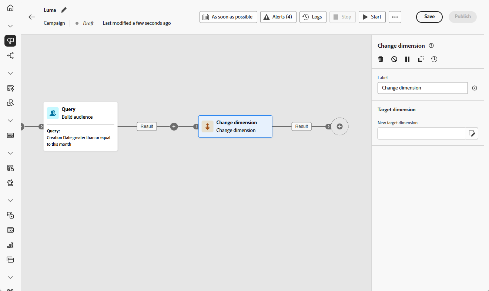

# 更改维度 {#change-dimension}

>[!CONTEXTUALHELP]
>id="ajo_orchestration_dimension_complement"
>title="生成补集"
>abstract="可使用剩余群体（已排除的重复项）生成额外的出站过渡。为此，请打开生成补集选项为此，请打开&#x200B;**生成补集**&#x200B;选项。"

>[!CONTEXTUALHELP]
>id="ajo_orchestration_change_dimension"
>title="更改维度活动"
>abstract="通过此活动，可在生成受众时更改定位维度。它根据数据模板和输入维度移动轴。例如，您可以从“合同”维度切换到“客户”维度。"

+++ 目录

| 欢迎使用编排的营销活动 | 启动您的第一个编排的营销活动 | 查询数据库  | 编排的营销活动活动 |
|---|---|---|---|
| [开始使用编排的营销活动](../gs-orchestrated-campaigns.md)  [配置步骤](../configuration-steps.md)  [创建编排的营销活动的关键步骤](../gs-campaign-creation.md) | [创建协调的营销活动](../create-orchestrated-campaign.md)  [协调活动](../orchestrate-activities.md)  [发送包含协调的营销活动的消息](../send-messages.md)  [开始并监视营销活动](../start-monitor-campaigns.md)  [报告](../reporting-campaigns.md) | [使用查询Modeler](../orchestrated-rule-builder.md)  [生成您的第一个查询](../build-query.md)  [编辑表达式](../edit-expressions.md) | [开始使用活动](about-activities.md)  活动： [And-join](and-join.md) - [生成受众](build-audience.md) - [更改维度](change-dimension.md) - [组合](combine.md) - [重复数据删除](deduplication.md) - [扩充](enrichment.md) - [分支](fork.md) - [协调](reconciliation.md) - [拆分](split.md) - [等待](wait.md) |

{style="table-layout:fixed"}

+++

 

作为营销人员，您可以通过在编排的营销活动中从一个数据实体切换到另一个链接实体来优化受众定位。 这样，您就可以从定向用户配置文件转到重点关注特定操作，例如购买、预订或其他交互。

为此，请使用&#x200B;**[!UICONTROL 更改维度]**&#x200B;活动。 它允许您根据数据模型的结构和输入维度，在编排的营销活动中更改定向维度。

例如，您可以将定向维度从&#x200B;**个人资料**&#x200B;移至&#x200B;**合同**，以便直接将消息发送给与您所选受众关联的合同所有者。

<!--
>[!IMPORTANT]
>
>Please note that the **[!UICONTROL Change Dimension]** and **[!UICONTROL Change Data source]** activities should not be added in one row. If you need to use both activities consecutively, make sure you include an **[!UICONTROL Enrichement]** activity in between them. This ensures proper execution and prevents potential conflicts or errors.-->

## 配置更改维度活动 {#configure}

按照以下步骤配置&#x200B;**更改维度**&#x200B;活动：

1. 将&#x200B;**更改维度**&#x200B;活动添加到您的编排的营销活动中。

   

1. 定义&#x200B;**新目标维度**。 在维度更改期间，将保留所有记录。

1. 执行编排的活动以查看结果。 比较更改维度活动之前和之后表中的数据，并比较编排的活动表的结构。

## 示例 {#example}

此用例包括向在上个月创建愿望清单的用户档案发送短信。

使用&#x200B;**愿望清单**&#x200B;定向维度选择所有相关愿望清单，从&#x200B;**[!UICONTROL 构建受众]**&#x200B;活动开始。

接下来，插入&#x200B;**[!UICONTROL 更改维度]**&#x200B;活动以将定向维度从&#x200B;**愿望清单**&#x200B;切换到&#x200B;**收件人**。 这样，编排的营销活动就可以向与这些愿望清单相关联的用户档案发送短信。

