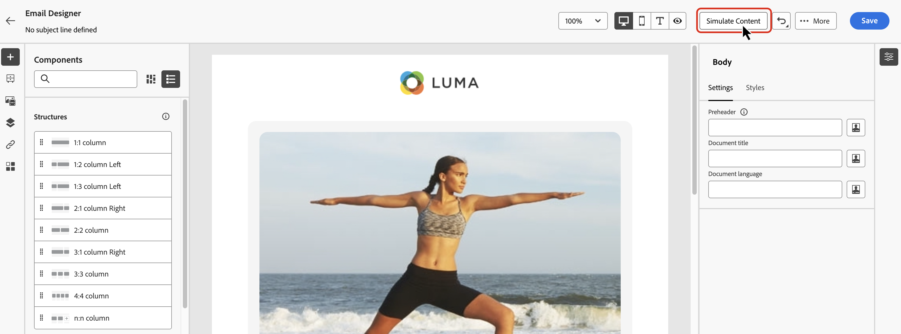

# 渠道活动 {#channel}

>[!CONTEXTUALHELP]
>id="ajo_orchestration_email"
>title="电子邮件活动"
>abstract="通过电子邮件活动，您可以在编排的营销活动中发送一次性消息和定期消息的电子邮件。 它可用于自动向同一个精心编排的营销活动中计算得出的目标受众发送电子邮件。您可以将渠道活动合并到多步骤营销活动画布中，创建可根据客户行为和数据触发操作的跨渠道营销活动。"

>[!CONTEXTUALHELP]
>id="ajo_orchestration_sms"
>title="短信活动"
>abstract="利用短信活动，您可以在编排的活动中发送一次性消息和定期消息的短信。 它用于自动向同一个精心编排的营销活动中计算得出的目标受众发送短信。您可以在多步骤营销活动画布中组合各类渠道活动，构建跨渠道营销活动，以根据客户行为和数据触发相应操作。"

>[!CONTEXTUALHELP]
>id="ajo_orchestration_push"
>title="推送活动"
>abstract="推送活动可让您在编排的活动中发送推送通知。 它允许同时交付一次性活动和循环编排活动，从而在同一编排活动中自动向预定义目标发送推送通知。 您可以在营销活动画布中组合各类渠道活动，构建跨渠道营销活动，以根据客户行为和数据触发相应操作。"

<!--
UNUSED IDs in BJ

>[!CONTEXTUALHELP]
>id="ajo_orchestration_push_ios"
>title="Push iOS activity"
>abstract="The Push iOS activity lets you send iOS Push notifications as part of your Orchestrated campaign. It enables the delivery of both one-time and recurring Orchestrated campaigns, automating the sending of iOS Push notifications to a predefined target within the same workflow. You can combine channel activities into the campaign canvas to create cross-channel campaigns that can trigger actions based on customer behavior and data."

>[!CONTEXTUALHELP]
>id="ajo_orchestration_push_android"
>title="Push Android activity"
>abstract="The Push Android activity lets you send Android Push notifications as part of your Orchestrated campaign. It enables the delivery of both one-time and recurring messages, automating the sending of Android Push notifications to a predefined target within the same Orchestrated campaign. You can combine channel activities into the Orchestrated campaign canvas to create cross-channel campaigns that can trigger actions based on customer behavior and data."

-->

>[!CONTEXTUALHELP]
>id="ajo_orchestration_directmail"
>title="直邮活动"
>abstract="直邮活动可在您的编排营销活动中以直邮方式发送消息，支持一次性发送和定期发送。它用于自动生成直邮服务商所需的提取文件，从而实现直邮流程的自动化。您可以在编排营销活动画布中组合各类渠道活动，构建跨渠道营销活动，以根据客户行为和数据触发相应操作。"

[!DNL Adobe Journey Optimizer] 允许您跨电子邮件、短信或推送通知等渠道自动化和执行营销活动。您可以将这些渠道活动合并到活动画布中，以创建跨渠道编排的活动。 这些营销活动可根据客户行为和数据触发操作。

例如：

* 通过电子邮件、短信和推送发送系列欢迎内容。
* 在购买后发送跟进电子邮件。
* 通过短信发送个性化的生日问候。

通过使用渠道活动，您可以创建全面、个性化的营销活动，通过多个接触点吸引客户并推动转化。

>[!CAUTION]
>
>编排的营销活动仅支持短信、推送和电子邮件渠道。

## 添加渠道活动并定义其属性 {#add}

>[!PREREQUISITES]
>
>在添加渠道活动之前，请使用[构建受众](build-audience.md)或[读取受众](read-audience.md)活动定义目标受众。

1. 将渠道活动添加到画布中。可用的渠道活动包括&#x200B;**[!UICONTROL 电子邮件]**、**[!UICONTROL 短信]**&#x200B;和&#x200B;**[!UICONTROL 推送]**。

   

1. 选择活动并单击&#x200B;**[!UICONTROL 编辑电子邮件]**、**[!UICONTROL 编辑短信]**&#x200B;或&#x200B;**[!UICONTROL 编辑推送]**（具体取决于所选的渠道）。

   

1. 在&#x200B;**[!UICONTROL 属性]**&#x200B;选项卡中，输入描述，然后切换到&#x200B;**[!UICONTROL 操作]**&#x200B;选项卡以配置活动。

## 设置渠道配置和设置 {#configuration}

使用&#x200B;**[!UICONTROL 操作]**&#x200B;选项卡为您的消息选择渠道配置并配置其他设置，如跟踪、内容试验或多语言内容。

1. **选择渠道配置**

   配置由[系统管理员](../../start/path/administrator.md)定义。它包含用于发送消息的所有技术参数，如标头参数、子域、移动应用程序等。[了解如何设置渠道配置](../../configuration/channel-surfaces.md)。

   

1. **应用上限规则**

   在&#x200B;**[!UICONTROL 规则集]**&#x200B;下拉列表中，选择一个渠道规则集以将上限规则应用于营销活动。 利用渠道规则集，可设置按通信类型划分的频率封顶，以防止消息类似的客户超载。 [了解如何使用规则集](../../conflict-prioritization/rule-sets.md)

1. **跟踪参与情况**（电子邮件和短信）

   使用&#x200B;**[!UICONTROL 操作跟踪]**&#x200B;部分，跟踪收件人对电子邮件或短信投放的反应。执行营销活动后，即可从营销活动报告获取跟踪结果。[了解关于营销活动报告的更多信息](../../reports/campaign-global-report-cja.md)

1. **启用快速传递模式** （推送）

   快速投放模式是一个 [!DNL Journey Optimizer] 附加组件，允许通过营销活动以非常快的速度发送大量推送消息。当消息投放中的延迟对业务至关重要时，可使用快速投放。 例如，您希望在手机上发送紧急推送通知，例如向安装了您新闻频道应用程序的用户发送突发新闻。 了解如何在此页面[上为推送通知](../../push/create-push.md#rapid-delivery)启用快速传递模式。

   有关使用快速投放模式时的性能的详细信息，请参阅 [Adobe Journey Optimizer 产品说明](https://helpx.adobe.com/cn/legal/product-descriptions/adobe-journey-optimizer.html){target="_blank"}。

1. **创建内容试验**

   使用&#x200B;**[!UICONTROL 内容试验]**&#x200B;部分，您可以定义多种投放处理方式，以衡量哪种方式最适合您的目标受众。单击&#x200B;**[!UICONTROL 创建试验]**&#x200B;按钮，然后按照本节中详述的步骤操作：[创建内容试验](../../content-management/content-experiment.md)。

1. **添加多语言内容**

   使用&#x200B;**[!UICONTROL 语言]**&#x200B;部分，在营销活动中创建多种语言内容。要进行此操作，请单击&#x200B;**[!UICONTROL 添加语言]**&#x200B;按钮，然后选择所需的&#x200B;**[!UICONTROL 语言设置]**。有关如何设置和使用多语言功能的详细信息，请参阅此部分：[多语言内容快速入门](../../content-management/multilingual-gs.md)

   

配置渠道活动后，选择&#x200B;**[!UICONTROL 内容]**&#x200B;选项卡以定义其内容。

## 定义内容 {#content}

切换到&#x200B;**[!UICONTROL 内容]**&#x200B;选项卡，创建您的消息。流程步骤因所选渠道而异。 在以下页面中了解创建消息内容的详细步骤。

<table style="table-layout:fixed"><tr style="border: 0; text-align: center;" >
<td> <a href="../../email/create-email.md"><strong>创建电子邮件</strong></a></td>
<td> <a href="../../sms/create-sms.md"><strong>创建短信</strong></a></td>
<td><a href="../../push/create-push.md"><strong>创建推送通知</strong></a></td>
</tr></table>

## 添加个性化

编排的营销活动中的Personalization的工作方式与其他&#x200B;**[!UICONTROL Journey Optimizer]**&#x200B;营销活动或历程类似。 但是，有一些特定于编排画布的关键差异。

从编排的营销活动访问个性化编辑器时，有两个主文件夹包含可用于个性化的属性，如下所述。

* **[!UICONTROL 轮廓属性]**

  此文件夹包含来自[!DNL Adobe Experience Platform]的所有配置文件相关数据。 这些是标准属性，例如名称、电子邮件地址、位置或用户配置文件中捕获的任何其他特征。

* **[!UICONTROL Target属性]** （特定于编排的营销活动）

  此文件夹对于编排的营销活动是唯一的。 它包含直接在营销活动画布中计算的属性。 它包含两个子文件夹：

   * **`<Targeting dimension>`**（例如，“收件人”、“购买”）：包含与活动所针对的维度相关的所有属性。

   * **`Enrichment`**：包含通过画布中的&#x200B;**[!UICONTROL 扩充]**&#x200B;活动添加的数据。 这样，您就可以根据外部数据集或在编排过程中合并的其他逻辑来个性化消息。 [了解如何使用扩充活动](../activities/enrichment.md)

有关如何使用个性化编辑器的详细概述，请参阅[个性化入门](../../personalization/personalize.md)

## 检查并测试您的内容

创建内容后，使用&#x200B;**[!UICONTROL 模拟内容]**&#x200B;按钮预览和测试内容，此时会用到测试轮廓或通过 CSV/JSON 文件上传或手动添加的样本输入数据。[了解详情](../../content-management/preview-test.md)

## 后续步骤 {#next}

消息内容就绪后，使用&#x200B;**[!UICONTROL 返回]**&#x200B;箭头返回您的编排营销活动。 然后，您可以在画布中完成活动编排，并发布营销活动以开始发送消息。[了解如何启动和监控编排的营销活动](../start-monitor-campaigns.md)

<!--
## Examples {#cross-channel-workflow-sample}

Here is a cross-channel Orchestrated campaign example with a segmentation and two deliveries. The Orchestrated campaign targets all customers who live in Paris and who are interested in coffee machines. Among this population, an email is sent to the regular customers and an SMS is sent to the VIP clients.

<!--
description, which use case you can perform (common other activities that you can link before of after the activity)

how to add and configure the activity

example of a configured activity within a workflow
The Email delivery activity allows you to configure the sending an email in a workflow. 

-->

<!--You can also create a recurring Orchestrated campaign to send a personalized SMS every first day of the month at 8 PM to all customers living in Paris.

-->

<!-- Scheduled emails available?

This can be a single send email and sent just once, or it can be a recurring email.
* Single send emails are standard emails, sent once.
* Recurring emails allow you to send the same email multiple times to different targets over a defined period. You can aggregate the deliveries per period in order to get reports that correspond to your needs.

When linked to a scheduler, you can define recurring emails.
Email recipients are defined upstream of the activity in the same workflow, via an Audience targeting activity.

-->

<!--The message preparation is triggered according to the workflow execution parameters. From the message dashboard, you can select whether to request or not a manual confirmation to send the message (required by default). You can start the workflow manually or place a scheduler activity in the workflow to automate execution.-->

