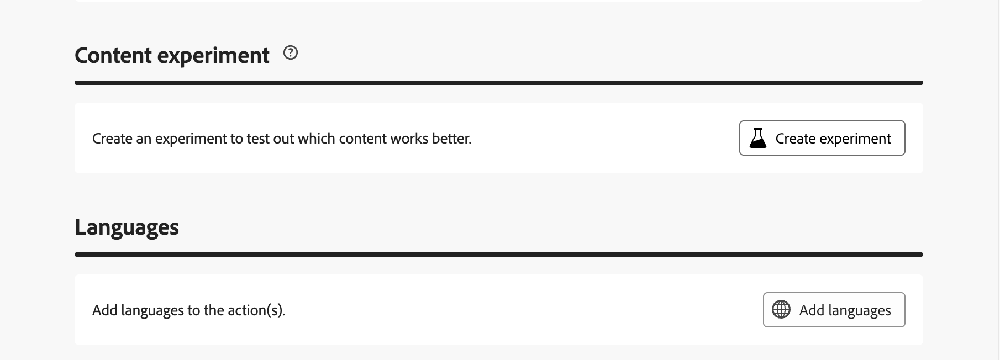

# 渠道活动 {#channel}

>[!CONTEXTUALHELP]
>id="ajo_orchestration_email"
>title="电子邮件活动"
>abstract="通过电子邮件活动，您可以在编排的活动中发送一次性消息和定期消息的电子邮件。 它有助于自动执行向在同一编排的营销活动中算出的目标发送电子邮件的过程。 您可以将渠道活动合并到多步骤营销活动画布中，创建可根据客户行为和数据触发操作的跨渠道营销活动。"

>[!CONTEXTUALHELP]
>id="ajo_orchestration_sms"
>title="短信活动"
>abstract="利用短信活动，您可以在编排的活动中发送一次性消息和定期消息的短信。 它有助于自动执行向在同一编排的营销活动中算出的目标发送短信的过程。 您可以将渠道活动合并到多步骤营销活动画布中，创建可根据客户行为和数据触发操作的跨渠道营销活动。"

>[!CONTEXTUALHELP]
>id="ajo_orchestration_push"
>title="推送活动"
>abstract="推送活动可让您在编排的活动中发送推送通知。 它允许同时交付一次性活动和定期编排的活动，在同一编排的活动中，自动向预定义目标发送推送通知。 您可以将渠道活动合并到活动画布中，以创建跨渠道活动，从而根据客户行为和数据触发操作。"

<!--
UNUSED IDs in BJ

>[!CONTEXTUALHELP]
>id="ajo_orchestration_push_ios"
>title="Push iOS activity"
>abstract="The Push iOS activity let you send iOS Push notifications as part of your orchestrated campaign. It enables the delivery of both one-time and recurring orchestrated campaigns, automating the sending iOS Push notifications to a predefined target within the same workflow. You can combine channel activities into the campaign canvas to create cross-channel campaigns that can trigger actions based on customer behavior and data."

>[!CONTEXTUALHELP]
>id="ajo_orchestration_push_android"
>title="Push Android activity"
>abstract="The Push Android activity ket you send Android Push notifications as part of your orchestrated campaign. It enables the delivery of both one-time and recurring messages, automating the sending Android Push notifications to a predefined target within the same orchestrated campaign. You can combine channel activities into the orchestrated campaign canvas to create cross-channel campaigns that can trigger actions based on customer behavior and data."

-->

>[!CONTEXTUALHELP]
>id="ajo_orchestration_directmail"
>title="直邮活动"
>abstract="直邮活动有助于在编排的活动中发送一次性消息和定期消息的直邮。 它可用于自动生成直邮提供商所需的提取文件。您可以将渠道活动合并到编排的活动画布中，以创建跨渠道活动，从而根据客户行为和数据触发操作。"

+++ 目录

| 欢迎使用编排的营销活动 | 启动第一个精心策划的营销活动 | 查询数据库 | 精心策划的营销活动 |
|---|---|---|---|
| [开始使用编排的营销活动](../gs-orchestrated-campaigns.md)  [配置步骤](../configuration-steps.md)  [创建编排的营销活动的关键步骤](../gs-campaign-creation.md) | [创建编排的营销活动](../create-orchestrated-campaign.md)  [编排活动](../orchestrate-activities.md)   [启动并监视营销活动](../start-monitor-campaigns.md)  [报告](../reporting-campaigns.md) | [使用查询Modeler](../orchestrated-rule-builder.md)  [生成您的第一个查询](../build-query.md)  [编辑表达式](../edit-expressions.md) | [开始使用活动](about-activities.md)  活动： [并加入](and-join.md) - [生成受众](build-audience.md) - [更改维度](change-dimension.md) - **[渠道活动](channels.md)** - [组合](combine.md) - [重复数据删除](deduplication.md) - [扩充](enrichment.md) - [分支](fork.md) - [协调](reconciliation.md) - [拆分](split.md) - [等待](wait.md) |

{style="table-layout:fixed"}

+++

 

[!DNL Adobe Journey Optimizer]允许您跨渠道自动执行营销活动。 您可以将渠道活动合并到编排的活动画布中，以创建跨渠道编排的活动，从而根据客户行为和数据触发操作。

例如，您可以创建一个欢迎电子邮件活动，其中包含跨不同渠道（例如电子邮件、短信或推送消息）的一系列消息。您还可以在客户完成购买后发送跟进电子邮件，或者通过短信向客户发送个性化的生日消息。

通过使用渠道活动，您可以创建全面的个性化营销活动，在多个接触点吸引客户并促进转化。 支持的渠道包括电子邮件、短信和推送。

>[!PREREQUISITES]
>
>添加渠道活动之前，必须定义受众。 受众是投放的主要目标：接收消息的用户档案。 [了解如何使用生成受众活动](build-audience.md)

要在编排的活动上下文中设置投放，请执行以下步骤。

## 添加渠道活动并定义其属性 {#add}

1. 将渠道活动添加到画布中。 可用的渠道活动包括&#x200B;**[!UICONTROL 电子邮件]**、**[!UICONTROL 短信]**&#x200B;和&#x200B;**[!UICONTROL 推送]**。

   

1. 选择添加的活动，然后单击&#x200B;**[!UICONTROL 编辑电子邮件]**、**[!UICONTROL 编辑短信]**&#x200B;或&#x200B;**[!UICONTROL 编辑推送]**&#x200B;按钮（具体取决于所选的渠道）。

   

1. 在&#x200B;**[!UICONTROL 属性]**&#x200B;选项卡中，输入营销活动的描述，然后转到&#x200B;**[!UICONTROL 操作]**&#x200B;选项卡配置该活动。

## 设置渠道配置和设置 {#configuration}

使用&#x200B;**[!UICONTROL 操作]**&#x200B;选项卡为您的消息选择渠道配置并配置其他设置，如跟踪、内容实验或多语言内容。

1. 选择用于消息的渠道配置。

   配置由[系统管理员](../../start/path/administrator.md)定义。 它包含用于发送消息的所有技术参数，如标头参数、子域、移动应用程序等。[了解如何设置渠道配置](../../configuration/channel-surfaces.md)。

   显示“操作”部分的

1. 对于电子邮件和短信，请使用&#x200B;**[!UICONTROL 操作跟踪]**&#x200B;部分中的选项来跟踪收件人对电子邮件或短信投放的反应。 执行营销活动后，即可从营销活动报表访问跟踪结果。 [了解有关营销活动报告的更多信息](../../reports/campaign-global-report-cja.md)

1. 对于推送通知，请使用&#x200B;**[!UICONTROL 快速传递模式]**&#x200B;选项在推送渠道上向3000万以下的受众规模进行高速消息发送。

   快速传递模式是一个[!DNL Journey Optimizer]加载项，允许通过营销活动以非常快的速度发送大量推送消息。 当消息投放延迟对业务至关重要，并且您想要在手机上发送紧急推送警报（例如，向已安装您的新闻频道应用程序的用户发送突发新闻）时，可使用快速投放。 有关使用快速传递模式时性能的详细信息，请参阅[Adobe Journey Optimizer产品说明](https://helpx.adobe.com/cn/legal/product-descriptions/adobe-journey-optimizer.html)。

1. 使用&#x200B;**[!UICONTROL 内容试验]**&#x200B;部分定义多种传递处理，以衡量哪种传递处理对目标受众的效果最佳。 单击&#x200B;**[!UICONTROL 创建试验]**&#x200B;按钮，然后按照本节中详述的步骤操作：[创建内容试验](../../content-management/content-experiment.md)。

   

1. 使用&#x200B;**[!UICONTROL 语言]**&#x200B;部分在营销策划中创建多种语言的内容。 为此，请单击&#x200B;**[!UICONTROL 添加语言]**&#x200B;按钮，然后选择所需的&#x200B;**[!UICONTROL 语言设置]**。 有关如何设置和使用多语言功能的详细信息，请参阅此部分： [开始使用多语言内容](../../content-management/multilingual-gs.md)

配置渠道活动后，选择&#x200B;**[!UICONTROL 内容]**&#x200B;选项卡以定义其内容。

## 定义内容 {#content}

使用&#x200B;**[!UICONTROL Content]**&#x200B;选项卡定义消息的内容。 内容创建过程取决于所选的渠道。 在以下页面中了解创建消息内容的详细步骤。

<table style="table-layout:fixed"><tr style="border: 0; text-align: center;" >
<td> <a href="../../email/create-email.md"><strong>电子邮件</strong></a></td>
<td> <a href="../../sms/create-sms.md"><strong>短信</strong></a></td>
<td><a href="../../push/create-push.md"><strong>推送通知</strong></a></td>
</tr></table>

定义内容后，使用&#x200B;**[!UICONTROL 模拟内容]**&#x200B;按钮，使用从CSV/JSON文件上传或手动添加的测试配置文件或示例输入数据预览和测试内容。 [了解详情](../../content-management/preview-test.md)

## 后续步骤 {#next}

消息内容就绪后，使用&#x200B;**[!UICONTROL 返回]**&#x200B;箭头返回您精心安排的营销活动。

您现在可以在画布中完成活动编排，并发布活动以开始发送消息。 [了解如何启动和监控编排的营销活动](../start-monitor-campaigns.md)

显示“返回”按钮的

<!--
## Examples {#cross-channel-workflow-sample}

Here is a cross-channel orchestrated campaign example with a segmentation and two deliveries. The orchestrated campaign targets all customers who live in Paris and who are interested in coffee machines. Among this population, an email is sent to the regular customers and an SMS is sent to the VIP clients.

<!--
description, which use case you can perform (common other activities that you can link before of after the activity)

how to add and configure the activity

example of a configured activity within a workflow
The Email delivery activity allows you to configure the sending an email in a workflow. 

-->

<!--You can also create a recurring orchestrated campaign to send a personalized SMS every first day of the month at 8 PM to all customers living in Paris.

-->

<!-- Scheduled emails available?

This can be a single send email and sent just once, or it can be a recurring email.
* Single send emails are standard emails, sent once.
* Recurring emails allow you to send the same email multiple times to different targets over a defined period. You can aggregate the deliveries per period in order to get reports that correspond to your needs.

When linked to a scheduler, you can define recurring emails.
Email recipients are defined upstream of the activity in the same workflow, via an Audience targeting activity.

-->

<!--The message preparation is triggered according to the workflow execution parameters. From the message dashboard, you can select whether to request or not a manual confirmation to send the message (required by default). You can start the workflow manually or place a scheduler activity in the workflow to automate execution.-->
