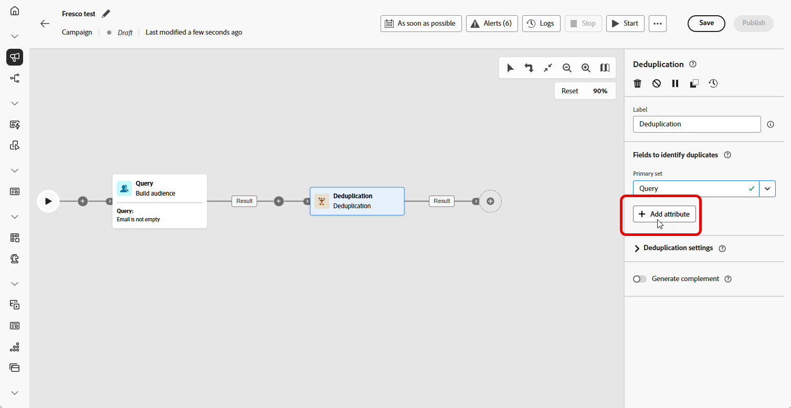

# 重复数据删除 {#deduplication}

>[!CONTEXTUALHELP]
>id="ajo_orchestration_deduplication_fields"
>title="用于识别重复项的字段"
>abstract="在&#x200B;**用于识别重复项的字段**&#x200B;部分中，单击&#x200B;**&#x200B;添加属性&#x200B;**&#x200B;按钮以指定允许将相同值视为重复的字段，如电子邮件地址、名字、姓氏等。栏位的顺序可让您指定首要处理的条件。"

>[!CONTEXTUALHELP]
>id="ajo_orchestration_deduplication"
>title="删除重复项活动"
>abstract="删除&#x200B;**重复项活动可让您删除**&#x200B;入站活动结果中的重复项。主要在定位活动之后且在允许使用目标数据的活动之前使用。"

>[!CONTEXTUALHELP]
>id="ajo_orchestration_deduplication_complement"
>title="生成补集"
>abstract="可使用剩余群体（已排除的重复项）生成额外的出站过渡。为此，请打开生成补集选项为此，请打开&#x200B;**生成补集**&#x200B;选项。"

>[!CONTEXTUALHELP]
>id="ajo_orchestration_deduplication_settings"
>title="删除重复项设置"
>abstract="要删除传入数据中的重复项，请在以下字段中定义删除重复项方法。默认情况下，只会保留一条记录。您还应该根据表达式或属性选择删除重复项模式。默认情况下，要避免重复的记录是随机选择的。"

+++ 目录

| 欢迎使用编排的营销活动 | 启动第一个精心策划的营销活动 | 查询数据库 | 精心策划的营销活动 |
|---|---|---|---|
| [开始使用协调的营销活动](../gs-orchestrated-campaigns.md)  [配置步骤](../configuration-steps.md)  [访问和管理协调的营销活动](../access-manage-orchestrated-campaigns.md) | [创建编排营销活动的关键步骤](../gs-campaign-creation.md)  [创建和计划营销活动](../create-orchestrated-campaign.md)  [编排活动](../orchestrate-activities.md)  [启动和监控营销活动](../start-monitor-campaigns.md)  [报告](../reporting-campaigns.md) | [使用规则生成器](../orchestrated-rule-builder.md)  [生成您的第一个查询](../build-query.md)  [编辑表达式](../edit-expressions.md)  [重新定位](../retarget.md) | [开始使用活动](about-activities.md)  活动： [并加入](and-join.md) - [生成受众](build-audience.md) - [更改维度](change-dimension.md) - [渠道活动](channels.md) - [组合](combine.md) - <b>[重复数据删除](deduplication.md)</b> - [扩充](enrichment.md) - [分支](fork.md) - [协调](reconciliation.md) - [保存受众](save-audience.md) - [拆分](split.md) - [等待](wait.md) |

{style="table-layout:fixed"}

+++

 

**[!UICONTROL 重复数据删除]**&#x200B;活动是&#x200B;**[!UICONTROL 定位]**&#x200B;活动。 利用此活动，可删除集客活动结果中的重复项，例如收件人列表中重复的用户档案。 **[!UICONTROL 重复数据删除]**&#x200B;活动通常用在定向活动之后，以及允许使用定向数据的活动之前。

## 配置重复数据删除活动{#deduplication-configuration}

按照以下步骤配置&#x200B;**[!UICONTROL 重复数据删除]**&#x200B;活动：

1. 将&#x200B;**[!UICONTROL 重复数据删除]**&#x200B;活动添加到您的编排营销活动中。

1. 在&#x200B;**[!UICONTROL 用于识别重复项的字段]**&#x200B;部分中，单击&#x200B;**[!UICONTROL &#x200B;添加属性&#x200B;]**&#x200B;按钮以指定允许将相同值视为重复的字段，如电子邮件地址、名字、姓氏等。栏位的顺序可让您指定首要处理的条件。

   

1. 在&#x200B;**[!UICONTROL 重复数据删除设置]**&#x200B;部分中，使用“要保留的重复项”字段选择要保留的唯一记录数。 默认值为1，该值会为每个重复组保留一个记录。 将其设置为0可保留所有重复项。

   例如，如果记录A和B是Y的重复项，而记录C是Z的重复项：

   * **如果该字段的值为1**：只保留Y和Z记录。
   * **如果该字段的值为0**：保留所有记录(A、B、C、Y、Z)。
   * **如果字段的值为2**：保留C和Z，以及A、B和Y中的两个值，随机或基于您的重复数据删除方法。

1. 选择&#x200B;**[!UICONTROL 重复数据删除方法]**，这将定义系统如何决定要保留每组重复项中的哪些记录：

   * **[!UICONTROL 随机选择]**：随机选择要保留的重复项记录。
   * **[!UICONTROL 使用表达式]**：根据您定义的表达式，保留具有最高值或最低值的记录。
   * **[!UICONTROL 非空值]**：保留选定字段不为空的记录，例如，仅保留具有电话号码的用户档案。
   * **[!UICONTROL 遵循值列表]**：允许您优先处理一个或多个字段的特定值，例如，您可以优先处理“国家/地区”设置为“法国”的记录。 单击&#x200B;**[!UICONTROL 属性]**&#x200B;以选择字段或创建自定义表达式。 使用&#x200B;**[!UICONTROL 添加按钮]**&#x200B;按优先级顺序输入首选值。

   

1. 如果要利用剩余群体，请选中&#x200B;**[!UICONTROL 生成补码]**&#x200B;选项。 补充包含所有重复项。 然后，将向该活动添加其他过渡。

## 示例{#deduplication-example}

在以下示例中，使用&#x200B;**[!UICONTROL 重复数据删除]**&#x200B;活动在发送投放之前从目标受众中删除重复记录。 首先，过滤受众以仅包含具有非空电子邮件字段的用户档案。 然后，**[!UICONTROL 重复数据删除]**&#x200B;活动会使用电子邮件地址来识别和排除重复项。

