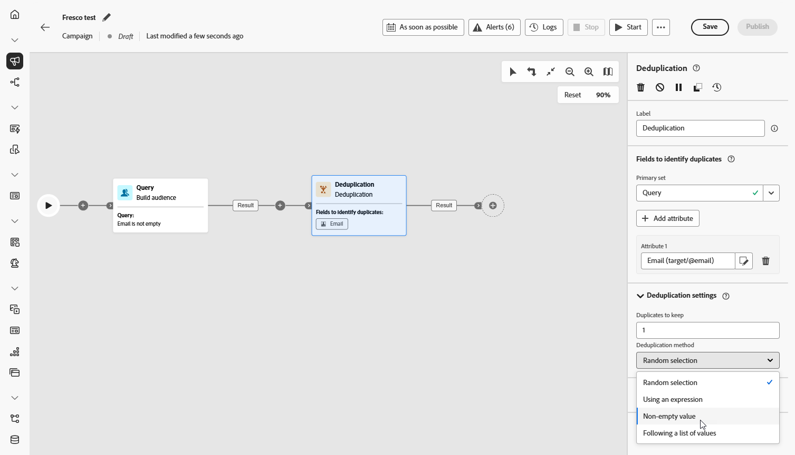
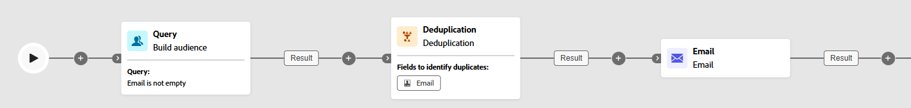

# 重复数据删除 {#deduplication}

>[!CONTEXTUALHELP]
>id="ajo_orchestration_deduplication_fields"
>title="用于识别重复项的字段"
>abstract="在&#x200B;**用于识别重复项的字段**&#x200B;部分中，单击&#x200B;**&#x200B;添加属性&#x200B;**&#x200B;按钮以指定允许将相同值视为重复的字段，如电子邮件地址、名字、姓氏等。栏位的顺序可让您指定首要处理的条件。"

>[!CONTEXTUALHELP]
>id="ajo_orchestration_deduplication"
>title="重复数据删除活动"
>abstract="**重复数据删除活动可让您删除**&#x200B;入站活动结果中的重复项。主要在定位活动之后且在允许使用目标数据的活动之前使用。"

>[!CONTEXTUALHELP]
>id="ajo_orchestration_deduplication_complement"
>title="生成补集"
>abstract="可使用剩余群体（已排除的重复项）生成额外的出站过渡。为此，请打开生成补集选项为此，请打开&#x200B;**生成补集**&#x200B;选项。"

>[!CONTEXTUALHELP]
>id="ajo_orchestration_deduplication_settings"
>title="重复数据删除设置"
>abstract="要删除传入数据中的重复项，请在以下字段中定义重复数据删除方法。默认情况下，只会保留一条记录。您还应该根据表达式或属性选择重复数据删除模式。默认情况下，要避免重复的记录是随机选择的。"

**[!UICONTROL 重复数据删除]**&#x200B;活动是一种&#x200B;**[!UICONTROL 目标选择]**&#x200B;活动。利用此活动，您可以删除入站活动结果中的重复项，例如收件人列表中重复的轮廓。通常，在目标选择活动之后且在允许使用目标数据的活动之前进行&#x200B;**[!UICONTROL 重复数据删除]**&#x200B;活动。

## 配置“重复数据删除”活动{#deduplication-configuration}

请按照以下步骤操作，配置&#x200B;**[!UICONTROL 重复数据删除]**&#x200B;活动：

1. 将&#x200B;**[!UICONTROL 重复数据删除]**&#x200B;活动添加到您的编排营销活动。

1. 在&#x200B;**[!UICONTROL 用于识别重复项的字段]**&#x200B;部分中，单击&#x200B;**[!UICONTROL &#x200B;添加属性&#x200B;]**&#x200B;按钮以指定允许将相同值视为重复的字段，如电子邮件地址、名字、姓氏等。栏位的顺序可让您指定首要处理的条件。

   

1. 在&#x200B;**[!UICONTROL 重复数据删除设置]**&#x200B;部分中，使用“要保留的重复项”字段选择要保留的唯一记录数量。默认值为 1，这会为每个重复组保留一个记录。将其设置为 0 可保留所有重复项。

   例如，如果记录 A 和 B 是记录 Y 的重复项，而记录 C 是记录 Z 的重复项：

   * **如果字段的值为 1**：只保留 Y 和 Z 记录。
   * **如果字段的值为 0**：保留所有记录（A、B、C、Y、Z）。
   * **如果字段的值为 2**：保留 C 和 Z，并随机保留或根据重复数据删除方法保留 A、B 和 Y 中的两个值。

1. 选择&#x200B;**[!UICONTROL 重复数据删除方法]**，这将定义系统如何确定保留每组重复项中的哪些记录：

   * **[!UICONTROL 随机选择]**：随机选择要保留的重复项记录。
   * **[!UICONTROL 使用表达式]**：根据您定义的表达式，保留具有最高值或最低值的记录。
   * **[!UICONTROL 非空值]**：保留所选字段不为空的记录，例如，仅保留电话号码不为空的轮廓。
   * **[!UICONTROL 遵循值列表]**：优先保留一个或多个字段的特定值，例如，您可以优先保留“国家/地区”设置为“法国”的记录。单击&#x200B;**[!UICONTROL 属性]**，选择字段或创建自定义表达式。使用&#x200B;**[!UICONTROL 添加按钮]**，按优先级顺序输入首选值。

   

1. 如果您想利用剩余群体的数据，可以选中&#x200B;**[!UICONTROL 生成补集]**&#x200B;选项。补集包含所有重复项。然后，一个额外的过渡将添加到活动中。

## 示例{#deduplication-example}

在以下示例中，使用&#x200B;**[!UICONTROL 重复数据删除]**&#x200B;活动在发送投放之前从目标受众中删除重复记录。首先，对受众进行筛选，仅包含具有非空电子邮件字段的轮廓。然后，**[!UICONTROL 重复数据删除]**&#x200B;活动使用电子邮件地址来识别和排除重复项。

