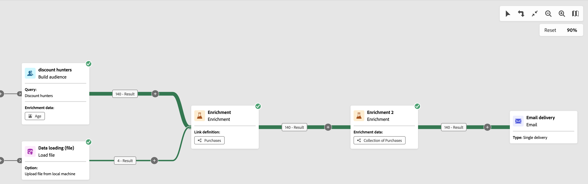
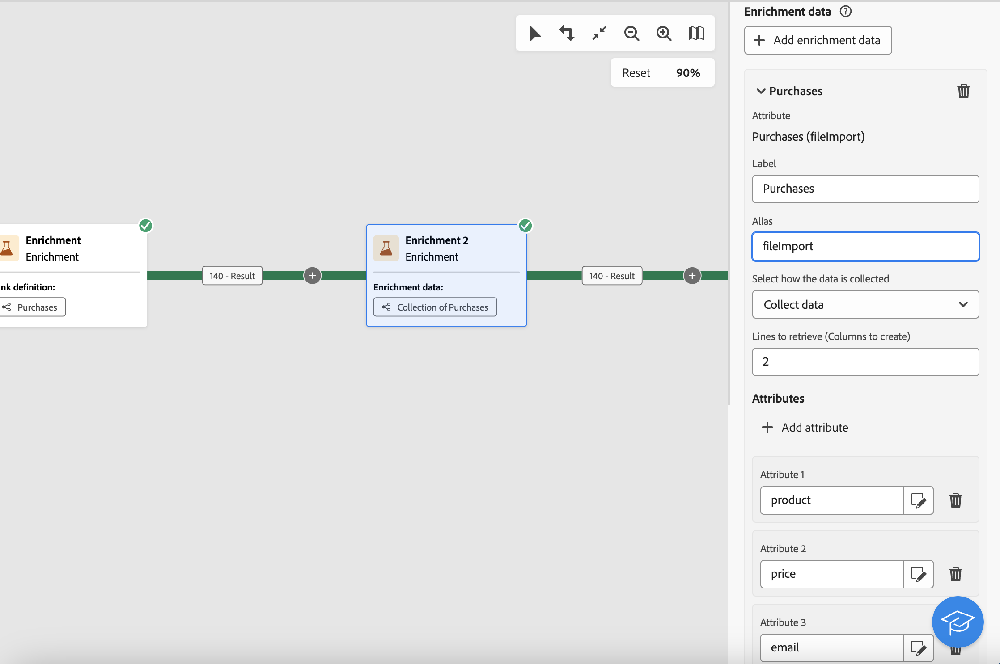
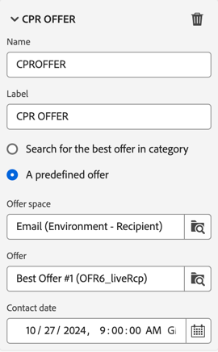

# 扩充 {#enrichment}

>[!CONTEXTUALHELP]
>id="ajo_orchestration_enrichment"
>title="扩充活动"
>abstract="通过&#x200B;**扩充**&#x200B;活动，可利用来自数据库的其他信息增强目标数据。 该活动通常在分段活动之后的营销活动中使用。"

**[!UICONTROL 扩充]**&#x200B;活动是一种&#x200B;**[!UICONTROL 目标选择]**&#x200B;活动，可以让您使用其他属性增强受众数据。

您可以利用此信息，根据行为、偏好或需求更准确地细分受众，并制作个性化消息以更好地与每个轮廓联系。

## 添加扩充活动 {#enrichment-configuration}

>[!CONTEXTUALHELP]
>id="ajo_targetdata_personalization_enrichmentdata"
>title="扩充数据"
>abstract="选择要使用哪些数据来扩充您精心编排的营销活动。 可选择两种类型的扩充数据：目标维度中的单个扩充属性或收藏集链接（即在各表之间具有 1-N 基数的链接）。"

>[!CONTEXTUALHELP]
>id="ajo_orchestration_enrichment_data"
>title="扩充活动"
>abstract="将扩充数据添加到精心编排的营销活动中后，可以在扩充活动后添加的活动中使用这些数据，以根据客户的行为、偏好和需求来将客户分成不同的组，或者创建更可能让目标受众产生共鸣的个性化营销邮件和营销活动。"

请按照以下步骤操作，配置&#x200B;**扩充**&#x200B;活动：

1. 添加&#x200B;**扩充**&#x200B;活动。

1. 单击&#x200B;**添加扩充数据**，然后选择要用于扩充数据的属性。

   您可以选择两种类型的扩充数据：定位维度中的单个扩充属性，或集合链接。 以下示例详细介绍了每种类型：

   * [单个扩充属性](#single-attribute)
   * [集合链接](#collection-link)

   

1. 单击&#x200B;**[!UICONTROL 添加链接]**&#x200B;可在工作表数据与Adobe Journey Optimizer之间创建链接。 [了解详情](#create-links)

   例如，如果您从包含客户忠诚度层和上次购买日期的文件加载数据，则需要创建指向用户档案表的链接，以便使用这些属性扩充收件人记录，并将这些数据用于个性化或定位。

   

## 在表之间创建链接 {#create-links}

>[!CONTEXTUALHELP]
>id="ajo_orchestration_enrichment_simplejoin"
>title="链接定义"
>abstract="在工作表数据和 Adobe Journey Optimizer 之间创建链接。 例如，如果您从包含收件人的帐号、国家/地区和电子邮件的文件中加载数据，则必须创建一个指向该国家/地区表的链接，以便在其轮廓中更新此信息。"

使用&#x200B;**[!UICONTROL 链接定义]**&#x200B;部分定义工作表与其他数据源之间的关系。 例如，如果导入包含客户忠诚度层和上次购买日期的文件，则可以创建指向用户档案表的链接，以便这些属性可用于个性化和定位。

要创建链接，请执行以下操作：

1. 在&#x200B;**[!UICONTROL 链接定义]**&#x200B;部分中，单击&#x200B;**[!UICONTROL 添加链接]**。

   

1. 从&#x200B;**[!UICONTROL 关系类型]**&#x200B;下拉列表中，选择主集与链接数据之间的关系类型：

   * **[!UICONTROL 1基数简单链接]**：主集中的每个记录只映射到链接数据中的一个记录。
   * **[!UICONTROL 0或1基数简单链接]**：主集中的每个记录都映射到链接数据中的零个或一个记录。
   * **[!UICONTROL N基数集合链接]**：主集中的每个记录都可以映射到链接数据中的多个记录。

   

1. 选择要将主集链接到的目标：

   * **[!UICONTROL 数据库架构]**：链接到数据库中的现有表。 从&#x200B;**[!UICONTROL 目标架构]**&#x200B;字段中选择表。
   * **[!UICONTROL 临时架构]**：链接到从输入转换到达的数据。 从列表中选择相关过渡。

1. 定义用于匹配主集和链接架构之间的记录的连接条件：

   * **[!UICONTROL 简单联接]**：匹配特定属性对上的记录。 单击&#x200B;**[!UICONTROL 添加联接]**，然后选择要用作匹配条件的&#x200B;**[!UICONTROL Source]**&#x200B;和&#x200B;**[!UICONTROL 目标]**&#x200B;属性。
   * **[!UICONTROL 高级联接]**：使用规则生成器生成自定义匹配逻辑。 单击&#x200B;**[!UICONTROL 创建条件]**&#x200B;以开始。

## 示例 {#example}

### 单个扩充属性 {#single-attribute}

在本例中，您使用当前目标维度中的单个属性（如出生日期）来扩充受众。

操作步骤：

1. 单击&#x200B;**[!UICONTROL 添加扩充数据]**。

1. 从当前维度中选择一个简单字段，如&#x200B;**[!UICONTROL 出生日期]**。

   

1. 单击&#x200B;**[!UICONTROL 确认]**。

### 集合链接 {#collection-link}

此用例利用链接表中的数据扩充受众。 例如，您希望检索 100 美元以下的最近三次购买记录。

要实现此目的，请按照以下方式配置扩充：

* **扩充属性**：**[!UICONTROL 价格]**

* **要检索的记录数**：3

* **筛选条件**：仅包括&#x200B;**[!UICONTROL 价格]**&#x200B;低于 100 美元的购买记录

#### 添加属性 {#add-attribute}

首先，选择包含要用于扩充的数据的集合链接。

1. 单击&#x200B;**[!UICONTROL 添加扩充数据]**。

1. 在&#x200B;**[!UICONTROL 购买]**&#x200B;表中，选择&#x200B;**[!UICONTROL 价格]**&#x200B;字段。

   

#### 定义集合设置{#collection-settings}

接下来，配置收集数据的方式以及要包括的条目数。

1. 在&#x200B;**[!UICONTROL 选择数据收集方式]**&#x200B;下拉列表中，选择&#x200B;**[!UICONTROL 收集数据]**。

   

1. 在&#x200B;**[!UICONTROL 要检索的行（要创建的列）]**&#x200B;字段中，输入 `3`。

1. 要执行聚合（例如，平均购买量），请选择&#x200B;**[!UICONTROL 聚合数据]**，然后从&#x200B;**[!UICONTROL 聚合函数]**&#x200B;下拉列表中选择 **[!UICONTROL Average]**。

   

1. 使用&#x200B;**[!UICONTROL 标签]**&#x200B;和&#x200B;**[!UICONTROL 别名]**&#x200B;字段，使扩充属性在后续活动中更容易识别。

#### 定义筛选条件{#collection-filters}

最后，应用筛选条件，确保仅包含相关记录：

1. 单击&#x200B;**[!UICONTROL 创建筛选条件]**。

1. 添加以下两个条件：

   * **[!UICONTROL 价格]**&#x200B;存在（用于排除空对象）

   * **[!UICONTROL 价格]**&#x200B;低于 100

   

1. 单击&#x200B;**[!UICONTROL 确认]**。

<!--
#### Define the sorting{#collection-sorting}

We now need to apply sorting in order to retrieve the three **latest** purchases.

1. Activate the **Enable sorting** option.
1. Click inside the **Attribute** field.
1. Select the **Order date** field.
1. Click **Confirm**. 
1. Select **Descending** from the **Sort** drop-down.

## Data reconciliation {#reconciliation}

>[!CONTEXTUALHELP]
>id="ajo_orchestration_enrichment_reconciliation"
>title="Reconciliation"
>abstract="The **Enrichment** activity can be used to reconcile data from the Journey Optimizer schema with data from another schema, or with data coming from a temporary schema such as data uploaded using a Load file activity. This type of link defines a reconciliation towards a unique record. Journey Optimizer creates a link to a target table by adding a foreign key in it for storing a reference to the unique record."

The **Enrichment** activity can be used to reconcile data from the the Campaign database schema with data from another schema, or with data coming from a temporary schema such as data uploaded using a Load file activity. This type of link defines a reconciliation towards a unique record. Journey Optimizer creates a link to a target table by adding a foreign key in it for storing a reference to the unique record.

For example, you can use this option to reconcile a profile's country, specified in an uploaded file, with one of the countries available in the dedicated table of the Campaign database. 

Follow the steps to configure an **Enrichment** activity with a reconciliation link: 

1. Click the **Add link** button in the **Reconciliation** section.
1. Identify the data you want to create a reconciliation link with.

    * To create a reconciliation link with data from the Campaign database, select **Database schema** and choose the schema where the target is stored. 
    * To create a reconciliation link with data coming from the input transition, select **Temporary schema** and choose the Orchestrated campaign transition where the target data is stored. 

1. The **Label** and **Name** fields are automatically populated based on the selected target schema. You can change their values if necessary.

1. In the **Reconciliation criteria** section, specify how you want to reconcile data from the source and destination tables:

    * **Simple join**: Reconcile a specific field from the source table with another field in the destination table. To do this, click the **Add join** button and specify the **Source** and **Destination** fields to use for the reconciliation.

        >[!NOTE]
        >
        >You can use one or more **Simple join** criteria, in which case they must all be verified so that the data can be linked together.

    * **Advanced join**: Use the rule builder to configure the reconciliation criteria. To do this, click the **Create condition** button then define your reconciliation criteria by building your own rule using AND and OR operations.

The example below shows an Orchestrated campaign configured to create a link between Journey Optimizer profiles table and a temporary table generated a **Load file** activity. In this example, the **Enrichment** activity reconciliates both tables using the email address as reconciliation criteria.

### Enrichment with linked data {#link-example}

The example below shows an Orchestrated campaign configured to create a link between two transitions. The first transitions targets profile data using a **Query** activity, while the second transition includes purchase data stored into a file loaded through a Load file activity.

* The first **Enrichment** activity links the primary set (data from the **Query** activity) with the schema from the **Load file** activity. This allows us to match each profile targeted by the query with the corresponding purchase data.

    

* A second **Enrichment** activity is added in order to enrich data from the Orchestrated campaign table with the purchase data coming from the **Load file** activity. This allows us to use those data in further activities, for example, to personalize messages sent to the customers with information on their purchase.

    

## Add offers {#add-offers}

>[!CONTEXTUALHELP]
>id="ajo_orchestration_enrichment_offer_proposition"
>title="Offer proposition"
>abstract="The Enrichment activity allows you to add offers for each profile."

The **[!UICONTROL Enrichment]** activity allows you to add offers for each profile.

To do so, follow the steps to configure an **[!UICONTROL Enrichment]** activity with an offer: 

1. In the **[!UICONTROL Enrichment]** activity, at the **[!UICONTROL Offer proposition]** section, click on the **[!UICONTROL Add offer]** button

    

1. You have two choices for the offer selection :

    * **[!UICONTROL Search for the best offer in category]** : check this option and specify the offer engine call parameters (offer space, category or theme(s), contact date, number of offers to keep). The engine will calculate the best offer(s) to add according to these parameters. We recommend completing either the Category or the Theme field, rather than both at the same time.

        

    * **[!UICONTROL A predefined offer]** : check this option and specify an offer space, a specific offer, and a contact date to directly configure the offer that you would like to add, without calling the offer engine.

        

1. After selecting your offer, click on **[!UICONTROL Confirm]** button.

You can now use the offer in the delivery activity.

### Using the offers from Enrichment activity

Within an Orchestrated campaign, if you want to use the offers you get from an enrichment activity in your delivery, follow the steps below:

1. Open the delivery activity and go in the content edition. Click on **[!UICONTROL Offers settings]** button and select in the drop-down list the **[!UICONTROL Offers space]** corresponding to your offer. 
If you want to to view only offers from the enrichment activity, set the number of **[!UICONTROL Propositions]** to 0, and save the modifications.

     

1. In the Email Designer, when adding a personalization with offers, click on the **[!UICONTROL Propositions]** icon, it will display the offer(s) you get from the **[!UICONTROL Enrichment]** activity. Open the offer you want to choose by clicking on it.

     

    Go in **[!UICONTROL Rendering functions]** and choose **[!UICONTROL HTML rendering]** or **[!UICONTROL Text rendering]** according to your needs.

     

>[!NOTE]
>
>If you choose to have more than one offer in the **[!UICONTROL Enrichment]** activity at the **[!UICONTROL Number of offers to keep]** option, all the offers are displayed when clicking on the **[!UICONTROL Propositions]** icon.
-->