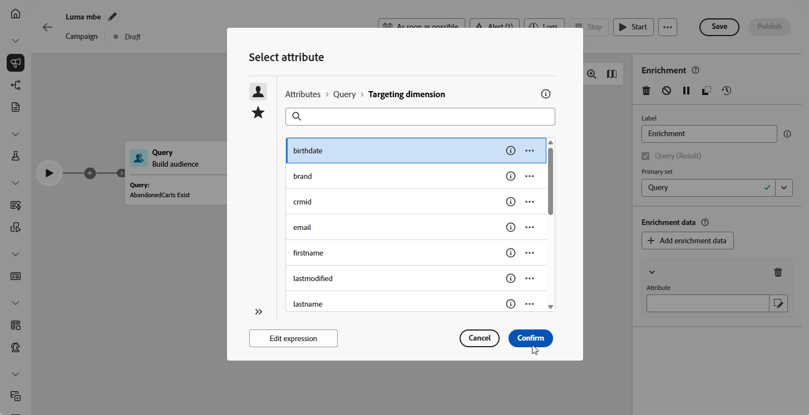
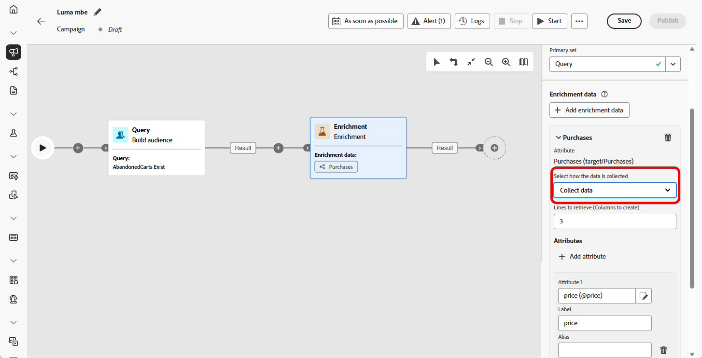

# 扩充 {#enrichment}

>[!CONTEXTUALHELP]
>id="ajo_orchestration_enrichment"
>title="扩充活动"
>abstract="通过&#x200B;**扩充**&#x200B;活动，可利用来自数据库的其他信息增强目标数据。通常在分段活动之后的工作流中使用它。"

+++ 目录

| 欢迎使用编排的营销活动 | 启动您的第一个编排的营销活动 | 查询数据库  | 编排的营销活动活动 |
|---|---|---|---|
| [开始使用编排的营销活动](../gs-orchestrated-campaigns.md)  [配置步骤](../configuration-steps.md)  [创建编排的营销活动的关键步骤](../gs-campaign-creation.md) | [创建协调的营销活动](../create-orchestrated-campaign.md)  [协调活动](../orchestrate-activities.md)  [发送包含协调的营销活动的消息](../send-messages.md)  [开始并监视营销活动](../start-monitor-campaigns.md)  [报告](../reporting-campaigns.md) | [使用查询Modeler](../orchestrated-rule-builder.md)  [生成您的第一个查询](../build-query.md)  [编辑表达式](../edit-expressions.md) | [开始使用活动](about-activities.md)  活动： [And-join](and-join.md) - [生成受众](build-audience.md) - [更改维度](change-dimension.md) - [组合](combine.md) - [重复数据删除](deduplication.md) - [扩充](enrichment.md) - [分支](fork.md) - [协调](reconciliation.md) - [拆分](split.md) - [等待](wait.md) |

{style="table-layout:fixed"}

+++

 

**[!UICONTROL 扩充]**&#x200B;活动是一个&#x200B;**[!UICONTROL 定位]**&#x200B;活动，它允许您使用其他属性增强受众数据。

您可以利用此信息，根据行为、偏好或需求更准确地细分受众，并制作个性化消息以更好地与每个用户档案联系。

## 添加扩充活动 {#enrichment-configuration}

>[!CONTEXTUALHELP]
>id="ajo_targetdata_personalization_enrichmentdata"
>title="扩充数据"
>abstract="选择要使用的数据来扩充您的协同营销活动。可选择两种类型的扩充数据：目标维度中的单个扩充属性或收藏集链接（即在各表之间具有 1-N 基数的链接）。"

>[!CONTEXTUALHELP]
>id="ajo_orchestration_enrichment_data"
>title="扩充活动"
>abstract="将扩充数据添加到协同营销活动中后，可以在扩充活动后添加的活动中使用这些数据，以根据客户的行为、偏好和需求来将客户分成不同的组，或者创建更可能让目标受众产生共鸣的个性化营销邮件和营销活动。"

请按照以下步骤操作，配置&#x200B;**扩充**&#x200B;活动：

1. 添加&#x200B;**扩充**&#x200B;活动。

1. 单击&#x200B;**添加扩充数据**&#x200B;并选择要用于扩充数据的属性。

   您可以选择两种类型的扩充数据：从目标维中选择单个扩充属性，或者选择收集链接。 以下示例详细介绍了每种类型：

   * [单个扩充属性](#single-attribute)
   * [收藏集链接](#collection-link)

   

## 示例 {#example}

### 单个扩充属性 {#single-attribute}

在本例中，您使用当前定向维度中的单个属性（如出生日期）来扩充受众。

操作步骤：

1. 单击&#x200B;**[!UICONTROL 添加扩充数据]**。

1. 从当前维度中选择一个简单字段，如&#x200B;**[!UICONTROL 出生日期]**。

   

1. 单击&#x200B;**[!UICONTROL 确认]**。

### 收藏集链接 {#collection-link}

此用例利用链接表中的数据丰富了受众。 例如，您希望检索100美元以下的最近三次购买。

要实现此目的，请按照以下方式配置扩充：

* **扩充属性**： **[!UICONTROL 价格]**

* **要检索的记录数**： 3

* **筛选器**：仅包括&#x200B;**[!UICONTROL 价格]**&#x200B;小于$100的购买

#### 添加属性 {#add-attribute}

首先，选择包含要用于扩充的数据的收集链接。

1. 单击&#x200B;**[!UICONTROL 添加扩充数据]**。

1. 从&#x200B;**[!UICONTROL 购买]**&#x200B;表中，选择&#x200B;**[!UICONTROL 价格]**&#x200B;字段。

   

#### 定义收藏集设置{#collection-settings}

接下来，配置应如何收集数据以及要包括的条目数。

1. 在&#x200B;**[!UICONTROL 选择数据收集方式]**&#x200B;下拉列表中，选择&#x200B;**[!UICONTROL 收集数据]**。

   

1. 在要检索的&#x200B;**[!UICONTROL 行（要创建的列）]**&#x200B;字段中，输入`3`。

1. 要执行聚合（例如，平均购买量），请选择&#x200B;**[!UICONTROL 聚合数据]**，然后从&#x200B;**[!UICONTROL 聚合函数]**&#x200B;下拉列表中选择&#x200B;**[!UICONTROL 平均]**。

   

1. 使用&#x200B;**[!UICONTROL 标签]**&#x200B;和&#x200B;**[!UICONTROL 别名]**&#x200B;字段使扩充属性更容易在后续活动中识别。

#### 定义筛选条件{#collection-filters}

最后，应用过滤器以确保仅包含相关记录：

1. 单击&#x200B;**[!UICONTROL 创建筛选器]**。

1. 添加这两个条件：

   * **[!UICONTROL 价格]**&#x200B;存在（用于排除NULL）

   * **[!UICONTROL 价格]**&#x200B;小于100

   

1. 单击&#x200B;**[!UICONTROL 确认]**。

<!--
#### Define the sorting{#collection-sorting}

We now need to apply sorting in order to retrieve the three **latest** purchases.

1. Activate the **Enable sorting** option.
1. Click inside the **Attribute** field.
1. Select the **Order date** field.
1. Click **Confirm**. 
1. Select **Descending** from the **Sort** drop-down.

## Data reconciliation {#reconciliation}

>[!CONTEXTUALHELP]
>id="ajo_orchestration_enrichment_reconciliation"
>title="Reconciliation"
>abstract="The **Enrichment** activity can be used to reconcile data from the Journey Optimizer schema with data from another schema, or with data coming from a temporary schema such as data uploaded using a Load file activity. This type of link defines a reconciliation towards a unique record. Journey Optimizer creates a link to a target table by adding a foreign key in it for storing a reference to the unique record."

The **Enrichment** activity can be used to reconcile data from the the Campaign database schema with data from another schema, or with data coming from a temporary schema such as data uploaded using a Load file activity. This type of link defines a reconciliation towards a unique record. Journey Optimizer creates a link to a target table by adding a foreign key in it for storing a reference to the unique record.

For example, you can use this option to reconcile a profile's country, specified in an uploaded file, with one of the countries available in the dedicated table of the Campaign database. 

Follow the steps to configure an **Enrichment** activity with a reconciliation link: 

1. Click the **Add link** button in the **Reconciliation** section.
1. Identify the data you want to create a reconciliation link with.

    * To create a reconciliation link with data from the Campaign database, select **Database schema** and choose the schema where the target is stored. 
    * To create a reconciliation link with data coming from the input transition, select **Temporary schema** and choose the orchestrated campaign transition where the target data is stored. 

1. The **Label** and **Name** fields are automatically populated based on the selected target schema. You can change their values if necessary.

1. In the **Reconciliation criteria** section, specify how you want to reconcile data from the source and destination tables:

    * **Simple join**: Reconcile a specific field from the source table with another field in the destination table. To do this, click the **Add join** button and specify the **Source** and **Destination** fields to use for the reconciliation.

        >[!NOTE]
        >
        >You can use one or more **Simple join** criteria, in which case they must all be verified so that the data can be linked together.

    * **Advanced join**: Use the query modeler to configure the reconciliation criteria. To do this, click the **Create condition** button then define your reconciliation criteria by building your own rule using AND and OR operations.

The example below shows an orchestrated campaign configured to create a link between Journey Optimizer profiles table and a temporary table generated a **Load file** activity. In this example, the **Enrichment** activity reconciliates both tables using the email address as reconciliation criteria.

### Enrichment with linked data {#link-example}

The example below shows an orchestrated campaign configured to create a link between two transitions. The first transitions targets profile data using a **Query** activity, while the second transition includes purchase data stored into a file loaded through a Load file activity.

* The first **Enrichment** activity links the primary set (data from the **Query** activity) with the schema from the **Load file** activity. This allows us to match each profile targeted by the query with the corresponding purchase data.

    

* A second **Enrichment** activity is added in order to enrich data from the orchestrated campaign table with the purchase data coming from the **Load file** activity. This allows us to use those data in further activities, for example, to personalize messages sent to the customers with information on their purchase.

    

## Create links between tables {#create-links}

>[!CONTEXTUALHELP]
>id="ajo_orchestration_enrichment_simplejoin"
>title="Link definition"
>abstract="Create a link between the working table data and Adobe Journey Optimizer. For example, if you load data from a file which contains the account number, country and email of recipients, you have to create a link towards the country table in order to update this information in their profiles."

The **[!UICONTROL Link definition]** section allows you to create a link between the working table data and Adobe Journey Optimizer. For example, if you load data from a file which contains the account number, country and email of recipients, you have to create a link towards the country table in order to update this information in their profiles.

There are several types of links available:

* **[!UICONTROL 1 cardinality simple link]**: Each record from the primary set can be associated with one and only one record from the linked data.
* **[!UICONTROL 0 or 1 cardinality simple link]**: Each record from the primary set can be associated with 0 or 1 record from the linked data, but not more than one.
* **[!UICONTROL N cardinality collection link]**: Each record from the primary set can be associated with 0, 1 or more (N) records from the linked data.

To create a link, follow these steps:

1. In the **[!UICONTROL Link definition]** section, click the **[!UICONTROL Add link]** button.

    

1. In the **Relation type** drop-down list, choose the type of link you want to create.

1. Identify the target you want to link the primary set to:

    * To link an existing table in the database, choose **[!UICONTROL Database schema]** and select the desired table from the **[!UICONTROL Target schema]** field.
    * To link with data from the input transition, choose **Temporary schema** and select the transition whose data you want to use.

1. Define the reconciliation criteria to match data from the primary set with the linked schema. There are two types of joins available:

    * **Simple join**: Select a specific attribute to match data from the two schemas. Click **Add join** and select the **Source** and **Destination** attributes to use as reconciliation criteria. 
    * **Advanced join**: Create a join using advanced conditions. Click **Add join** and click the **Create condition** button to open the query modeler.

A workflow example using links is available in the [Examples](#link-example) section.

## Add offers {#add-offers}

>[!CONTEXTUALHELP]
>id="ajo_orchestration_enrichment_offer_proposition"
>title="Offer proposition"
>abstract="The Enrichment activity allows you to add offers for each profile."

The **[!UICONTROL Enrichment]** activity allows you to add offers for each profile.

To do so, follow the steps to configure an **[!UICONTROL Enrichment]** activity with an offer: 

1. In the **[!UICONTROL Enrichment]** activity, at the **[!UICONTROL Offer proposition]** section, click on the **[!UICONTROL Add offer]** button

    

1. You have two choices for the offer selection :

    * **[!UICONTROL Search for the best offer in category]** : check this option and specify the offer engine call parameters (offer space, category or theme(s), contact date, number of offers to keep). The engine will calculate the best offer(s) to add according to these parameters. We recommend completing either the Category or the Theme field, rather than both at the same time.

        

    * **[!UICONTROL A predefined offer]** : check this option and specify an offer space, a specific offer, and a contact date to directly configure the offer that you would like to add, without calling the offer engine.

        

1. After selecting your offer, click on **[!UICONTROL Confirm]** button.

You can now use the offer in the delivery activity.

### Using the offers from Enrichment activity

Within an orchestrated campaign, if you want to use the offers you get from an enrichment activity in your delivery, follow the steps below:

1. Open the delivery activity and go in the content edition. Click on **[!UICONTROL Offers settings]** button and select in the drop-down list the **[!UICONTROL Offers space]** corresponding to your offer. 
If you want to to view only offers from the enrichment activity, set the number of **[!UICONTROL Propositions]** to 0, and save the modifications.

     

1. In the email designer, when adding a personalization with offers, click on the **[!UICONTROL Propositions]** icon, it will display the offer(s) you get from the **[!UICONTROL Enrichment]** activity. Open the offer you want to choose by clicking on it.

     

    Go in **[!UICONTROL Rendering functions]** and choose **[!UICONTROL HTML rendering]** or **[!UICONTROL Text rendering]** according to your needs.

     

>[!NOTE]
>
>If you choose to have more than one offer in the **[!UICONTROL Enrichment]** activity at the **[!UICONTROL Number of offers to keep]** option, all the offers are displayed when clicking on the **[!UICONTROL Propositions]** icon.

-->