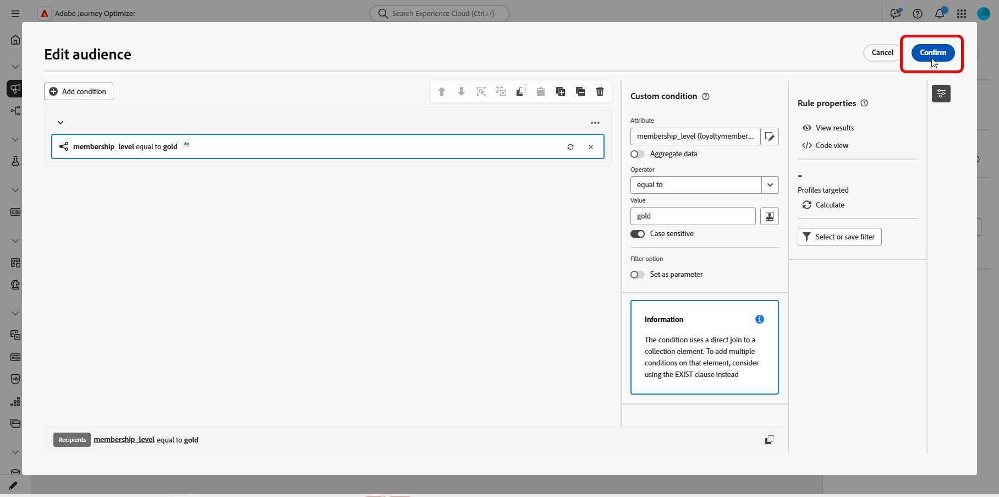
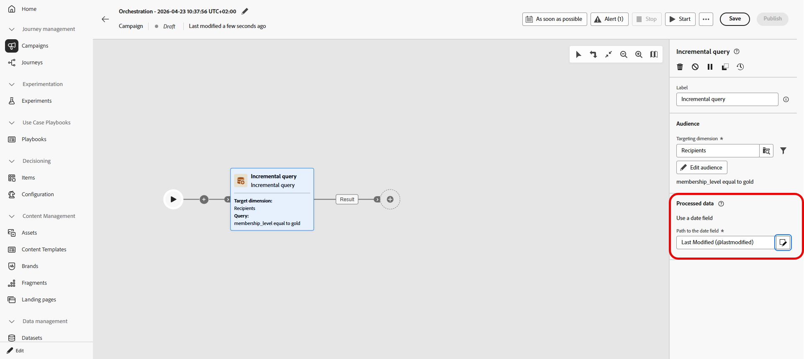

# 增量查询 {#incremental-query}

>[!CONTEXTUALHELP]
>id="ajo_orchestration_incrementalquery"
>title="增量查询"
>abstract="增量查询是一种定位活动，每当编排的活动运行时，该活动都会运行数据库查询。 它仅返回新记录，并排除之前运行中已包含的任何记录，因此您可以避免重新定位相同的人员或重新导出相同的行。"

>[!CONTEXTUALHELP]
>id="ajo_orchestration_incrementalquery_processeddata"
>title="处理过的数据"
>abstract="在“已处理数据”下，选择如何从早期运行中排除记录。 通过使用日期字段选项，活动使用选定的日期字段而不是跟踪单个ID，并且每次运行只返回日期在最后一次执行之后的行。"

>[!CONTEXTUALHELP]
>id="ajo_orchestration_incrementalquery_history"
>title="历史记录（天）"
>abstract="此设置控制该列表保留的时长。 值为 0 表示无限期保留，不移除任何记录。"

**[!UICONTROL 增量查询]**&#x200B;活动是&#x200B;**[!UICONTROL 定位]**&#x200B;活动，每次运行编排的活动时都会运行数据库查询。 重要部分是它只输出&#x200B;**新**&#x200B;记录。 之前运行中已选取的任何人将被排除，因此您可以避免重新定位相同的人员或重新导出相同的行。

当营销活动可以运行多次时使用，例如，当您计划营销活动时，例如每周一次或者当活动由外部信号或API触发时，可使用它。 每次运行都只定位上次运行中未返回的记录，因此可避免重复。

典型用途：

* **消息传送和受众**：在下一步中只提取新注册、新购买者或其他“自上次运行以来新增的”区段（例如电子邮件、短信）。
* **正在进行的导出**：只将新行或更新行发送到文件以用于报表或BI工具，而不复制已导出的内容。

当运行未返回任何行时，编排的营销活动将在&#x200B;**增量查询**&#x200B;停止。 增量查询后的活动直到有数据时才会执行，此时活动会再次运行。

## 配置增量查询活动 {#incremental-query-configuration}

设置定向维度，构建查询，然后选择活动如何决定从未来运行中排除哪些记录。

1. 将&#x200B;**[!UICONTROL 增量查询]**&#x200B;活动拖放到您的编排的活动中。

1. 在&#x200B;**[!UICONTROL 受众]**&#x200B;中，选择&#x200B;**[!UICONTROL 定向维度]**，例如收件人、订阅者，然后单击&#x200B;**[!UICONTROL 继续]**。 了解有关[定向维度](../target-dimension.md)的更多信息。

   

1. 单击&#x200B;**[!UICONTROL 添加条件]**&#x200B;以定义查询。 [了解如何使用规则生成器](../orchestrated-rule-builder.md)。

   

1. 在&#x200B;**[!UICONTROL 已处理数据]**&#x200B;下，选择您的&#x200B;**[!UICONTROL 日期字段路径]**。 该属性必须使用&#x200B;**日期时间**&#x200B;格式。 每次运行只返回日期在最后一次执行之后的行。

   

<!--
   * **[!UICONTROL Exclude results of previous execution]**: The activity maintains a list of records returned in prior runs. Each run excludes those records and returns only new ones. **[!UICONTROL History in days]** controls the retention period for that list. 0 indicates indefinite retention, no records are removed.

   >[!IMPORTANT]
   >
   >This mode stores the primary key of each processed record. Personally identifiable information (PII) must not be used as the primary key.

-->

## 示例 {#incremental-query-example}

以下示例向刚刚成为金会员的用户档案发送欢迎电子邮件。 可将营销活动安排为每周、每周一运行。 每次运行仅定向自上次运行以来符合金会员资格的用户档案，因此每位收件人都会收到一次欢迎电子邮件。

* **[!UICONTROL 增量查询]**：选择金会员。 第一次运行：所有当前金会员。 以后运行：仅包含自上次执行以来成为金会员的用户档案。
* **[!UICONTROL 电子邮件投放]**：通过查询将欢迎电子邮件发送到用户档案输出。

