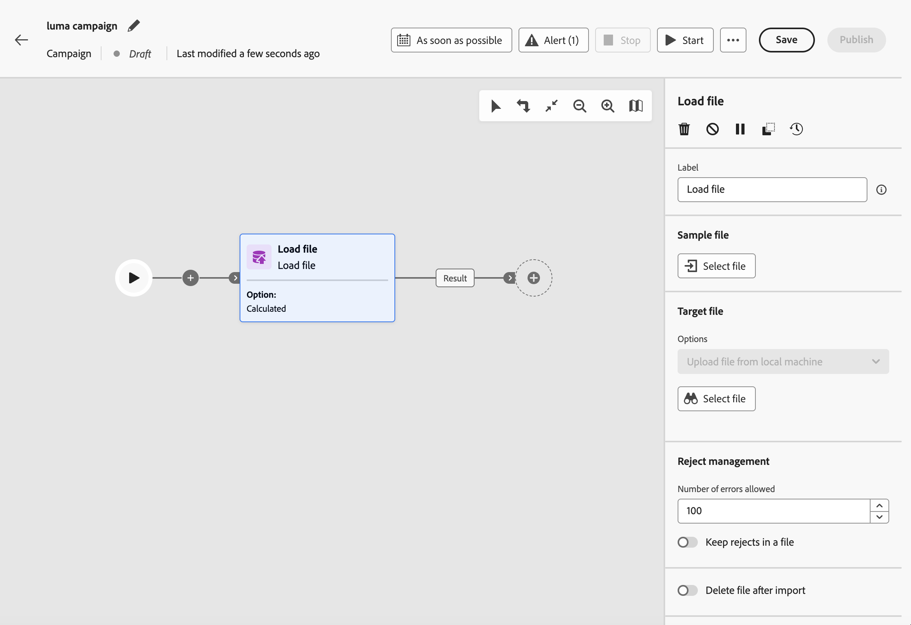

# 加载文件 {#load-file}

>[!BEGINSHADEBOX]

**在此页面上：**&#x200B;了解如何使用加载文件数据管理活动，在执行时从外部CSV或TXT文件定位编排的活动受众，而无需将文件摄取到Adobe Experience Platform。

>[!ENDSHADEBOX]

>[!CONTEXTUALHELP]
>id="ajo_orchestration_load_file"
>title="加载文件活动"
>abstract="**加载文件**&#x200B;活动是一项&#x200B;**数据管理**&#x200B;活动。 使用此功能可在“编排的营销活动”画布上使用存储在外部文件中的轮廓和数据，并定义营销活动受众。 文件数据在执行时被使用，并且不作为 Adobe Experience Platform 数据集持久存储。"

**[!UICONTROL 加载文件]**&#x200B;活动是一项&#x200B;**[!UICONTROL 数据管理]**&#x200B;活动。 使用它处理存储在外部文件中的用户档案和数据。 如果您的收件人列表来自外部系统（例如，CRM导出或合作伙伴文件），并且您想要运行活动而不首先构建完整的Adobe Experience Platform引入管道，则在编排的营销活动中它支持&#x200B;**基于文件的定位**。

>[!AVAILABILITY]
>
>**加载文件**&#x200B;活动在&#x200B;**有限可用性**&#x200B;中可用于一组组织。 要请求访问权限，请与 Adobe 代表联系。 有关可用性阶段，请参阅[Journey Optimizer发行周期](../../rn/releases.md)。
>
>此活动当前不可用于&#x200B;**Healthcare Shield**。

## 权限 {#permissions}

若要在协调的活动中使用&#x200B;**[!UICONTROL 加载文件]**&#x200B;活动，必须为用户分配正确的权限。 这两个权限都可在权限UI中的&#x200B;**[!UICONTROL Adobe Experience Platform]** > **[!UICONTROL Adobe Journey Optimizer]** > **[!UICONTROL 编排的营销活动]**&#x200B;下使用。

* **[!UICONTROL 在编排的营销活动中查看文件]** — 授予只读访问权限。 具有此权限的用户可以预览包含&#x200B;**[!UICONTROL 加载文件]**&#x200B;活动的已编排营销活动的结果，但无法添加活动或上传文件。
* **[!UICONTROL 在编排的营销活动中管理文件]** — 需要将&#x200B;**[!UICONTROL 加载文件]**&#x200B;活动添加到营销活动画布并上传文件。 将此权限分配给需要创建或配置&#x200B;**[!UICONTROL 加载文件]**&#x200B;活动的任何用户。

有关分配权限的说明，请参阅[管理用户和角色](../../administration/permissions.md)。

## 护栏和限制 {#limitations}

以下限制适用于加载文件活动：

* 每个文件最多可上传50 MB。
* 仅支持平面结构的CSV和TXT文件。
* 上传的数据在营销活动运行时使用，并且不会存储为Adobe Experience Platform数据集。

有关渠道和画布活动的限制，请参阅[护栏和限制](../guardrails.md#activities-limitations)。

## 先决条件 {#prerequisites}

管理员必须先完成以下一次性设置，然后才能将&#x200B;**[!UICONTROL 加载文件]**&#x200B;活动添加到已编排的活动并将其连接到消息活动。

### 创建文件类型目标维度 {#file-target-dimension}

类型为&#x200B;**[!UICONTROL 文件]**&#x200B;的&#x200B;**[!UICONTROL 配置文件目标Dimension]**&#x200B;允许编排的活动从上传的文件而不是Adobe Experience Platform架构解析收件人。 它定义在营销活动执行时处理文件受众时使用的身份命名空间和标识符字段。

从&#x200B;**[!UICONTROL 管理]** > **[!UICONTROL 配置]** > **[!UICONTROL Campaign Target Dimension]**&#x200B;创建目标维度。 [了解有关目标维度的更多信息](../target-dimension.md)

为基于文件的定位创建目标维度时，请确保：

* 将&#x200B;**[!UICONTROL Dimension源]**&#x200B;设置为&#x200B;**[!UICONTROL 文件]**。
* 选择与文件中的标识符列匹配的&#x200B;**[!UICONTROL 身份命名空间]**，例如&#x200B;**[!UICONTROL 电子邮件]**。
* 输入&#x200B;**[!UICONTROL 标识字段路径]**。 使用包含标识符的文件字段，例如，如果上载的文件包含`email`列，则为`email`。

>[!CAUTION]
>
>保存目标维度后，无法更改架构和标识值。 在保存之前验证身份命名空间和身份字段路径。

### 为基于文件的交付创建渠道配置 {#file-channel-configuration}

创建使用文件类型目标维度的专用渠道配置。 在活动画布中的&#x200B;**[!UICONTROL 加载文件]**&#x200B;活动之后的消息活动中选择此配置。

1. 导航到&#x200B;**[!UICONTROL 管理]** > **[!UICONTROL 渠道]** > **[!UICONTROL 渠道配置]**&#x200B;并创建新配置。

1. 在&#x200B;**[!UICONTROL 执行详细信息]**&#x200B;下，选择&#x200B;**[!UICONTROL 协调的营销活动]**&#x200B;选项卡，并启用协调的营销活动的配置。

1. 在&#x200B;**[!UICONTROL 配置文件目标Dimension]**&#x200B;字段中，选择在上一步中创建的文件类型目标维度。

1. 填写其余渠道配置字段并保存。 [了解有关编排营销活动的渠道配置的更多信息](../channel-config.md)

>[!IMPORTANT]
>
>基于用户档案的标准渠道配置不适用于基于文件的受众。 对于跟随&#x200B;**[!UICONTROL 加载文件]**&#x200B;活动的所有消息活动，使用以文件类型维度为目标的渠道配置。

## 配置加载文件活动 {#load-file-configuration}

分两部分配置活动：使用示例文件定义预期的文件结构，然后指定要在活动运行时加载的文件。

1. 将&#x200B;**[!UICONTROL 加载文件]**&#x200B;活动添加到您的编排活动画布。

   

1. 输入活动的&#x200B;**[!UICONTROL 标签]**。

### 定义样例文件 {#sample-file}

使用样例文件配置&#x200B;**[!UICONTROL 列]**&#x200B;和&#x200B;**[!UICONTROL 格式]**。 示例数据不会导入为营销活动受众。

1. 在&#x200B;**[!UICONTROL 示例文件]**&#x200B;部分中，选择定义预期结构的本地文件。

   >[!NOTE]
   >
   > 样例文件仅用于配置列和格式，其数据不会导入为活动受众。 格式必须与运行营销策划时要加载的文件匹配。

1. 在&#x200B;**[!UICONTROL 文件类型]**&#x200B;下拉列表中，指定文件使用的是&#x200B;**分隔列**&#x200B;还是&#x200B;**固定宽度列**。

   

1. 在&#x200B;**[!UICONTROL 列]**&#x200B;部分中，展开每列并配置其属性。

   

   选择&#x200B;**[!UICONTROL 数据类型]**&#x200B;后，将显示该类型的其他选项。 展开以下部分，了解所有列的通用参数以及特定于类型的选项。

   +++公用列参数

   * **[!UICONTROL 忽略列]** — 在选中时从导入中排除该列。
   * **[!UICONTROL 标签]** — 列的显示名称（例如，`email`）。
   * **[!UICONTROL 内部名称]** — 列的系统名称，派生自文件标头（只读）。
   * **[!UICONTROL 数据类型]** — 列中的数据类型。
   * **[!UICONTROL 允许NULL]** — 指定如何管理列中的空值：

      * **[!UICONTROL Adobe Campaign默认值]** — 仅为数字字段生成错误。 否则，插入NULL值。
      * **[!UICONTROL 允许空值]** — 授权空值。 因此，会插入 NULL 值。
      * **[!UICONTROL 始终填充]** — 如果值为空，则生成错误。

   * **[!UICONTROL 错误处理]** — 定义在列中遇到错误时的行为：

      * **[!UICONTROL 忽略值]** — 忽略该值。
      * **[!UICONTROL 拒绝行]** — 不处理整行。
      * **[!UICONTROL 在发生错误时使用默认值]** — 将导致错误的值替换为在&#x200B;**[!UICONTROL 默认值]**&#x200B;字段中定义的默认值。
      * **[!UICONTROL 在值未重新映射时使用默认值]** — 除非已经为错误值定义了映射，否则将导致错误的值替换为&#x200B;**[!UICONTROL 默认值]**&#x200B;字段中定义的默认值。
      * **[!UICONTROL 没有重新映射值时拒绝该行]** — 除非为错误值定义了映射，否则不会处理整行。

   * **[!UICONTROL 默认值]** — 将&#x200B;**[!UICONTROL 错误处理]**&#x200B;时使用的默认值设置为使用默认值。
   * **[!UICONTROL 值重新映射]** — 将特定值映射到新值。 单击&#x200B;**[!UICONTROL 添加映射]**&#x200B;以定义每个映射（例如，将`True`/`False`替换为`1`/`0`）。

   +++

   +++字符串列参数

   * **[!UICONTROL 宽度]** — 最大字符数。
   * **[!UICONTROL 数据转换]** — 将大小写转换应用于字符串值（例如，无或大写/小写）。
   * **[!UICONTROL 空格管理]** — 如何处理字符串值中的前导空格或尾随空格。

   +++

   +++整数和浮点数列参数

   * **[!UICONTROL 格式]** — 定义如何读取文件中的数值：

      * **[!UICONTROL 其他]** — 在&#x200B;**[!UICONTROL 分隔符]**&#x200B;部分中定义&#x200B;**[!UICONTROL 千位分隔符]**&#x200B;和&#x200B;**[!UICONTROL 小数分隔符]**。
      * **[!UICONTROL 1,000.00]** — 逗号作为千位分隔符，句点作为小数分隔符。
      * **[!UICONTROL 1 000,00]** — 空格作为千位分隔符，逗号作为小数分隔符。

   * **[!UICONTROL 分隔符]** （当&#x200B;**[!UICONTROL 格式]**&#x200B;为&#x200B;**[!UICONTROL Other]**&#x200B;时）：

      * **[!UICONTROL 千位分隔符]** — 将千位分组为数字值的字符（如果不使用，则留空）。
      * **[!UICONTROL 小数分隔符]** — 用于数值的小数部分的字符（例如，`,`或`.`）。

   +++

   +++日期和时间列参数

   选项取决于&#x200B;**[!UICONTROL 数据类型]**&#x200B;是&#x200B;**日期**、**时间**&#x200B;还是&#x200B;**日期和时间**。

   **日期**

   * **[!UICONTROL 日期格式]** — 与日期在文件中的显示方式匹配的模式（例如，`yyyy/mm/dd`）。
   * **[!UICONTROL 分隔符]**：

      * **[!UICONTROL 年、月、日]** — 年、月和日组件之间的字符（例如，`/`）。

   **时间**

   * **[!UICONTROL 时间格式]** — 与时间在文件中的显示方式匹配的模式（例如，`13:30`表示24小时制和分钟制）。
   * **[!UICONTROL 分隔符]**：

      * **[!UICONTROL 小时、分钟、秒]** — 小时、分钟和秒组件之间的字符（例如，`:`）。

   **日期和时间**

   * **[!UICONTROL 日期格式]** — 与文件中日期部分的显示方式匹配的模式。
   * **[!UICONTROL 时间格式]** — 与时间部分在文件中的显示方式匹配的模式。
   * **[!UICONTROL 分隔符]** — 日期和时间组件之间的字符。

   +++

1. 在&#x200B;**[!UICONTROL 格式设置]**&#x200B;部分中，指定文件的结构方式，以便在营销活动运行时正确读取行和列。 目标文件必须使用与示例文件相同的格式。

   

   * **[!UICONTROL 使用第一行作为列标题]** — 在选中时，文件的第一行被视为列名。 在从包含标题行的文件中配置示例时，通常会启用此选项。
   * **[!UICONTROL 使用行号作为标识符]** — 选中时，每行都由文件中的行号标识。
   * **[!UICONTROL 记录跨越多行]** — 选中后，单个记录可以跨越文件中的多行（例如，当字段包含换行符时）。
   * **[!UICONTROL 要忽略的行数]** — 读取数据之前在文件开头要跳过的行数（例如，注释行或元数据行）。
   * **[!UICONTROL 时区]** — 导入日期和时间值时应用的时区。
   * **[!UICONTROL 编码]** — 文件的字符编码。 选择与源文件匹配的编码。
   * **[!UICONTROL 字符串分隔符]** — 用于在文件中包含字符串值的字符。
   * **[!UICONTROL 列分隔符]** — 分隔文件中列的字符。

1. 单击&#x200B;**[!UICONTROL 确认]**&#x200B;以验证示例文件配置。

### 定义目标文件 {#target-file}

指定要在活动执行时加载的文件，以及每行与现有收件人的匹配方式。

1. 在&#x200B;**[!UICONTROL 目标文件]**&#x200B;部分中，选择包含要定位的受众的CSV或TXT文件。

   

   >[!CAUTION]
   >
   > 确保目标文件遵循与示例文件相同的格式、列结构和列数。

1. 在&#x200B;**[!UICONTROL 拒绝管理]**&#x200B;部分中，定义在处理文件期间发生错误时活动的行为方式：

   * **[!UICONTROL 允许的错误数]** — 在活动失败之前允许的错误数上限。
   * **[!UICONTROL 将拒绝保留在文件中]** — 启用时，无法加载的行将写入服务器上的拒绝文件，以供执行后审查。

1. （可选）启用&#x200B;**[!UICONTROL 导入后删除文件]**，以便在活动运行后从服务器中删除上传的文件。

在&#x200B;**[!UICONTROL 加载文件]**&#x200B;解析受众后，将出站过渡连接到下游活动。 [了解如何精心策划营销活动](../orchestrate-activities.md)
