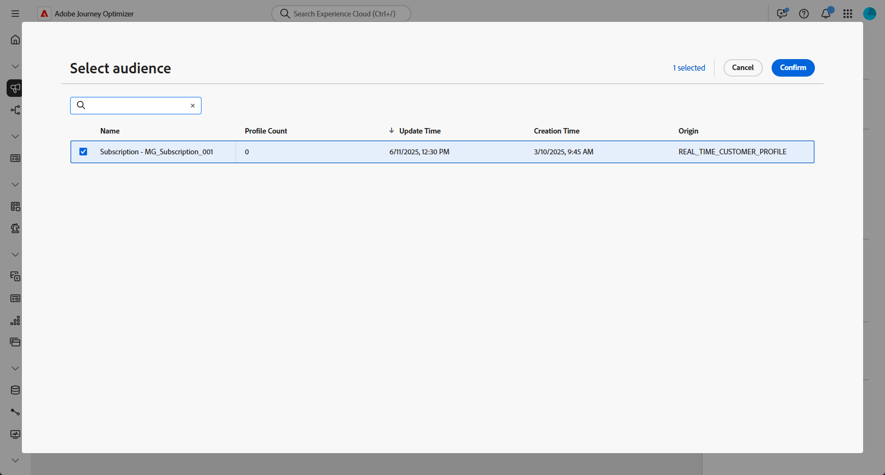

# 读取受众 {#read-audience}

>[!CONTEXTUALHELP]
>id="ajo_orchestration_read_audience"
>title="生成受众活动"
>abstract="您可以使用&#x200B;**阅读受众**&#x200B;活动，选择将进入编排式营销活动的受众。该受众可以是现有的 Adobe Experience Platform 受众，也可以是从 CSV 文件导入的受众。在编排式营销活动中发送消息时，消息受众不是在渠道活动中定义的，而是在&#x200B;**读取受众**&#x200B;或&#x200B;**构建受众**&#x200B;活动中定义的。"

+++ 目录

| 欢迎了解精心策划的营销活动 | 启动第一个精心策划的营销活动 | 查询数据库 | 精心策划的营销活动 |
|---|---|---|---|
| [开始使用编排的营销活动](../gs-orchestrated-campaigns.md)  创建和管理关系架构和数据集：  <ul><li>[架构和数据集入门](../gs-schemas.md)</li><li>[手动架构](../manual-schema.md)</li><li>[文件上载架构](../file-upload-schema.md)</li><li>[摄取数据](../ingest-data.md)</li></ul>[访问和管理编排的营销活动](../access-manage-orchestrated-campaigns.md) | [创建精心策划的营销活动的关键步骤](../gs-campaign-creation.md)  [创建和计划营销活动](../create-orchestrated-campaign.md)  [精心策划活动](../orchestrate-activities.md)  [启动和监控营销活动](../start-monitor-campaigns.md)  [报告](../reporting-campaigns.md) | [使用规则生成器](../orchestrated-rule-builder.md)  [生成您的第一个查询](../build-query.md)  [编辑表达式](../edit-expressions.md)  [重定向](../retarget.md) | [活动快速入门](about-activities.md)  活动： [并行汇聚](and-join.md) - [生成受众](build-audience.md) - [更改维度](change-dimension.md) - [渠道活动](channels.md) - [合并](combine.md) - [重复数据删除](deduplication.md) - [扩充](enrichment.md) - [分叉](fork.md) - [协调](reconciliation.md) - [保存受众](save-audience.md) - [拆分](split.md) - [等待](wait.md) |

{style="table-layout:fixed"}

+++

 

>[!BEGINSHADEBOX]

 

此页面上的内容不是最终内容，可能会发生变化。

>[!ENDSHADEBOX]

**[!UICONTROL 读取受众]**&#x200B;活动允许您检索之前保存或导入的现有受众，并在编排的活动中重复使用它。 在无需执行新的分段过程的情况下定位预定义的用户档案集时，此活动特别有用。

加载受众后，您可以选择通过选择一个唯一的身份字段并使用其他配置文件属性丰富受众来优化受众，以便进行定位、个性化或报告。

## 配置读取受众活动 {#read-audience-configuration}

按照以下步骤配置&#x200B;**[!UICONTROL 读取受众]**&#x200B;活动：

1. 将&#x200B;**[!UICONTROL 读取受众]**&#x200B;活动添加到您的编排的营销活动中。

   

1. 为您的活动输入&#x200B;**[!UICONTROL 标签]**。

1. 单击以选择要针对编排的营销活动定向的受众。

   

1. 从营销活动定向维度中选择一个&#x200B;**[!UICONTROL 实体{1&#x200B;}。]**

   ➡️ [按照此页面中详述的步骤创建您的营销活动定位维度](../target-dimension.md)

   

1. 选择&#x200B;**[!UICONTROL 添加属性]**&#x200B;以使用附加数据扩充所选受众。 生成的受众将包含收件人列表，每个收件人均具有选定的用户档案属性丰富的内容。

1. 选择要添加到受众的&#x200B;**[!UICONTROL 属性]**。

   

## 示例

在下面的示例中，**[!UICONTROL 读取受众]**&#x200B;活动用于检索订阅新闻稿的先前创建和保存的用户档案受众。 然后，使用&#x200B;**忠诚度会员资格**&#x200B;属性丰富受众，以启用对忠诚度计划注册会员的用户的定位。

