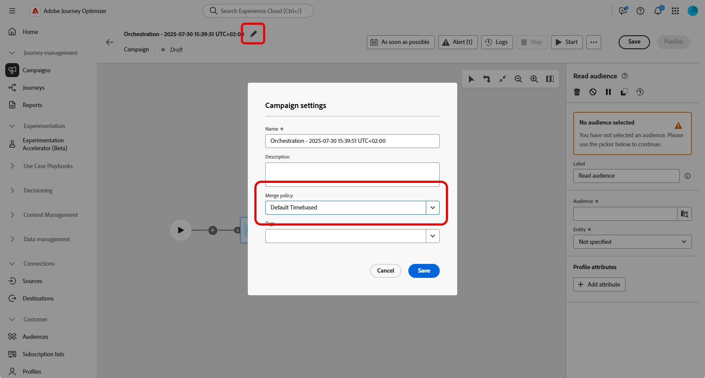

# 读取受众 {#read-audience}

>[!CONTEXTUALHELP]
>id="ajo_orchestration_read_audience"
>title="生成受众活动"
>abstract="您可以使用&#x200B;**读取受众**&#x200B;活动，选择哪些受众将进入精心编排的营销活动。该受众可以是现有的 Adobe Experience Platform 受众，也可以是从 CSV 文件导入的受众。在精心编排的营销活动上下文中发送消息时，消息受众不是在渠道活动中定义的，而是在&#x200B;**读取受众**&#x200B;或&#x200B;**构建受众**&#x200B;活动中定义的。"

**[!UICONTROL 读取受众]**&#x200B;活动允许您检索之前保存或导入的现有受众，并在编排的营销活动中重复使用它。 在无需执行新的分段过程的情况下定位预定义的用户档案集时，此活动特别有用。

加载受众后，您可以选择通过选择一个唯一的身份字段并使用其他配置文件属性丰富受众来优化受众，以便进行定位、个性化或报告。

## 读取受众缓存 {#cache}

测试编排的营销活动时，**[!UICONTROL 读取受众]**&#x200B;活动通常需要一些时间来获取数据，这会延长测试运行时间。 若要加快此速度，可使用&#x200B;**[!UICONTROL 读取受众]**&#x200B;缓存。

缓存将受众和选定的属性一起存储了两个小时&#x200B;**&#x200B;**。 在此期间，任何后续测试运行都可以使用缓存的结果，从而无需再次获取数据。 一旦&#x200B;**两小时期间**&#x200B;结束，必须重新检索数据。

将为每个编排的活动保存缓存，而不是为受众本身保存缓存。 如果在另一个编排的营销活动中的&#x200B;**[!UICONTROL 读取受众]**&#x200B;活动中使用了相同的受众，则系统仍需要重新获取数据。

在以下情况中，不保留缓存：

* 当使用新属性更新&#x200B;**[!UICONTROL 读取受众]**&#x200B;活动时，将使用新属性数据刷新缓存。 因此，更新后的首次测试运行将需要更长的时间，因为需要再次检索数据。

* 发布编排的营销活动时，在执行实时编排的营销活动时获取最新数据。

## 配置读取受众活动 {#read-audience-configuration}

按照以下步骤配置&#x200B;**[!UICONTROL 读取受众]**&#x200B;活动：

1. 在添加&#x200B;**[!UICONTROL 读取受众]**&#x200B;活动之前，请确保在Campaign设置中选择&#x200B;**[!UICONTROL 合并策略]**。

   

1. 将&#x200B;**[!UICONTROL 读取受众]**&#x200B;活动添加到您的编排营销活动中。

   

1. 为您的活动输入&#x200B;**[!UICONTROL 标签]**。 此标签将用作受众的名称。

1. 单击以选择要针对编排的营销活动定位的受众。 [了解有关如何在Journey Optimizer中生成和定位受众的更多信息](../../audience/about-audiences.md)。

   

1. 从营销活动定向维度中选择一个&#x200B;**[!UICONTROL 实体{1&#x200B;}。]**&#x200B;此设置定义目标实体以及用于协调受众与目标维度的属性。

   ➡️ [按照此页面中详述的步骤创建您的营销活动定位维度](../target-dimension.md)

   

1. 选择&#x200B;**[!UICONTROL 添加属性]**&#x200B;以使用附加数据扩充所选受众。 通过此步骤，可将配置文件属性添加到受众，从而生成具有这些属性增强的收件人列表。

1. 选择要添加到受众的&#x200B;**[!UICONTROL 属性]**。 属性选取器显示&#x200B;**联合配置文件架构**&#x200B;中的字段：

   * 对于基于CSV的受众，这包括&#x200B;**配置文件**&#x200B;属性和自定义受众级别属性。 这些属性可以在以下架构路径下找到：

     `<audienceid> > _ajobatchjourneystage > audienceEnrichment > CustomerAudienceUpload > <audienceid>`

   * 对于标准AEP受众，只有&#x200B;**配置文件**&#x200B;属性可用，因为它们不包含嵌入的受众特定字段。

   >[!NOTE]
   >
   > 虽然某些属性可能会显示在选取器中，但其运行时可用性取决于受众数据是否已成功协调并与&#x200B;**Adobe Experience Platform配置文件**&#x200B;合并。

   

创建受众后，该受众将以只读形式提供，且无法再编辑。 它只能在创建过程完全完成后使用。

## 示例

在下面的示例中，**[!UICONTROL 读取受众]**&#x200B;活动用于检索订阅新闻稿的先前创建和保存的用户档案受众。 然后，使用&#x200B;**忠诚度会员资格**&#x200B;属性丰富受众，以启用对忠诚度计划注册会员的用户的定位。

