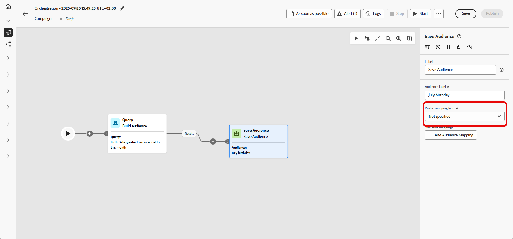

# 保存受众 {#save-audience}

>[!CONTEXTUALHELP]
>id="ajo_orchestration_save_audience"
>title="保存受众活动"
>abstract="**保存受众**&#x200B;活动是一种&#x200B;**目标选择**&#x200B;活动，通过该活动，可更新现有受众或利用之前在精心策划的营销活动中生成的群体创建新受众。创建受众后，这些受众将被添加到应用程序受众列表中，并可从&#x200B;**受众**&#x200B;菜单访问。"

+++ 目录

| 欢迎了解精心策划的营销活动 | 启动第一个精心策划的营销活动 | 查询数据库 | 精心策划的营销活动 |
|---|---|---|---|
| [开始使用编排的营销活动](../gs-orchestrated-campaigns.md)  创建和管理关系架构和数据集：  <ul><li>[架构和数据集入门](../gs-schemas.md)</li><li>[手动架构](../manual-schema.md)</li><li>[文件上载架构](../file-upload-schema.md)</li><li>[摄取数据](../ingest-data.md)</li></ul>[访问和管理编排的营销活动](../access-manage-orchestrated-campaigns.md) | [创建精心策划的营销活动的关键步骤](../gs-campaign-creation.md)  [创建和计划营销活动](../create-orchestrated-campaign.md)  [精心策划活动](../orchestrate-activities.md)  [启动和监控营销活动](../start-monitor-campaigns.md)  [报告](../reporting-campaigns.md) | [使用规则生成器](../orchestrated-rule-builder.md)  [生成您的第一个查询](../build-query.md)  [编辑表达式](../edit-expressions.md)  [重定向](../retarget.md) | [活动快速入门](about-activities.md)  活动： [并行汇聚](and-join.md) - [生成受众](build-audience.md) - [更改维度](change-dimension.md) - [渠道活动](channels.md) - [合并](combine.md) - [重复数据删除](deduplication.md) - [扩充](enrichment.md) - [分叉](fork.md) - [协调](reconciliation.md) - <b>[保存受众](save-audience.md)</b> - [拆分](split.md) - [等待](wait.md) |

{style="table-layout:fixed"}

+++

 

>[!BEGINSHADEBOX]

 

此页面上的内容不是最终内容，可能会发生变化。

>[!ENDSHADEBOX]

**[!UICONTROL 保存受众]**&#x200B;活动是一个&#x200B;**[!UICONTROL 定位]**&#x200B;活动，用于根据之前在编排的营销活动中生成的群体创建新受众或更新现有受众。 保存后，该受众将添加到应用程序受众列表中，并可从&#x200B;**[!UICONTROL 受众]**&#x200B;菜单访问。

它通常用于捕获在同一营销活动工作流中构建的受众区段，以便在未来的营销活动中重复使用。 通常，该受众与其他定向活动相关，如&#x200B;**[!UICONTROL 构建受众]**&#x200B;或&#x200B;**[!UICONTROL 合并]**，以保存最终定向群体。

## 配置“保存受众”活动 {#save-audience-configuration}

请按照以下步骤配置&#x200B;**[!UICONTROL 保存受众]**&#x200B;活动：

1. 将&#x200B;**[!UICONTROL 保存受众]**&#x200B;活动添加到精心策划的营销活动中。

1. 输入用于标识所保存受众的&#x200B;**[!UICONTROL 受众标签]**。

1. 单击&#x200B;**[!UICONTROL 添加受众属性]**，定义构建和存储受众数据以供将来重复使用的方式。

   

1. 然后，选择适当的&#x200B;**[!UICONTROL 主要身份标识字段]**&#x200B;和&#x200B;**[!UICONTROL 身份标识命名空间]**，确保进行精确的轮廓解析。

   

1. 保存并发布精心策划的营销活动，完成设置。这将生成并存储您的受众。

随后，受众的详情视图中会提供所保存受众的内容，可通过&#x200B;**[!UICONTROL 受众]**&#x200B;菜单访问该视图。

## 示例 {#save-audience-example}

以下示例演示了如何使用目标选择创建简单的受众。查询可识别过去 30 天内有过购买行为的所有轮廓。然后，**[!UICONTROL 保存受众]**&#x200B;活动会捕获这些轮廓，以基于最近购买者创建可重用受众。

