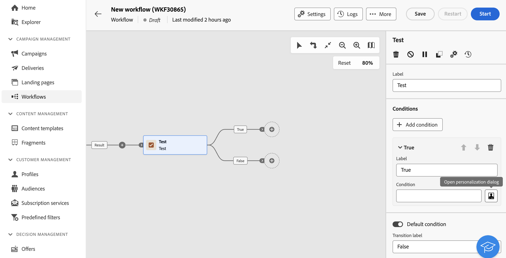

# 测试 {#test}

>[!CONTEXTUALHELP]
>id="ajo_orchestration_test"
>title="”测试“活动"
>abstract="**测试**&#x200B;活动是&#x200B;**流量控制**&#x200B;活动。它允许您根据指定条件启用过渡。"

>[!CONTEXTUALHELP]
>id="ajo_orchestration_test_conditions"
>title="条件"
>abstract="**测试**&#x200B;活动可以有多个输出过渡。在执行精心策划的营销活动期间，将会按顺序测试每个条件，直到满足其中一个条件。如果没有满足任何条件，协同营销活动会沿着&#x200B;**[!UICONTROL 默认条件]**&#x200B;路径继续。如果没有激活默认条件，协同营销活动会在此时停止。"

+++ 目录

| 欢迎了解精心策划的营销活动 | 启动第一个精心策划的营销活动 | 查询数据库 | 精心策划的营销活动 |
|---|---|---|---|
| [开始使用编排的营销活动](../gs-orchestrated-campaigns.md)  创建和管理关系架构和数据集：  <ul><li>[架构和数据集入门](../gs-schemas.md)</li><li>[手动架构](../manual-schema.md)</li><li>[文件上载架构](../file-upload-schema.md)</li><li>[摄取数据](../ingest-data.md)</li></ul>[访问和管理编排的营销活动](../access-manage-orchestrated-campaigns.md) | [创建精心策划的营销活动的关键步骤](../gs-campaign-creation.md)  [创建和计划营销活动](../create-orchestrated-campaign.md)  [精心策划活动](../orchestrate-activities.md)  [启动和监控营销活动](../start-monitor-campaigns.md)  [报告](../reporting-campaigns.md) | [使用规则生成器](../orchestrated-rule-builder.md)  [生成您的第一个查询](../build-query.md)  [编辑表达式](../edit-expressions.md)  [重定向](../retarget.md) | [活动快速入门](about-activities.md)  活动： [并行汇聚](and-join.md) - [生成受众](build-audience.md) - [更改维度](change-dimension.md) - [渠道活动](channels.md) - [合并](combine.md) - [重复数据删除](deduplication.md) - [扩充](enrichment.md) - [分叉](fork.md) - [协调](reconciliation.md) - [保存受众](save-audience.md) - [拆分](split.md) - [等待](wait.md) |

{style="table-layout:fixed"}

+++

 

>[!BEGINSHADEBOX]

 

此页面上的内容不是最终内容，可能会发生变化。

>[!ENDSHADEBOX]

**[!UICONTROL 测试]**&#x200B;活动是&#x200B;**[!UICONTROL 流量控制]**&#x200B;活动。它允许您根据指定条件启用过渡。

## 配置测试活动 {#test-configuration}

请按照以下步骤操作，配置&#x200B;**[!UICONTROL 测试]**&#x200B;活动：

1. 将&#x200B;**[!UICONTROL 测试]**&#x200B;活动添加到精心策划的营销活动中。

1. 默认情况下，**[!UICONTROL 测试]**&#x200B;活动会进行简单的布尔值测试。如果满足“True”过渡中定义的条件，则将激活此过渡。否则，将激活默认的“False”过渡。

1. 要配置与过渡关联的条件，请单击&#x200B;**[!UICONTROL 打开个性化对话框]**&#x200B;图标。使用表达式编辑器定义激活此过渡所需的规则。您还可以利用事件变量、条件和日期/时间函数。

   此外，您可以修改&#x200B;**[!UICONTROL 标签]**&#x200B;字段，以便在精心策划的营销活动画布上个性化过渡名称。

   

1. 您可以向&#x200B;**[!UICONTROL 测试]**&#x200B;活动添加多个输出过渡。为此，请单击&#x200B;**[!UICONTROL 添加条件]**&#x200B;按钮，并为每个过渡配置标签和相关条件。
v
1. 在执行精心策划的营销活动期间，将会按顺序测试每个条件，直到满足其中一个条件。如果没有满足任何条件，精心策划的营销活动会沿着&#x200B;**[!UICONTROL 默认条件]**&#x200B;的路径继续。如果没有激活默认条件，工作流会在此时停止。

## 示例 {#example}

在此示例中，会根据&#x200B;**[!UICONTROL 生成受众]**&#x200B;活动选择的目标轮廓数量激活不同的过渡：

* 如果选择的目标轮廓数量超过 10,000 个，则发送电子邮件。
* 如果轮廓数量在 1,000 到 10,000 之间，则发送短信。
* 如果目标轮廓数量低于 1,000，则会被定向到“请勿联系”过渡。

为此，已在“电子邮件”和“短信”条件中利用 `vars.recCount` 事件变量，计算目标轮廓的数量并激活相应的过渡。

