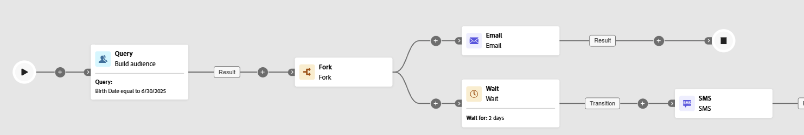

# 等待 {#wait}

>[!CONTEXTUALHELP]
>id="ajo_orchestration_wait"
>title="等待活动"
>abstract="**等待**&#x200B;活动用于将过渡从一个活动推迟另一个活动。"

**[!UICONTROL 等待]**&#x200B;活动是一个&#x200B;**[!UICONTROL 流量控制]**&#x200B;组件，用于在编排的营销活动中的两个活动之间引入延迟。 这有助于确保在更合适的时间进行后续行动，并且使后续行动对用户参与度的影响更大。

例如，您可以在投放电子邮件后等待几天，以便跟踪打开数和点击数，然后再发送后续消息。

## 配置{#wait-configuration}

>[!IMPORTANT]
>
>临时表中的数据在&#x200B;**5天**&#x200B;之后不再保留。 当您使用&#x200B;**[!UICONTROL 持续时间]**&#x200B;或&#x200B;**[!UICONTROL 固定时间]**&#x200B;等待时，请确保直至下一个活动在该限制内完成所用的时间，以便中间数据保持可用。

请按照以下步骤操作，配置&#x200B;**[!UICONTROL 等待]**&#x200B;活动：

1. 将&#x200B;**[!UICONTROL 等待]**&#x200B;活动添加到您的编排营销活动中。

1. 选择最适合您需求的等待类型：

   * **[!UICONTROL 持续时间]**：以秒、分钟、小时或天为单位指定延迟，然后再进行下一个活动。

   * **[!UICONTROL 固定时间]**：设置下一个活动开始的特定日期和时间。

   

## 示例{#wait-example}

下面的示例展示了典型用例中的&#x200B;**[!UICONTROL 等待]**&#x200B;活动。  将会发送包含促销代码的电子邮件给庆祝生日的轮廓。 2天后，将向同一组发送短信，提醒其生日促销代码即将过期。

