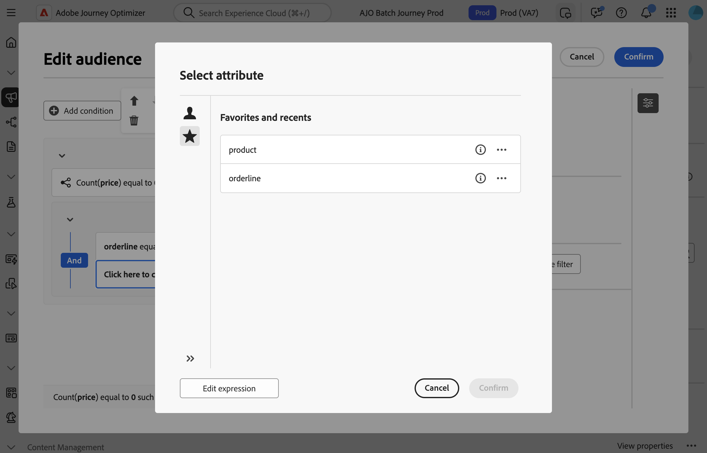
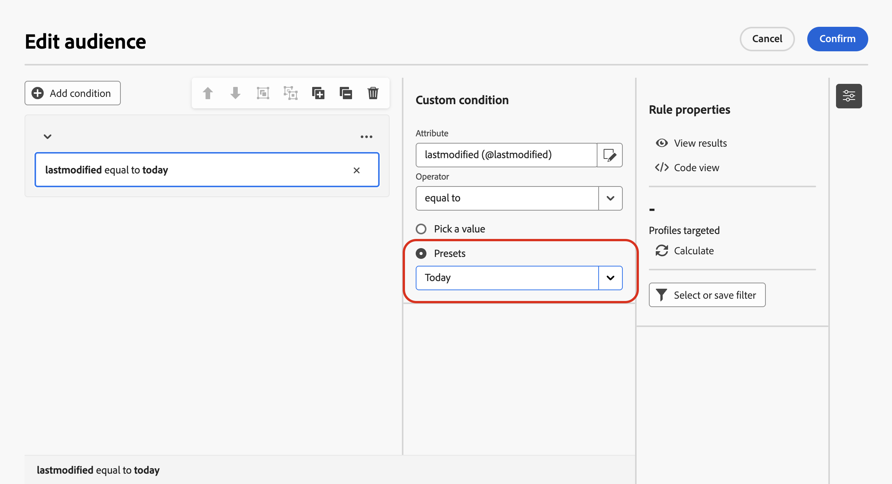

# 构建您的第一条规则 {#build-query}

+++ 目录

| 欢迎使用编排的营销活动 | 启动您的第一个编排的营销活动 | 查询数据库  | 编排的营销活动活动 |
|---|---|---|---|
| [开始使用编排的营销活动](gs-orchestrated-campaigns.md)  [配置步骤](configuration-steps.md)  [创建编排的营销活动的关键步骤](gs-campaign-creation.md) | [创建协调的营销活动](create-orchestrated-campaign.md)  [协调活动](orchestrate-activities.md)  [发送包含协调的营销活动的消息](send-messages.md)  [开始并监视营销活动](start-monitor-campaigns.md)  [报告](reporting-campaigns.md) | [使用规则生成器](orchestrated-rule-builder.md)  [生成您的第一个查询](build-query.md)  [编辑表达式](edit-expressions.md) | [开始使用活动](activities/about-activities.md)  活动： [And-join](activities/and-join.md) - [生成受众](activities/build-audience.md) - [更改维度](activities/change-dimension.md) - [组合](activities/combine.md) - [重复数据删除](activities/deduplication.md) - [扩充](activities/enrichment.md) - [分支](activities/fork.md) - [协调](activities/reconciliation.md) - [拆分](activities/split.md) - [等待](activities/wait.md) |

{style="table-layout:fixed"}

+++

 

为编排的活动构建规则的主要步骤如下：

1. **添加条件** — 创建自定义条件，以使用数据库和高级表达式中的属性构建您自己的条件来筛选查询。
1. **组合条件** — 使用组和逻辑运算符排列画布中的条件。
1. **检查并验证规则** — 在保存之前检查规则的生成数据。

## 添加条件 {#conditions}

要在查询中添加条件，请执行以下步骤：

1. 从&#x200B;**[!UICONTROL 构建受众]**&#x200B;活动访问规则生成器。

1. 单击&#x200B;**添加条件**&#x200B;按钮以创建查询的第一个条件。

   您也可以使用预定义过滤器来启动查询。 为此，请单击&#x200B;**[!UICONTROL 选择或保存筛选器]**&#x200B;按钮，然后选择&#x200B;**[!UICONTROL 选择预定义筛选器]**。

1. 识别数据库中的属性以用作条件的标准。 属性旁边的“i”图标提供了有关存储该属性及其数据类型的表格的信息。

   

   >[!NOTE]
   >
   >使用&#x200B;**编辑表达式**&#x200B;按钮，您可以使用表达式编辑器使用数据库和帮助程序函数中的字段手动定义表达式。 [了解如何编辑表达式](expression-editor.md)

1. 单击属性旁边显示“更多操作”按钮](assets/do-not-localize/rule-builder-icon-more.svg)按钮的![图像以访问这些附加选项：

+++ 值分布

   分析表中给定属性的值分布。 此功能对于理解可用的值、其数量和百分比十分有用。它还有助于避免在构建查询或创建表达式时出现大小写或拼写不一致等问题。

   如果某些属性有大量值，该工具仅显示前二十个值。在这种情况下，会出现一个&#x200B;**[!UICONTROL 部分加载]**&#x200B;通知来表示有此限制。您可以应用高级过滤器来优化显示的结果，并重点关注特定值或数据子集。

   显示值分布的

+++

+++ 添加到收藏夹

   将属性添加到收藏夹菜单可快速访问最常使用的属性。 您最多可以将20个属性添加到收藏夹。 收藏和最近使用的属性与组织内的每位用户关联，确保在不同设备间也能访问，从而提供跨设备的一致体验。

   要访问您收藏的属性，请使用&#x200B;**[!UICONTROL 收藏夹和最新内容]**&#x200B;菜单。 收藏夹属性首先显示，然后是最近使用的属性，这样可以轻松找到所需的属性。 要从收藏夹中移除属性，请再次选择星形图标。

   

+++

1. 单击&#x200B;**[!UICONTROL 确认]**&#x200B;以将所选属性添加到您的条件。

1. 此时将显示一个属性窗格，您可以在其中配置所需的属性值。

   

1. 从下拉列表中选择要应用的&#x200B;**[!UICONTROL 运算符]**。

   可以使用各种运算符。 下拉列表中可用的运算符取决于属性的数据类型。

   +++可用运算符列表

   | 操作员 | 目的 | 示例 |
   |---|---|---|
   | 等于 | 返回与在第二个“值”列中输入的数据相同的结果。 | 等于“Jones”的姓氏(@lastName)将仅返回姓氏为Jones的收件人。 |
   | 不等于 | 返回与输入值不相同的所有值。 | 语言(@language)不等于“英语”。 |
   | 大于 | 返回大于输入值的值。 | 年龄(@age)大于50将返回所有大于“50”的值，如“51”、“52”。 |
   | 小于 | 返回小于输入值的值。 | “DaysAgo(100)”之前的创建日期(@created)将返回所有在100天内创建的收件人。 |
   | 大于或等于 | 返回所有等于或大于输入值的值。 | 年龄(@age)大于或等于“30”将返回所有30岁或以上的收件人。 |
   | 小于或等于 | 返回等于或小于输入值的所有值。 | 年龄(@age)小于或等于“60”将返回所有60岁或以下的收件人。 |
   | 包含在 | 返回指定值中包含的结果。 这些值必须以逗号分隔。 | 出生日期(@birthDate)包含在“12/10/1979,12/10/1984”中，将返回这些日期之间出生的收件人。 |
   | Not in | 其工作方式与包含在运算符中类似。 在本例中，将根据输入的值排除收件人。 | 出生日期(@birthDate)未列入`12/10/1979,12/10/1984`。 将不会返回在这些日期中出生的收件人。 |
   | 为空 | 返回与第二个“值”列中的空值匹配的结果。 | Mobile (@mobilePhone)为空，则会返回所有没有手机号码的收件人。 |
   | 不为空 | 与Is empty运算符相反。 无需在第二个“值”列中输入数据。 | 电子邮件(@email)不为空。 |
   | 开始于 | 返回以输入值开头的结果。 | 帐户# (@account)以“32010”开头。 |
   | Does not start with | 返回不以输入值开头的结果。 | 帐户# (@account)不以“20”开头。 |
   | Contains | 返回至少包含输入值的结果。 | 包含“mail”的电子邮件域(@domain)将返回包含“mail”的所有域名，如“gmail.com”。 |
   | 不包含 | 返回不包含输入值的结果。 | 电子邮件域(@domain)不包含“vo”。 包含“vo”的域名（如“voila.fr”）将不会显示在结果中。 |
   | 类似 | 与Contains运算符类似，它允许您在值中插入%通配符。 | 姓氏(@lastName)，如“Jon%s”。 通配符用作“小丑”，可查找诸如“Jones”之类的姓名。 |
   | 不相似 | 与Contains运算符类似，它允许您在值中插入%通配符。 | 姓氏(@lastName)不像“Smi%h”。 不会返回姓氏为“Smith”的收件人。 |

+++

1. 在&#x200B;**值**&#x200B;字段中，定义预期值。 您还可以使用表达式编辑器使用数据库和帮助程序函数中的字段手动定义表达式。 为此，请单击显示表达式编辑器图标](assets/do-not-localize/rule-builder-icon-editor.svg)图标的

   对于日期类型属性，使用&#x200B;**[!UICONTROL 预设]**&#x200B;选项可以获得预定义的值。

   +++请参阅示例

   显示预设选项的

+++

### 链接表（1-1和1-N链接）上的自定义条件{#links}

自定义条件允许您查询链接到规则当前使用的表的表。 这包括具有1-1基数链接的表，或集合表（1-N链接）。

对于&#x200B;**1-1链接**，导航到链接表，选择所需属性并定义预期值。

您还可以直接选择&#x200B;**值**&#x200B;选取器中的表链接并进行确认。 在这种情况下，需要使用专用选取器来选择对所选表可用的值，如下面的示例所示。

+++查询示例

在本例中，查询的目标品牌标签为“正在运行”。

1. 在&#x200B;**Brand**&#x200B;表中导航并选择&#x200B;**标签**&#x200B;属性。

   

1. 定义属性的预期值。

   

以下是一个直接选择表链接的查询示例。 必须从专用选取器中选择此表的可用值。

+++

对于&#x200B;**1-N链接**，您可以定义子条件来优化查询，如下面的示例所示。

+++查询示例

在本例中，查询的目标是购买与Brewmsaster产品相关且价格超过1000美元的收件人。

1. 选择&#x200B;**购买**&#x200B;表并进行确认。

1. 单击&#x200B;**[!UICONTROL 添加条件]**&#x200B;以定义要应用于选定表的子条件。

   

1. 根据您的需要添加子条件。

   

+++

### 包含聚合数据的自定义条件 {#aggregate}

自定义条件允许您执行聚合操作。 要实现此目的，需要直接从集合表中选择属性：

1. 在所需的集合表中导航，并选择要对其执行聚合操作的属性。

1. 在属性窗格中，打开&#x200B;**聚合数据**&#x200B;选项并选择所需的聚合函数。

   

## 使用运算符组合条件 {#operators}

每次在规则中添加新条件时，都会通过&#x200B;**AND**&#x200B;运算符自动将其链接到现有条件。 这意味着将两个条件得出的结果结合在一起。

要更改条件之间的运算符，请单击该运算符，然后选择所需的运算符。

可用的运算符包括：

* **AND （交集）**：将匹配出站过渡中所有筛选组件的结果组合在一起。
* **OR （并集）**：包含与叫客过渡中至少一个筛选组件匹配的结果。
* **EXCEPT （排除）**：排除与叫客过渡中所有筛选组件匹配的结果。

## 操作条件 {#manipulate}

规则生成器画布工具栏提供了一些选项，用于轻松处理规则中的条件：

| 工具栏图标 | 描述 |
|--- |--- |
|  | 将组件上移一行。 |
|  | 将组件下移一行。 |
|  | 将两个组件放在一个组中。 |
|  | 将单个组的组件分开。 |
|  | 展开所有组。 |
|  | 折叠所有组。 |
|  | 删除所有组和组件。 |

根据需要，您可能需要通过将组件分组到同一组并将它们链接在一起来创建中间组件组。

* 若要将两个现有条件分组，请选择其中一个条件，然后单击或按钮，以将其与上方或下方条件分组。

* 要将现有条件与新条件进行分组，请选择该条件，单击显示“更多操作”按钮](assets/do-not-localize/rule-builder-icon-more.svg)按钮的![图像，然后选择&#x200B;**[!UICONTROL 添加组]**。 选择要添加到组的新属性，然后确认。

  

在下面的示例中，我们创建了一个中间组，以定向购买BrewMaster或VanillaVelvet产品的客户。

## 检查并验证您的查询

在画布中构建查询后，可以使用&#x200B;**规则属性**&#x200B;窗格检查查询。 可用的操作包括：

* **查看结果：**&#x200B;显示查询产生的数据。
* **代码视图**：显示SQL中查询的基于代码的版本。
* **计算**：更新并显示规则定向的记录数。
* **选择或保存筛选器**：选择要在画布中使用的现有预定义筛选器，或将查询另存为预定义筛选器以供将来重用。

  >[!IMPORTANT]
  >
  >从“规则属性”窗格中选择一个预定义过滤器，将画布中已构建的规则替换为所选过滤器。

规则就绪后，单击中的&#x200B;**[!UICONTROL 确认]**&#x200B;按钮进行保存。
