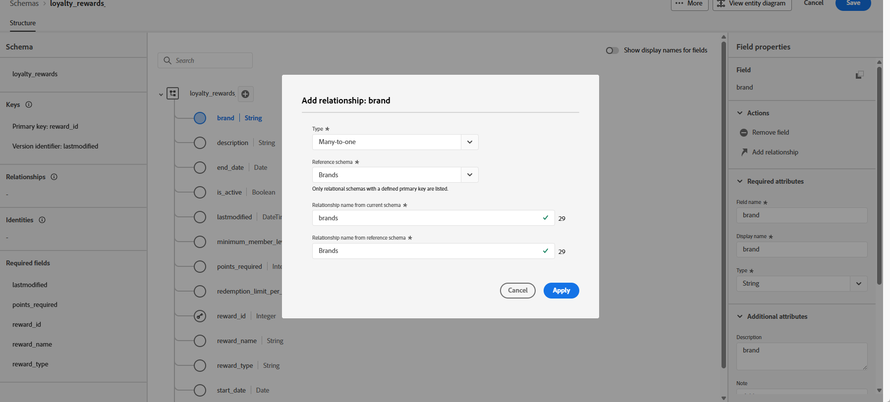

# 配置步骤 {#configuration-steps}

+++ 目录

| 欢迎使用编排的营销活动 | 启动第一个精心策划的营销活动 | 查询数据库 | 精心策划的营销活动 |
|---|---|---|---|
| [开始使用编排的营销活动](gs-orchestrated-campaigns.md)<br/><br/><b>[配置步骤](configuration-steps.md)</b><br/><br/>[访问和管理编排的营销活动](access-manage-orchestrated-campaigns.md) | [创建编排营销活动的关键步骤](gs-campaign-creation.md)<br/><br/>[创建和计划营销活动](create-orchestrated-campaign.md)<br/><br/>[编排活动](orchestrate-activities.md)<br/><br/>[发送包含编排营销活动的消息](send-messages.md)<br/><br/>[开始和监控营销活动](start-monitor-campaigns.md)<br/><br/>[报告](reporting-campaigns.md) | [使用规则生成器](orchestrated-rule-builder.md)<br/><br/>[生成您的第一个查询](build-query.md)<br/><br/>[编辑表达式](edit-expressions.md) | [开始使用活动](activities/about-activities.md)<br/><br/>活动：<br/>[And-join](activities/and-join.md) - [生成受众](activities/build-audience.md) - [更改维度](activities/change-dimension.md) - [组合](activities/combine.md) - [重复数据删除](activities/deduplication.md) - [扩充](activities/enrichment.md) - [分支](activities/fork.md) - [协调](activities/reconciliation.md) - [拆分](activities/split.md) - [等待](activities/wait.md) |

{style="table-layout:fixed"}

+++

</br>

>[!BEGINSHADEBOX]

正在进行文档

>[!ENDSHADEBOX]

本指南将指导您完成以下过程：创建关系架构、为编排的营销活动配置数据集、通过S3源摄取数据，以及在AP平台中查询摄取的数据。

在此示例中，设置包括集成两个关键实体&#x200B;**忠诚度交易**&#x200B;和&#x200B;**忠诚度奖励**，并将它们链接到现有核心实体&#x200B;**收件人**&#x200B;和&#x200B;**品牌**。

1. [上传DDL文件](#upload-ddl)

   为编排的营销活动定义关系数据模型，包括&#x200B;**忠诚度交易**&#x200B;和&#x200B;**忠诚度奖励**&#x200B;实体，以及所需的键和版本控制属性。

1. [选择实体](#entities)

   在架构中的表之间建立有意义的关系，以创建一致且互连的数据模型。

1. [链接架构](#link-schema)

   将&#x200B;**忠诚度交易**&#x200B;实体链接到&#x200B;**收件人**，将&#x200B;**忠诚度奖励**&#x200B;链接到&#x200B;**品牌**，以构建支持个性化客户历程的连接数据模型。

1. [引入数据](#ingest)

   将来自受支持源（如SFTP、云存储或数据库）的数据引入Adobe Experience Platform。

## 上传 DDL 文件 {#upload-ddl}

本节提供了有关如何通过上传DDL（数据定义语言）文件在Adobe Experience Platform中创建关系模式的分步指南。 使用DDL文件，您可以预先定义数据模型的结构，包括表、属性、键和关系。

1. 登录到AP平台。

1. 导航到&#x200B;**数据管理** > **架构**。

1. 单击&#x200B;**创建架构**。

1. 系统将提示您选择以下两种架构类型：

   * **标准**
   * **关系**，专门用于编排的营销活动

   

1. 选择&#x200B;**上传DDL文件**&#x200B;以定义实体关系图并创建架构。

   表结构必须包含：
   * 至少一个主键
   * 版本标识符，如`datetime`或`number`类型的`lastmodified`字段。

1. 拖放您的DDL文件并单击&#x200B;**[!UICONTROL 下一步]**。

1. 键入您的&#x200B;**[!UICONTROL 架构名称]**。

1. 设置每个架构及其列，确保指定了主键。

   必须指定一个属性（如`lastmodified`）作为版本描述符。 此属性（通常为`datetime`、`long`或`int`类型）对于摄取过程至关重要，可确保使用最新数据版本更新数据集。

   

1. 完成后，单击&#x200B;**[!UICONTROL 完成]**。

您现在可以在画布中验证表和字段定义。 [在下面的部分了解详情](#entities)

## 选择实体 {#entities}

要定义架构内各表之间的逻辑连接，请执行以下步骤。

1. 访问数据模型的画布视图，然后选择要链接的两个表

1. 单击Source联接旁边的按钮，然后拖动箭头并引导至Target联接以建立连接。

   

1. 填写给定表单以定义链接，配置完毕后单击&#x200B;**应用**。

   

   **基数**：

   * **1-N**：源表格的一个存在可以拥有目标表格的多个对应存在，但目标表格的一个存在最多可以拥有源表格的一个对应存在。

   * **N-1**：目标表的一个存在可以具有源表的多个对应存在，但源表的一个存在最多可以具有目标表的一个对应存在。

   * **1-1**：源表格的一个存在最多可以具有目标表格的一个对应存在。

1. 数据模型中定义的所有链接在画布视图中均表示为箭头。 单击两个表之间的箭头可查看详细信息、进行编辑或根据需要删除链接。

   

1. 使用工具栏自定义和调整画布。

   

   * **放大**：放大画布以更清楚地查看数据模型的详细信息。

   * **缩小**：缩小画布大小，以便更全面地查看数据模型。

   * **适合视图**：调整缩放以适合可见区域中的所有架构。

   * **筛选器**：选择要在画布中显示的架构。

   * **强制自动布局**：自动排列架构以便更好地进行组织。

   * **显示地图**：切换小型地图覆盖以帮助更轻松地导航大型或复杂的架构布局。

1. 完成后，单击&#x200B;**保存**。 此操作创建架构和关联的数据集，并启用数据集以用于编排的营销活动。

1. 单击&#x200B;**[!UICONTROL 打开作业]**&#x200B;以监视创建作业的进度。 此过程可能需要几分钟时间，具体取决于DDL文件中定义的表数。

   

## 链接架构 {#link-schema}

在&#x200B;**忠诚度交易**&#x200B;架构和&#x200B;**收件人**&#x200B;架构之间建立关系，以将每个交易与正确的客户记录相关联。

1. 导航到&#x200B;**[!UICONTROL 架构]**&#x200B;并打开您之前创建的&#x200B;**忠诚度交易记录**。

1. 单击客户&#x200B;**[!UICONTROL 字段属性]**&#x200B;中的&#x200B;**[!UICONTROL 添加关系]**。

   

1. 选择&#x200B;**[!UICONTROL 多对一]**&#x200B;作为关系&#x200B;**[!UICONTROL 类型]**。

1. 链接到现有&#x200B;**收件人**&#x200B;架构。

   

1. 输入来自当前架构&#x200B;**的**&#x200B;[!UICONTROL &#x200B;关系名称以及来自引用架构&#x200B;]&#x200B;**的**&#x200B;关系名称。

1. 单击&#x200B;**[!UICONTROL 应用]**&#x200B;以保存更改。

继续在&#x200B;**忠诚度奖励**&#x200B;架构和&#x200B;**品牌**&#x200B;架构之间创建关系，将每个奖励条目与相应的品牌关联。



## 引入数据 {#ingest}

Adobe Experience Platform允许从外部源摄取数据，同时让您能够使用Experience Platform服务来构建、标记和增强传入数据。 您可以从各种源中摄取数据，如 Adobe 应用程序、基于云的存储、数据库和许多其他源。

1. 从&#x200B;**[!UICONTROL 连接]**&#x200B;菜单中，访问&#x200B;**[!UICONTROL 源]**&#x200B;菜单。

1. 选择&#x200B;**[!UICONTROL 云存储]**&#x200B;类别，然后选择Amazon S3，然后单击&#x200B;**[!UICONTROL 添加数据]**。

   

1. 连接您的S3帐户：

   * 使用现有帐户

   * 使用新帐户

   [请参阅Adobe Experience Platform文档以了解详情](https://experienceleague.adobe.com/zh-hans/docs/experience-platform/destinations/catalog/cloud-storage/amazon-s3#connect)

   

1. 浏览连接的S3源，直到找到之前创建的两个文件夹，即&#x200B;**忠诚度奖励**&#x200B;和&#x200B;**忠诚度交易**。

1. 单击您的文件夹。

   选择文件夹可确保自动处理具有相同结构的所有当前和未来文件，而选择文件则需要手动更新每个新数据增量。

   

1. 选择您的数据格式，然后单击下一步。


<!--manual
## Create a relational schema manual


1. Log in to the AP Platform.
1. Navigate to the **Schema Management** section.
1. Click on **Create Schema**.

1. You will be prompted to select between two schema types:
    * **Standard**
    * **Relational** (used specifically for AGO campaigns)

1. Click on **Create Manual**.
1. Provide a **Schema Name** (e.g., `test_demo_ck001`).
1. Choose **Schema Type**:
    - **Record Type** (required for AGO campaigns)
    - **Time Series** (not applicable here)
1. Click **Finish** to proceed to the schema design canvas.

## Select entities and fields to import

1. In the canvas, add attributes (fields) to your schema.
1. Add a **Primary Key** (mandatory).
1. Add a **Version Descriptor** attribute (for CDC support):
    - This must be of type **DateTime** or **Numeric** (Integer, Long, Short, Byte).
    - Common example: `last_modified`

> **Why?** The **Primary Key** uniquely identifies each record, and the **Version Descriptor** tracks changes, supporting CDC (Change Data Capture) and data mirroring.

1. Mark the appropriate fields as **Primary Key** and **Version Descriptor**.
1. Click **Save**.

---


## 5. Creating a Dataset

1. Navigate to **Datasets**.
1. Click on **Create Dataset**.
1. Select the schema you just created.
1. Assign a **Dataset Name** (same as schema is fine).
1. Optionally, add tags (e.g., `AGO_campaigns`).
6. Ensure the checkbox **"Relational Schema"** is checked.
7. Click **Finish**.

> **Note:** Only one dataset can be created per relational schema.


## 6. Enabling the Dataset

1. Click **Enable** for the dataset.
1. Wait a few moments for the status to show **Enabled**.

> **Why?** Without enabling, the dataset cannot be used in orchestrated campaigns or ingest data.

## 7. Creating a Data Source (S3)

1. Navigate to **Sources**.
1. Click **Create Source**.
1. Choose the source type (e.g., **S3 Bucket**).
1. Provide connection details:
    - Bucket Path (optionally include subfolder path)
1. Save the source.

## 8. Preparing and Uploading Data

1. Prepare your CSV file with:
    - Column headers matching your schema attributes
    - `last_modified` column
    - `change_type` column (`U`/`DU` for upsert, `D` for delete)

> **Important:** `change_type` is required but does not need to be defined in the schema.

1. Save the file as `.csv`.

1. Upload the file to the specified folder in your S3 bucket.


## 9. Ingesting Data from S3

1. Go to **Sources** and find your S3 source.
1. Click **Add Data**.
1. Select the uploaded file.
1. Specify the file format as **CSV** and any compression type if applicable.
1. Review the data preview (ensure `change_type`, `last_modified`, and primary key are visible).
1. Click **Next**.

### Enable Change Data Capture (CDC)

- Check **Enable Change Data Capture**.
- Select the dataset enabled for AGO campaigns.

### Field Mapping

- Fields are auto-mapped (note that `change_type` is not mapped and that's expected).
- Click **Next**.

### Scheduling

- Schedule ingestion frequency (minute, hour, day, week).
- Set start time (immediate or future).
- Click **Finish** to create the data flow.

## 10. Monitoring Data Flow

1. Navigate back to **Sources > Data Flows**.
1. Wait 4–5 minutes for the first run (initial overhead).
1. Monitor:
    - Status (Started, Completed)
    - Number of records ingested
    - Errors (if any)

> **Tip:** Ingested data first lands in the **Data Lake**.

## 11. Data Replication to Data Store

The **Data Store** is updated:

- Every **15 minutes**, or

- If **Data Lake size exceeds 5MB**

This is a background replication process.


## 12. Querying the Dataset

1. Navigate to **Query Services**.
1. Click **Create Query**.
1. Example query:

   ```sql
   SELECT * FROM test_demo_ck001;
   ```

1. Run the query.

> **Note:** If ingestion is incomplete, query will return an error. Check data flow status.

-->