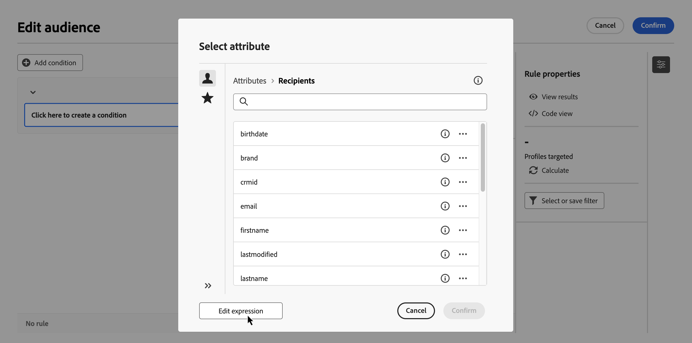

# 编辑表达式 {#edit-expressions}

+++ 目录

| 欢迎了解精心策划的营销活动 | 启动第一个精心策划的营销活动 | 查询数据库 | 精心策划的营销活动 |
|---|---|---|---|
| [开始使用编排的营销活动](gs-orchestrated-campaigns.md)  创建和管理关系架构和数据集：  <ul><li>[架构和数据集入门](gs-schemas.md)</li><li>[手动架构](manual-schema.md)</li><li>[文件上载架构](file-upload-schema.md)</li><li>[摄取数据](ingest-data.md)</li></ul>[访问和管理编排的营销活动](access-manage-orchestrated-campaigns.md)  [创建编排的营销活动的关键步骤](gs-campaign-creation.md) | [创建和计划营销活动](create-orchestrated-campaign.md)  [精心策划活动](orchestrate-activities.md)  [启动和监控营销活动](start-monitor-campaigns.md)  [报告](reporting-campaigns.md) | [使用规则生成器](orchestrated-rule-builder.md)  [生成您的第一个查询](build-query.md)  <b>[编辑表达式](edit-expressions.md)</b>  [重定向](retarget.md) | [活动快速入门](activities/about-activities.md)  活动： [并行汇聚](activities/and-join.md) - [生成受众](activities/build-audience.md) - [更改维度](activities/change-dimension.md) - [渠道活动](activities/channels.md) - [合并](activities/combine.md) - [重复数据删除](activities/deduplication.md) - [扩充](activities/enrichment.md) - [分叉](activities/fork.md) - [协调](activities/reconciliation.md) - [保存受众](activities/save-audience.md) - [拆分](activities/split.md) - [等待](activities/wait.md) |

{style="table-layout:fixed"}

+++
 

>[!BEGINSHADEBOX]

此页面上的内容不是最终内容，可能会发生变化。

>[!ENDSHADEBOX]

>[!NOTE]
>
>以下部分提供了有关如何使用表达式编辑器生成规则的信息。请记住，用于生成规则的语法不同于用于添加个性化的语法。

## 使用表达式编辑器 {#edit}

编辑表达式需要手动输入条件以形成规则。您可以通过此模式使用高级函数，这些函数可以让您处理用于执行特定查询（如处理日期、字符串、数字字段和排序）的值。

在配置自定义条件时，可以通过规则生成器的&#x200B;**[!UICONTROL 编辑表达式]**&#x200B;按钮启用表达式编辑器，并且可将其用于&#x200B;**[!UICONTROL 属性]**&#x200B;和&#x200B;**[!UICONTROL 值]**&#x200B;字段。

| 从&#x200B;**属性**&#x200B;字段访问 | 从&#x200B;**值**&#x200B;字段访问 |
| --- | --- |
| {zoomable="yes"}{width="200" align="center" zoomable="yes"} | {zoomable="yes"}{width="200" align="center" zoomable="yes"} |

表达式编辑器提供：

* **输入字段 (1)**，用于定义表达式。
* 可用&#x200B;**字段 (2)** 的列表，可在表达式中使用并对应查询的目标维度。
* **辅助函数 (3)**，按类别排序。

通过直接在输入字段中输入表达式来编辑表达式。要添加字段或辅助函数，请将光标置于要添加该字段或辅助函数的表达式中，然后单击 + 按钮。

{zoomable="yes"}

## 辅助函数

利用查询编辑工具，可使用高级函数根据所需结果和所处理数据的类型执行复杂筛选。可以使用以下函数：

### 聚合

聚合函数对一组值执行计算。

<table>
<tbody>
<tr>
<td><strong>名称</strong></td>
<td><strong>描述</strong></td>
<td><strong>句法</strong></td>
</tr>
<tr>
<td><strong>Avg</strong></td>
<td>返回数字类型列的平均值</td>
<td>Avg(&lt;值&gt;)</td>
</tr>
<tr>
<td><strong>Count</strong></td>
<td>计算列中的非空值</td>
<td>Count(&lt;值&gt;)</td>
</tr>
<tr>
<td><strong>CountAll</strong></td>
<td>计算返回的值（所有字段）</td>
<td>CountAll()</td>
</tr>
<tr>
<td><strong>Countdistinct</strong></td>
<td>计算列中非空的不同值</td>
<td>Countdistinct(&lt;值&gt;)</td>
</tr>
<tr>
<td><strong>Max</strong></td>
<td>返回数字、字符串或日期类型列中的最大值</td>
<td>Max(&lt;值&gt;)</td>
</tr>
<tr>
<td><strong>Min</strong></td>
<td>返回数字、字符串或日期类型列中的最小值</td>
<td>Min(&lt;值&gt;)</td>
</tr>
<tr>
<td><strong>StdDev</strong></td>
<td>返回数字、字符串或日期列中的标准差</td>
<td>StdDev(&lt;值&gt;)</td>
</tr>
<tr>
<td><strong>StringAgg</strong></td>
<td>返回字符串类型列的值的串联，由第二个参数中的字符分隔</td>
<td>StringAgg(&lt;值&gt;, &lt;字符串&gt;)</td>
</tr>
<tr>
<td><strong>Sum</strong></td>
<td>返回数字、字符串或日期类型列的值的总和</td>
<td>Sum(&lt;值&gt;)</td>
</tr>
</tbody>
</table>

### 日期

日期函数可处理日期或时间值。

<table>
<tbody>
<tr>
<td><strong>名称</strong></td>
<td><strong>描述</strong></td>
<td><strong>句法</strong></td>
</tr>
<tr>
<td><strong>AddDays</strong></td>
<td>向日期添加天数</td>
<td>AddDays(&lt;日期&gt;, &lt;数字&gt;)</td>
</tr>
<tr>
<td><strong>AddHours</strong></td>
<td>向日期添加小时数</td>
<td>AddHours(&lt;日期&gt;, &lt;数字&gt;)</td>
</tr>
<tr>
<td><strong>AddMinutes</strong></td>
<td>向日期添加分钟数</td>
<td>AddMinutes(&lt;日期&gt;, &lt;数字&gt;)</td>
</tr>
<tr>
<td><strong>AddMonths</strong></td>
<td>向日期添加月数</td>
<td>AddMonths(&lt;日期&gt;, &lt;数字&gt;)</td>
</tr>
<tr>
<td><strong>AddSeconds</strong></td>
<td>向日期添加秒数</td>
<td>AddSeconds(&lt;日期&gt;, &lt;数字&gt;)</td>
</tr>
<tr>
<td><strong>AddYears</strong></td>
<td>向日期添加年数</td>
<td>AddYears(&lt;日期&gt;, &lt;数字&gt;)</td>
</tr>
<tr>
<td><strong>ConvertNTZ</strong></td>
<td>将时间戳 NTZ（不带时区的时间戳）转换为 TZ（带时区的时间戳），并应用定义的会话 TZ</td>
<td>ConvertNTZ(&lt;日期+时间&gt;)</td>
</tr>
<tr>
<td><strong>DateCmp</strong></td>
<td>比较两个日期</td>
<td>DateCmp(&lt;日期&gt;, &lt;日期&gt;)</td>
</tr>
<tr>
<td><strong>DateOnly</strong></td>
<td>仅返回日期（且时间为 00:00）</td>
<td>DateOnly(&lt;日期&gt;)</td>
</tr>
<tr>
<td><strong>Day</strong></td>
<td>返回表示日期天数的数字</td>
<td>Day(&lt;日期&gt;)</td>
</tr>
<tr>
<td><strong>DayOfYear</strong></td>
<td>返回表示是一年中第几天的数字</td>
<td>DayOfYear(&lt;日期&gt;)</td>
</tr>
<tr>
<td><strong>DaysAgo</strong></td>
<td>返回对应于当前日期减 n 天的日期</td>
<td>DaysAgo(&lt;数字&gt;)</td>
</tr>
<tr>
<td><strong>DaysAgoInt</strong></td>
<td>返回对应于当前日期减 n 天的日期（整数年月日）</td>
<td>DaysAgoInt(&lt;数字&gt;)</td>
</tr>
<tr>
<td><strong>DaysDiff</strong></td>
<td>返回两个日期之间的天数</td>
<td>DaysDiff(&lt;结束日期&gt;, &lt;开始日期&gt;)</td>
</tr>
<tr>
<td><strong>DaysOld</strong></td>
<td>返回基于某个日期的以天数为单位的年龄</td>
<td>DaysOld(&lt;日期&gt;)</td>
</tr>
<tr>
<td><strong>GetDate</strong></td>
<td>返回服务器的当前系统日期</td>
<td>GetDate()</td>
</tr>
<tr>
<td><strong>Hour</strong></td>
<td>返回日期的小时数</td>
<td>Hour(&lt;日期&gt;)</td>
</tr>
<tr>
<td><strong>HoursDiff</strong></td>
<td>返回两个日期之间的小时数之差</td>
<td>HoursDiff(&lt;结束日期&gt;, &lt;开始日期&gt;)</td>
</tr>
<tr>
<td><strong>Minute</strong></td>
<td>返回日期的分钟数</td>
<td>Minute(&lt;日期&gt;)</td>
</tr>
<tr>
<td><strong>MinutesDiff</strong></td>
<td>返回两个日期之间的分钟数之差</td>
<td>MinutesDiff(&lt;结束日期&gt;, &lt;开始日期&gt;)</td>
</tr>
<tr>
<td><strong>Month</strong></td>
<td>返回表示日期所在月份的数字</td>
<td>Month(&lt;日期&gt;)</td>
</tr>
<tr>
<td><strong>MonthsAgo</strong></td>
<td>返回当前日期减去 n 个月后的对应日期</td>
<td>MonthsAgo(&lt;数字&gt;)</td>
</tr>
<tr>
<td><strong>MonthsDiff</strong></td>
<td>返回两个日期之间的月数之差</td>
<td>MonthsDiff(&lt;结束日期&gt;, &lt;开始日期&gt;)</td>
</tr>
<tr>
<td><strong>MonthsOld</strong></td>
<td>返回基于某个日期的以月数为单位的年龄</td>
<td>MonthsOld(&lt;日期&gt;)</td>
</tr>
<tr>
<td><strong>Oldest</strong></td>
<td>返回范围内最早的日期</td>
<td>Oldest(&lt;日期&gt;, &lt;日期&gt;)</td>
</tr>
<tr>
<td><strong>Second</strong></td>
<td>返回日期的秒数</td>
<td>Second(&lt;日期&gt;)</td>
</tr>
<tr>
<td><strong>SecondsDiff</strong></td>
<td>返回两个日期之间的秒数之差</td>
<td>SecondsDiff(&lt;结束日期&gt;, &lt;开始日期&gt;)</td>
</tr>
<tr>
<td><strong>SubDays</strong></td>
<td>从日期减去天数</td>
<td>SubDays(&lt;日期&gt;, &lt;数字&gt;)</td>
</tr>
<tr>
<td><strong>SubHours</strong></td>
<td>从日期减去小时数</td>
<td>SubHours(&lt;日期&gt;, &lt;数字&gt;)</td>
</tr>
<tr>
<td><strong>SubMinutes</strong></td>
<td>从日期减去分钟数</td>
<td>SubMinutes(&lt;日期&gt;, &lt;数字&gt;)</td>
</tr>
<tr>
<td><strong>SubMonths</strong></td>
<td>从日期减去月数</td>
<td>SubMonths(&lt;日期&gt;, &lt;数字&gt;)</td>
</tr>
<tr>
<td><strong>SubSeconds</strong></td>
<td>从日期减去秒数</td>
<td>SubSeconds(&lt;日期&gt;, &lt;数字&gt;)</td>
</tr>
<tr>
<td><strong>SubYears</strong></td>
<td>从日期减去年数</td>
<td>SubYears(&lt;日期&gt;, &lt;数字&gt;)</td>
</tr>
<tr>
<td><strong>ToDate</strong></td>
<td>将日期 + 时间转换为日期</td>
<td>ToDate(&lt;日期 + 时间&gt;)</td>
</tr>
<tr>
<td><strong>ToDateTime</strong></td>
<td>将字符串转换为日期 + 时间</td>
<td>ToDateTime(&lt;字符串&gt;)</td>
</tr>
<tr>
<td><strong>ToTimestamp</strong></td>
<td>将字符串转换为时间戳</td>
<td>ToTimestamp(&lt;字符串&gt;)</td>
</tr>
<tr>
<td><strong>ToTimeZone</strong></td>
<td>将日期 + 时间转换为时区</td>
<td>ToTimeZone(&lt;日期&gt;, &lt;time zone&gt;)</td>
</tr>
<tr>
<td><strong>TruncDate</strong></td>
<td>将日期 + 时间舍入到最接近的秒数</td>
<td>TruncDate(@lastModified, &lt;秒数&gt;)</td>
</tr>
<tr>
<td><strong>TruncDateTZ</strong></td>
<td>将日期 + 时间舍入到以秒表示的精度</td>
<td>TruncDateTZ(&lt;日期&gt;, &lt;秒数&gt;, &lt;time zone&gt;)</td>
</tr>
<tr>
<td><strong>TruncQuarter</strong></td>
<td>将日期舍入到季度</td>
<td>TruncQuarter(&lt;日期&gt;)</td>
</tr>
<tr>
<td><strong>TruncTime</strong></td>
<td>将时间部分舍入到最接近的秒</td>
<td>TruncTime(&lt;日期&gt;, &lt;秒数&gt;)</td>
</tr>
<tr>
<td><strong>TruncWeek</strong></td>
<td>将日期舍入到周</td>
<td>TruncWeek(&lt;日期&gt;)</td>
</tr>
<tr>
<td><strong>TruncYear</strong></td>
<td>将日期 + 时间舍入到年度的 1 月 1 日</td>
<td>TruncYear(&lt;日期&gt;)</td>
</tr>
<tr>
<td><strong>WeekDay</strong></td>
<td>返回一个数字，表示日期在当周的第几天（0 = 星期一，6 = 星期日）</td>
<td>WeekDay(&lt;日期&gt;)</td>
</tr>
<tr>
<td><strong>Year</strong></td>
<td>返回表示日期年份的数字</td>
<td>Year(&lt;日期&gt;)</td>
</tr>
<tr>
<td><strong>YearAndMonth</strong></td>
<td>返回表示日期的年份和月份的数字</td>
<td>YearAndMonth(&lt;日期&gt;)</td>
</tr>
<tr>
<td><strong>YearsAgo</strong></td>
<td>返回给定日期与当前日期之间的年数之差</td>
<td>YearsAgo(&lt;日期&gt;)</td>
</tr>
<tr>
<td><strong>YearsDiff</strong></td>
<td>返回两个日期之间的年数之差</td>
<td>YearsDiff(&lt;结束日期&gt;, &lt;开始日期&gt;)</td>
</tr>
<tr>
<td><strong>YearsOld</strong></td>
<td>返回基于某个日期的以年数为单位的年龄</td>
<td>YearsOld(&lt;日期&gt;)</td>
</tr>
</tbody>
</table>

>[!NOTE]
>
>请注意，**DateOnly** 函数采用的是服务器时区，而非操作员所在时区。

### 地理位置营销

利用地理位置营销函数来操作地理值。

<table> 
 <tbody> 
  <tr> 
   <td> <strong>名称</strong>  </td> 
   <td> <strong>描述</strong>  </td> 
   <td> <strong>语法</strong>  </td> 
  </tr> 
  <tr> 
   <td> <strong>Distance</strong>  </td> 
   <td> 返回由经度和纬度定义的两点之间的距离（以度表示）  </td> 
   <td> Distance(&lt;经度 A&gt;, &lt;纬度 A&gt;, &lt;经度 B&gt;, &lt;纬度 B&gt;)  </td>  
  </tr> 
 </tbody> 
</table>

### 数值

数值函数用于将文本转换为数字。

<table> 
 <tbody> 
  <tr> 
   <td> <strong>名称</strong>  </td> 
   <td> <strong>描述</strong>  </td> 
   <td> <strong>语法</strong>  </td> 
  </tr> 
  <tr> 
   <td> <strong>Abs</strong>  </td> 
   <td> 返回数字的绝对值  </td> 
   <td> Abs(&lt;数字&gt;)  </td>  
  </tr> 
  <tr> 
   <td> <strong>Ceil</strong>  </td> 
   <td> 返回大于或等于某个数字的最小整数  </td> 
   <td> Ceil(&lt;数字&gt;)  </td>  
  </tr> 
  <tr> 
   <td> <strong>Floor</strong>  </td> 
   <td> 返回大于或等于某个数字的最大整数  </td> 
   <td> Floor(&lt;数字&gt;)  </td>  
  </tr> 
  <tr> 
   <td> <strong>Greatest</strong>  </td> 
   <td> 返回两个数字中的较大者  </td> 
   <td> Greatest(&lt;数字 1&gt;, &lt;数字 2&gt;)  </td>  
  </tr> 
  <tr> 
   <td> <strong>Least</strong>  </td> 
   <td> 返回两个数字中的较小者  </td> 
   <td> Least(&lt;数字 1&gt;, &lt;数字 2&gt;)  </td>  
  </tr> 
  <tr> 
   <td> <strong>Mod</strong>  </td> 
   <td> 返回 n1 除以 n2 的整数除法的余数  </td> 
   <td> Mod(&lt;数字 1&gt;, &lt;数字 2&gt;)  </td>  
  </tr> 
  <tr> 
   <td> <strong>Percent</strong>  </td> 
   <td> 返回两个数字的比值，以百分比表示  </td> 
   <td> Percent(&lt;数字 1&gt;, &lt;数字 2&gt;)  </td>  
  </tr> 
  <tr> 
   <td> <strong>Random</strong>  </td> 
   <td> 返回随机值  </td> 
   <td> Random()  </td> 
  </tr> 
  <tr> 
   <td> <strong>Round</strong>  </td> 
   <td> 将数字舍入为 n 位小数  </td> 
   <td> Round(&lt;数字&gt;, &lt;小数&gt;)  </td>  
  </tr> 
  <tr> 
   <td> <strong>Sign</strong>  </td> 
   <td> 返回数字的符号  </td> 
   <td> Sign(&lt;数字&gt;)  </td>  
  </tr> 
  <tr> 
   <td> <strong>ToDouble</strong>  </td> 
   <td> 将整数转换为浮点  </td> 
   <td> ToDouble(&lt;数字&gt;)  </td>  
  </tr> 
  <tr> 
   <td> <strong>ToInt64</strong>  </td> 
   <td> 将浮点转换为 64 位整数  </td> 
   <td> ToInt64(&lt;数字&gt;)  </td>  
  </tr> 
  <tr> 
   <td> <strong>ToInteger</strong>  </td> 
   <td> 将浮点转换为整数  </td> 
   <td> ToInteger(&lt;数字&gt;)  </td>  
  </tr> 
  <tr> 
   <td> <strong>Trunc</strong>  </td> 
   <td> 将 n1 取整到 n2 位小数  </td> 
   <td> Trunc(&lt;n1&gt;, &lt;n2&gt;)  </td>  
  </tr> 
 </tbody> 
</table>

### 其他

此表还包含其余一些可用的函数。

<table> 
 <tbody> 
  <tr> 
   <td> <strong>名称</strong>  </td> 
   <td> <strong>描述</strong>  </td> 
   <td> <strong>语法</strong>  </td> 
  </tr> 
  <tr> 
   <td> <strong>AESEncrypt</strong>  </td> 
   <td> 对参数中提供的字符串进行加密  </td> 
   <td> AESEncrypt(&lt;值&gt;)  </td> 
  </tr>
  <tr> 
   <td> <strong>Case</strong>  </td> 
   <td> 如果条件为真，则返回值 1。如果为假，则返回值 2。  </td> 
   <td> Case(When(&lt;条件&gt;, &lt;值 1&gt;), Else(&lt;值 2&gt;))  </td> 
  </tr> 
  <tr> 
   <td> <strong>ClearBit</strong>  </td> 
   <td> 删除值中的标志  </td> 
   <td> ClearBit(&lt;标识符&gt;, &lt;标识&gt;)  </td>  
  </tr> 
  <tr> 
   <td> <strong>Coalesce</strong>  </td> 
   <td> 如果值 1 为 0 或 null，则返回值 2，否则返回值 1  </td> 
   <td> Coalesce(&lt;值 1&gt;, &lt;值 2&gt;)  </td>  
  </tr> 
  <tr> 
   <td> <strong>Decode</strong>  </td> 
   <td> 如果值 1 = 值 2，则返回值 3。否则返回值 4。  </td> 
   <td> Decode(&lt;值 1&gt;, &lt;值 2&gt;, &lt;值 3&gt;, &lt;值 4&gt;)  </td>  
  </tr>

<tr> 
   <td> <strong>Else</strong>  </td> 
   <td> 返回值 1（只能用作 case 函数的参数）  </td> 
   <td> Else(&lt;值 1&gt;, &lt;值 2&gt;)  </td>  
  </tr> 
  <tr> 
   <td> <strong>GetEmailDomain</strong>  </td> 
   <td> 从电子邮件地址提取域名  </td> 
   <td> GetEmailDomain(&lt;值&gt;)  </td>  
  </tr> 
  <tr> 
   <td> <strong>GetMirrorURL</strong>  </td> 
   <td> 检索镜像页面服务器的 URL  </td> 
   <td> GetMirrorURL(&lt;值&gt;)  </td>  
  </tr> 
  <tr> 
   <td> <strong>Iif</strong>  </td> 
   <td> 如果表达式为真，则返回值 1。否则，则返回值 2  </td> 
   <td> Iif(&lt;条件&gt;, &lt;值 1&gt;, &lt;值 2&gt;)  </td>  
  </tr> 
  <tr> 
   <td> <strong>IsBitSet</strong>  </td> 
   <td> 指示标志是否在值中  </td> 
   <td> IsBitSet(&lt;标识符&gt;, &lt;标识&gt;)  </td>  
  </tr> 
  <tr> 
   <td> <strong>IsEmptyString</strong>  </td> 
   <td> 如果字符串 1 为空，则返回值 2，否则返回值 3  </td> 
   <td> IsEmptyString(&lt;值 1&gt;, &lt;值 2&gt;, &lt;值 3&gt;)  </td>  
  </tr> 
  <tr> 
   <td> <strong>NewUUID</strong>  </td> 
   <td> 返回唯一 ID  </td> 
   <td> NewUUID()  </td>  
  </tr> 
  <tr> 
   <td> <strong>NoNull</strong>  </td> 
   <td> 如果参数为 NULL，则返回空字符串  </td> 
   <td> NoNull(&lt;值&gt;)  </td>   
  </tr> 
  <tr> 
   <td> <strong>RowId</strong>  </td> 
   <td> 返回行号  </td> 
   <td> RowId  </td> 
  </tr> 
  <tr> 
   <td> <strong>SetBit</strong>  </td> 
   <td> 强制将标志设在值中  </td> 
   <td> SetBit(&lt;标识符&gt;, &lt;标识&gt;)  </td>  
  </tr> 
  <tr> 
   <td> <strong>ToBoolean</strong>  </td> 
   <td> 将数字转换为布尔值  </td> 
   <td> ToBoolean(&lt;数字&gt;)  </td>   
  </tr> 
  <tr> 
   <td> <strong>When</strong>  </td> 
   <td> 如果表达式为真，则返回值 1。否则，返回值 2（只能用作 case 函数的参数）  </td> 
   <td> When(&lt;条件&gt;, &lt;值 1&gt;)  </td>  
  </tr> 
 </tbody> 
</table>

### 字符串

字符串函数用于操作一系列字符串。

<table> 
 <tbody> 
  <tr> 
   <td> <strong>名称</strong>  </td> 
   <td> <strong>描述</strong>  </td> 
   <td> <strong>语法</strong>  </td> 
  </tr> 
  <tr> 
   <td> <strong>AllNonNull2</strong>  </td> 
   <td> 指示所有参数是否为非 null 且不为空  </td> 
   <td> AllNonNull2(&lt;字符串&gt;, &lt;字符串&gt;) </td> 
  </tr> 
  <tr> 
   <td> <strong>AllNonNull3</strong>  </td> 
   <td> 指示所有参数是否为非 null 且不为空  </td> 
   <td> AllNonNull3(&lt;字符串&gt;, &lt;字符串&gt;, &lt;字符串&gt;) </td> 
  </tr> 
  <tr> 
   <td> <strong>Ascii</strong>  </td> 
   <td> 返回字符串中第一个字符的 ASCII 值。  </td> 
   <td> Ascii(&lt;字符串&gt;) </td> 
  </tr> 
  <tr> 
   <td> <strong>Char</strong>  </td> 
   <td> 返回与 ASCII 代码"n"对应的字符  </td> 
   <td> Char(&lt;数字&gt;) </td>  
  </tr> 
  <tr> 
   <td> <strong>Charindex</strong>  </td> 
   <td> 返回字符串 1 中字符串 2 的位置。  </td> 
   <td> Charindex(&lt;字符串&gt;, &lt;字符串&gt;) </td> 
  </tr> 
  <tr> 
   <td> <strong>dataLength</strong>  </td> 
   <td> 返回字符串的大小（以字节为单位）  </td> 
   <td> dataLength(&lt;字符串&gt;) </td> 
  </tr> 
  <tr> 
   <td> <strong>GetLine</strong>  </td> 
   <td> 返回字符串的 n（从 1 到 n）行  </td> 
   <td> GetLine(&lt;字符串&gt;) </td> 
  </tr> 
  <tr> 
   <td> <strong>IfEquals</strong>  </td> 
   <td> 如果前两个参数相等，则返回第三个参数。否则返回最后一个参数  </td> 
   <td> IfEquals(&lt;字符串&gt;, &lt;字符串&gt;, &lt;字符串&gt;, &lt;字符串&gt;) </td> 
  </tr> 
  <tr> 
   <td> <strong>IsMemoNull</strong>  </td> 
   <td> 指示作为参数传递的 Memo 是否为 null  </td> 
   <td> IsMemoNull(&lt;备注&gt;) </td> 
  </tr> 
  <tr> 
   <td> <strong>JuxtWords</strong>  </td> 
   <td> 将作为参数传递的字符串连接起来。必要时在字符串之间添加空格。  </td> 
   <td> JuxtWords(&lt;字符串&gt;, &lt;字符串&gt;) </td> 
  </tr> 
  <tr> 
   <td> <strong>JuxtWords3</strong>  </td> 
   <td> 将作为参数传递的字符串连接起来。必要时在字符串之间添加空格  </td> 
   <td> JuxtWords3(&lt;字符串&gt;, &lt;字符串&gt;, &lt;字符串&gt;) </td>  
  </tr> 
  <tr> 
   <td> <strong>Left</strong>  </td> 
   <td> 返回字符串的前 n 个字符  </td> 
   <td> Left(&lt;字符串&gt;, &lt;数字&gt;) </td> 
  </tr> 
  <tr> 
   <td> <strong>Length</strong>  </td> 
   <td> 返回字符串的长度  </td> 
   <td> Length(&lt;字符串&gt;) </td> 
  </tr> 
  <tr> 
   <td> <strong>行</strong>  </td> 
   <td> 从字符串中提取第 n 行  </td> 
   <td> Line(&lt;字符串&gt;, &lt;数字&gt;) </td> 
  </tr>
  <tr> 
   <td> <strong>Lower</strong>  </td> 
   <td> 以小写形式返回字符串  </td> 
   <td> Lower(&lt;字符串&gt;) </td> 
  </tr> 
  <tr> 
   <td> <strong>LPad</strong>  </td> 
   <td> 返回左侧的已完成字符串  </td> 
   <td> LPad (&lt;字符串&gt;, &lt;数字&gt;, &lt;字符&gt;) </td> 
  </tr> 
  <tr> 
   <td> <strong>Ltrim</strong>  </td> 
   <td> 删除字符串左侧的空格  </td> 
   <td> Ltrim(&lt;字符串&gt;) </td> 
  </tr> 
  <tr> 
   <td> <strong>Md5Digest</strong>  </td> 
   <td> 返回字符串以十六进制表示的 MD5 键值  </td> 
   <td> Md5Digest(&lt;字符串&gt;) </td> 
  </tr> 
  <tr> 
   <td> <strong>MemoContains</strong>  </td> 
   <td> 指定 Memo 是否包含作为参数传递的字符串  </td> 
   <td> MemoContains(&lt;备注&gt;, &lt;字符串&gt;) </td> 
  </tr> 
  <tr> 
   <td> <strong>NodeValue</strong>  </td> 
   <td> 从 XML 字段的 XPath 和字段数据中提取 XML 字段的值  </td> 
   <td> NodeValue (&lt;字符串&gt;, &lt;字符串&gt;) </td> 
  </tr> 
  <tr> 
   <td> <strong>Replace</strong>  </td> 
   <td> 将出现的所有指定字符串替换为其他字符串值。  </td> 
   <td> Replace(&lt;字符串&gt;,&lt;字符串&gt;,&lt;字符串&gt;) </td> 
  </tr> 
  <tr> 
   <td> <strong>Right</strong>  </td> 
   <td> 返回字符串的最后 n 个字符  </td> 
   <td> Right(&lt;字符串&gt;)  </td> 
  </tr> 
  <tr> 
   <td> <strong>RPad</strong>  </td> 
   <td> 返回右侧的已完成字符串  </td> 
   <td> RPad(&lt;字符串&gt;, &lt;数字&gt;, &lt;字符&gt;) </td> 
  </tr> 
  <tr> 
   <td> <strong>Rtrim</strong>  </td> 
   <td> 删除字符串右侧的空格  </td> 
   <td> Rtrim(&lt;字符串&gt;)  </td> 
  </tr> 
  <tr> 
   <td> <strong>Sha256Digest</strong>  </td> 
   <td> 以十六进制表示的字符串的 SHA256 键。  </td> 
   <td> Sha256Digest (&lt;字符串&gt;)  </td> 
  </tr> 
  <tr> 
   <td> <strong>Sha512Digest</strong>  </td> 
   <td> 以十六进制表示的字符串的 SHA512 键。  </td> 
   <td> Sha512Digest (&lt;字符串&gt;)  </td> 
  </tr> 
  <tr> 
   <td> <strong>Smart</strong>  </td> 
   <td> 以大写方式返回带每个单词的第一个字母的字符串  </td> 
   <td> Smart(&lt;字符串&gt;)  </td> 
  </tr> 
  <tr> 
   <td> <strong>Substring</strong>  </td> 
   <td> 提取从字符串的字符 n1 开始、长度为 n2 的子字符串  </td> 
   <td> Substring(&lt;字符串&gt;, &lt;偏移&gt;, &lt;长度&gt;)  </td>  
  </tr> 
  <tr> 
   <td> <strong>ToString</strong>  </td> 
   <td> 将数字转换为字符串  </td> 
   <td> ToString(&lt;数字&gt;, &lt;数字&gt;)  </td>  
  </tr> 
  <tr> 
   <td> <strong>Upper</strong>  </td> 
   <td> 返回以大写表示的字符串  </td> 
   <td> Upper(&lt;字符串&gt;)  </td>  
  </tr> 
  <tr> 
   <td> <strong>VirtualLink</strong>  </td> 
   <td> 如果其他两个参数相等，则返回作为参数传递的链接的外键  </td> 
   <td> VirtualLink(&lt;数字&gt;, &lt;数字&gt;, &lt;数字&gt;)  </td>  
  </tr> 
  <tr> 
   <td> <strong>VirtualLinkStr</strong>  </td> 
   <td> 如果其他两个参数相等，则返回作为参数传递的链接的外键（文本）  </td> 
   <td> VirtualLinkStr(&lt;字符串&gt;, &lt;数字&gt;, &lt;数字&gt;)  </td>  
  </tr> 
 </tbody> 
</table>

### 窗口

<table> 
 <tbody> 
  <tr> 
   <td> <strong>名称</strong>  </td> 
   <td> <strong>描述</strong>  </td> 
   <td> <strong>语法</strong>  </td> 
  </tr> 
  <tr> 
   <td> <strong>_Over__</strong>  </td> 
   <td> 相对于作为第二个参数输入的“分区”或“排序依据”字段，优先执行作为第一个参数输入的 SQL 函数调用  </td> 
   <td> _Over_ (&lt;值&gt;, &lt;值&gt;)  </td>  
  </tr> 
  <tr> 
   <td> <strong>Desc</strong>  </td> 
   <td> 应用降序排序  </td> 
   <td> Desc(&lt;值 1&gt;)  </td>  
  </tr> 
  <tr> 
   <td> <strong>OrderBy</strong>  </td> 
   <td> 对分区中的结果进行排序  </td> 
   <td> OrderBy(&lt;值 1&gt;)  </td>  
  </tr> 
  <tr> 
   <td> <strong>PartitionBy</strong>  </td> 
   <td> 对表格上的查询结果进行分区  </td> 
   <td> PartitionBy(&lt;值 1&gt;)  </td>  
  </tr> 
  <tr> 
   <td> <strong>RowNum</strong>  </td> 
   <td> 根据表分区和排序序列生成行号。  </td> 
   <td> RowNum(PartitionBy(&lt;值 1&gt;), OrderBy(&lt;值 1&gt;))  </td> 
  </tr> 
 </tbody> 
</table>
