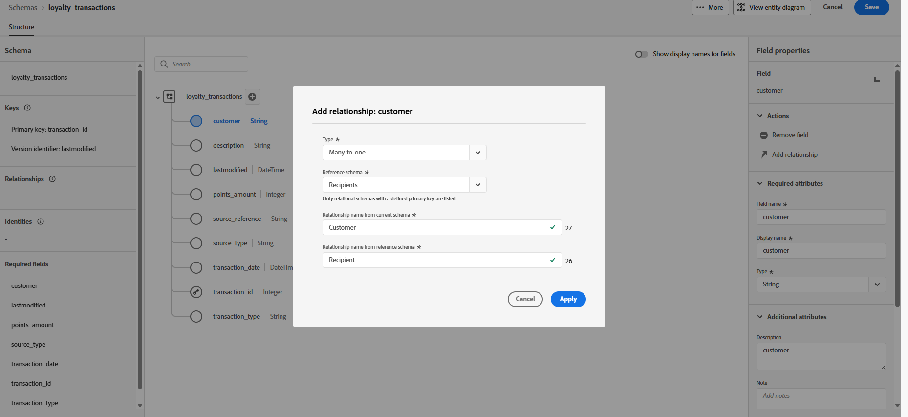

# 使用DDL文件创建关系架构 {#file-upload-schema}

+++ 目录

| 欢迎了解精心策划的营销活动 | 启动第一个精心策划的营销活动 | 查询数据库 | 精心策划的营销活动 |
|---|---|---|---|
| [开始使用编排的营销活动](gs-orchestrated-campaigns.md)  创建和管理关系架构和数据集：  <ul><li>[架构和数据集入门](gs-schemas.md)</li><li>[手动架构](manual-schema.md)</li><li>[文件上载架构](file-upload-schema.md)</li><li>[摄取数据](ingest-data.md)</li></ul>[访问和管理编排的营销活动](access-manage-orchestrated-campaigns.md)  [创建编排的营销活动的关键步骤](gs-campaign-creation.md) | [创建和计划营销活动](create-orchestrated-campaign.md)  [精心策划活动](orchestrate-activities.md)  [启动和监控营销活动](start-monitor-campaigns.md)  [报告](reporting-campaigns.md) | [使用规则生成器](orchestrated-rule-builder.md)  [生成您的第一个查询](build-query.md)  [编辑表达式](edit-expressions.md)  [重定向](retarget.md) | [活动快速入门](activities/about-activities.md)  活动： [并行汇聚](activities/and-join.md) - [生成受众](activities/build-audience.md) - [更改维度](activities/change-dimension.md) - [渠道活动](activities/channels.md) - [合并](activities/combine.md) - [重复数据删除](activities/deduplication.md) - [扩充](activities/enrichment.md) - [分叉](activities/fork.md) - [协调](activities/reconciliation.md) - [保存受众](activities/save-audience.md) - [拆分](activities/split.md) - [等待](activities/wait.md) |

{style="table-layout:fixed"}

+++

 

>[!BEGINSHADEBOX]

 

此页面上的内容不是最终内容，可能会发生变化。

>[!ENDSHADEBOX]

通过创建架构（如&#x200B;**忠诚度会员资格**、**忠诚度交易**&#x200B;和&#x200B;**忠诚度奖励**）来定义编排营销活动所需的关系数据模型。 每个架构必须包含一个主键、一个版本控制属性和适当的关系以引用实体，如&#x200B;**收件人**&#x200B;或&#x200B;**品牌**。

可以通过界面手动创建架构，或使用DDL文件批量导入架构。

本部分提供分步指导，说明如何通过上传 DDL（数据定义语言）文件在 Adobe Experience Platform 中创建关系型架构。可使用 DDL 文件预先定义数据模型的结构，包括表、属性、键和关系。

1. [上传DDL文件](#ddl-upload)以创建关系架构并定义其结构。

1. [定义数据模型中表之间的关系](#relationships)。

1. [链接架构](#link-schema)以将关系数据与现有的配置文件实体（如收件人或品牌）连接。

1. [从支持的源将数据摄取](ingest-data.md)到您的数据集中。

## 上载DDL文件{#ddl-upload}

通过上传DDL文件，您可以预先定义数据模型的结构，包括表、属性、键和关系。

支持基于Excel的架构文件上传。 下载[提供的模板](assets/template.zip)以轻松准备架构定义。

+++在Adobe Experience Platform中创建关系架构时支持以下功能

* **枚举**\
  基于DDL的架构和手动架构创建均支持ENUM字段，从而允许您定义具有一组固定的允许值的属性。

* 用于数据管理的&#x200B;**架构标签**\
  架构字段级别支持标签设置，以强制执行数据管理策略，例如访问控制和使用限制。 有关详细信息，请参阅[Adobe Experience Platform文档](https://experienceleague.adobe.com/docs/experience-platform/xdm/home.html)。

* **复合键**\
  关系模式定义支持复合主键，允许同时使用多个字段来唯一标识记录。

+++

1. 登录到Adobe Experience Platform。

1. 导航到&#x200B;**数据管理** > **架构**&#x200B;菜单。

1. 单击&#x200B;**创建架构**。

1. 选择&#x200B;**[!UICONTROL 关系]**&#x200B;作为&#x200B;**架构类型**。

   

1. 选择&#x200B;**[!UICONTROL 上传 DDL 文件]**&#x200B;以定义实体关系图并创建架构。

   表结构必须包含：
   * 至少一个主键
   * 版本标识符，如 `datetime` 或 `number` 类型的 `lastmodified` 字段。
   * 对于变更数据捕获(CDC)摄取，为名为`_change_request_type`且类型为`String`的特殊列，它指示数据变更的类型（例如，插入、更新、删除）并启用增量处理

   >[!IMPORTANT]
   >
   > 用于定位的任何架构必须至少包含一个类型为`String`且具有关联&#x200B;**标识命名空间**&#x200B;的标识字段。\
   >这可确保与Adobe Journey Optimizer的定位和身份解析功能兼容。

1. 拖放您的 DDL 文件并单击&#x200B;**[!UICONTROL 下一步]**。

   请注意，支持DDL文件的最大大小为10MB。

1. 键入您的&#x200B;**[!UICONTROL 架构名称]**。

1. 设置每个架构及其列，确保指定了主键。

   必须指定一个属性（如 `lastmodified`）作为版本描述符。此属性（通常为 `datetime`、`long` 或 `int` 类型）对于摄取过程至关重要，可确保使用最新数据版本更新数据集。

   

1. 完成后，单击&#x200B;**[!UICONTROL 完成]**。

您现在可以在画布中验证表和字段定义。[在下面的部分中了解更多信息](#entities)

## 定义关系 {#relationships}

要定义架构内各表之间的逻辑连接，请执行以下步骤。

1. 访问数据模型的画布视图，然后选择要关联的两个表

1. 单击“源联接”旁边的  按钮，然后拖动箭头指向“目标联接”连接以建立关联。

   

1. 填写给定表单以定义链接，配置完毕后单击&#x200B;**应用**。

   

   **基数**：

   * **1-N**：源表的一个项可以对应目标表的多个项，但目标表的一个项最多对应源表的一个项。

   * **N-1**：目标表的一个项可以对应源表的多个项，但源表的一个项最多对应目标表的一个项。

   * **1-1**：源表的一个项最多对应目标表的一个项。

1. 数据模型中定义的所有链接在画布视图中均表示为箭头。单击两个表之间的箭头可查看详细信息、进行编辑或根据需要移除链接。

   

1. 使用工具栏自定义和调整画布。

   

   * **放大**：放大画布，更清楚地查看数据模型的详细信息。

   * **缩小**：缩小画布大小，以便更全面地查看数据模型。

   * **适应视图**：调整缩放，适应可见区域内的所有架构。

   * **筛选**：选择要在画布中显示的架构。

   * **强制自动布局**：自动排列架构以便更好地进行组织。

   * **显示映射**：切换小映射叠加，有助于更轻松地浏览大型或复杂的架构布局。

1. 完成后，单击&#x200B;**保存**。此操作将创建架构和关联的数据集，并启用数据集以用于精心策划的营销活动。

1. 单击&#x200B;**[!UICONTROL 打开作业]**，监控创建作业的进度。此过程可能需要几分钟时间，具体取决于 DDL 文件中的表数量。

   您还可以通过打开&#x200B;**[!UICONTROL 上传DDL文件]**&#x200B;窗口并选择&#x200B;**[!UICONTROL 查看所有关系作业]**&#x200B;来访问关系作业。

   

## 链接架构 {#link-schema}

>[!IMPORTANT]
>
> 系统只识别在DDL文件中明确定义的关系。 存在于DDL文件外部的任何实体关系将被忽略并且不会进行处理。

在&#x200B;**忠诚度交易**&#x200B;架构和&#x200B;**收件人**&#x200B;架构之间建立关系，使每个交易与正确的客户记录相关联。

1. 导航到&#x200B;**[!UICONTROL 架构]**，然后打开您之前创建的&#x200B;**忠诚度交易**。

1. 单击客户&#x200B;**[!UICONTROL 字段属性]**&#x200B;中的&#x200B;**[!UICONTROL 添加关系]**。

   

1. 选择&#x200B;**[!UICONTROL 多对一]**&#x200B;作为关系&#x200B;**[!UICONTROL 类型]**。

1. 与现有的&#x200B;**收件人**&#x200B;架构相关联。

   

1. 输入&#x200B;**[!UICONTROL 当前架构中的关系名称]**&#x200B;以及&#x200B;**[!UICONTROL 引用架构中的关系名称]**。

1. 单击&#x200B;**[!UICONTROL 应用]**&#x200B;保存更改。

继续在&#x200B;**忠诚度奖励**&#x200B;架构和&#x200B;**品牌**&#x200B;架构之间创建关系，将每个奖励条目与相应的品牌关联。

<!--### Setting Up Change data capture ingestion {#cdc-ingestion}

If you need to change the data source, you must delete the existing dataflow and create a new one pointing to the same dataset with the new source.

When using Change Data Capture (CDC), it is essential that the source and dataset remain in sync to ensure accurate incremental updates. Follow the steps below:

1. **Schema Requirements**
   - Your schema must include:
     - A **primary key** (e.g., `transaction_id`)
     - A **versioning field** (e.g., `lastmodified` or an incrementing `version_id`)
   - Enable the dataset for **Orchestrated Campaigns** if needed.

2. **CDC Dataflow Setup**
   - During dataflow creation, after choosing your source and files:
     - **Enable the CDC option**
     - Select your CDC-ready dataset
     - Confirm field mappings (especially version field)

3. **Keep Source and Target in Sync**
   - The source system must consistently update the version field so the platform can detect changes accurately.

Once set up, the platform will automatically ingest **only changed or new records** each time the flow runs.
-->
