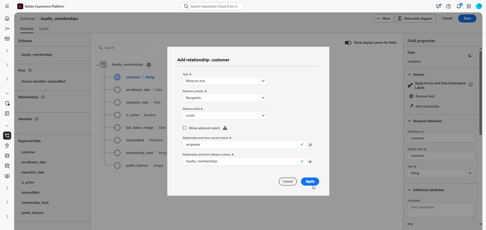

# 设置手动关系架构 {#manual-schema}

关系模式可以直接通过用户界面创建，从而能够对属性、主键、版本控制字段和关系进行详细配置。

以下示例手动定义&#x200B;**忠诚度会员资格**&#x200B;架构，以说明编排的营销活动所需的结构。

1. [使用Adobe Experience Platform界面手动创建关系架构](#schema)。

1. [添加属性](#schema-attributes)，如客户ID、成员资格级别和状态字段。

1. [将您的架构](#link-schema)链接到内置架构，如用于营销活动定位的收件人。

1. [基于您的架构创建数据集](#dataset)，并将其启用以用于编排的营销活动。

1. 从支持的数据源[将数据摄取](ingest-data.md)至数据集中。

➡️ [在Adobe Experience Platform文档中了解有关手动关系架构的更多信息](https://experienceleague.adobe.com/en/docs/experience-platform/xdm/ui/resources/schemas#create-manually)

## 创建您的架构 {#schema}

首先，在Adobe Experience Platform中手动创建新的关系架构。 此过程允许您从头开始定义架构结构，包括其名称和行为。

1. 登录到Adobe Experience Platform。

1. 导航到&#x200B;**[!UICONTROL 数据管理]** > **[!UICONTROL 架构]**&#x200B;菜单。

1. 单击&#x200B;**[!UICONTROL 创建架构]**。

1. 选择&#x200B;**[!UICONTROL 关系]**&#x200B;作为&#x200B;**架构类型**。

   {zoomable="yes"}

1. 选择&#x200B;**[!UICONTROL 手动创建]**&#x200B;以通过手动添加字段来构建架构。

1. 输入您的&#x200B;**[!UICONTROL 架构显示名称]**。

   {zoomable="yes"}

1. 单击&#x200B;**完成**&#x200B;以继续创建架构。

您现在可以开始向架构添加属性以定义其结构。

## 将属性添加到架构 {#schema-attributes}

接下来，添加属性以定义架构的结构。 这些字段表示在编排的营销活动中使用的关键数据点，例如客户标识符、成员资格详细信息和活动日期。 精确地定义它们可确保可靠的个性化、分段和跟踪。

用于定位的任何架构必须至少包含一个类型为`String`且具有关联标识命名空间的标识字段。 这可确保与Adobe Journey Optimizer的定位和身份解析功能兼容。

+++在Adobe Experience Platform中创建关系架构时支持以下功能

* **枚举**\
  基于DDL的架构和手动架构创建均支持ENUM字段，从而允许您定义具有一组固定的允许值的属性。

* 用于数据管理的&#x200B;**架构标签**\
  架构字段级别支持标签设置，以强制执行数据管理策略，例如访问控制和使用限制。 有关详细信息，请参阅[Adobe Experience Platform文档](https://experienceleague.adobe.com/docs/experience-platform/xdm/home.html?lang=zh-Hans)。

* **复合键**\
  关系模式定义支持复合主键，允许同时使用多个字段来唯一标识记录。

+++

1. 在画布中，单击架构名称&#x200B;**旁边的**&#x200B;以开始添加属性。

   {zoomable="yes"}

1. 输入您的属性&#x200B;**[!UICONTROL 字段名]**、**[!UICONTROL 显示名称]**&#x200B;和&#x200B;**[!UICONTROL 类型]**。

   在此示例中，我们已将下表中详述的属性添加到&#x200B;**忠诚度会员资格**&#x200B;架构。

   +++ 属性示例

   | 属性名称 | 数据类型 | 其他属性 |
   |-|-|-|
   | 客户 | 字符串 | 主键 |
   | membership_level | 字符串 | 必需 |
   | points_balance | 整数 | 必需 |
   | enrollment_date | 日期 | 必需 |
   | last_status_change | 日期 | 必需 |
   | expiration_date | 日期 | - |
   | is_active | 布尔型 | 必需 |
   | 上次修改时间 | 日期时间 | 必需 |

   +++ 

1. 将相应的字段分配为&#x200B;**[!UICONTROL 主键]**&#x200B;和&#x200B;**[!UICONTROL 版本描述符]**。

   在创建手动模式时，请确保包含以下基本字段：

   * 至少一个主键
   * 版本标识符，如 `datetime` 或 `number` 类型的 `lastmodified` 字段。
   * 对于变更数据捕获(CDC)摄取，为名为`_change_request_type`且类型为`String`的特殊列，它指示数据变更的类型（例如，插入、更新、删除）并启用增量处理。 请注意，`_change_request_type`不应是表架构的一部分，它只应在引入期间添加到数据文件。

   {zoomable="yes"}

1. 单击&#x200B;**[!UICONTROL 保存]**。

创建和保存属性后，可通过定义关系将方案与其他关系方案链接。

➡️ [在Adobe Experience Platform文档中了解有关关系架构的更多信息](https://experienceleague.adobe.com/en/docs/experience-platform/xdm/schema/relational#how-relational-schemas-differ-from-standard-xdm-schemas)

## 链接架构 {#link-schema}

通过在两个架构之间创建关系，您可以使用主要用户档案架构以外的数据增强编排的营销活动。

1. 从新创建的架构中，选择要用作链接的属性，然后单击&#x200B;**[!UICONTROL 添加关系]**。

   {zoomable="yes"}

1. 选择&#x200B;**[!UICONTROL 引用架构]**&#x200B;和&#x200B;**[!UICONTROL 引用字段]**&#x200B;以建立关系。

   在此示例中，`customer`属性链接到`recipients`架构。

   {zoomable="yes"}

1. 输入来自当前架构和引用架构的关系名称。

1. 配置后，单击&#x200B;**[!UICONTROL 应用]**。

## 为架构创建数据集 {#dataset}

定义架构后，您现在可以基于它创建数据集。 数据集存储了您摄取的数据，必须启用该数据集才能访问编排的营销活动。

1. 导航到&#x200B;**[!UICONTROL 数据管理]** > **[!UICONTROL 数据集]**&#x200B;菜单，然后单击&#x200B;**[!UICONTROL 创建数据集]**。

   {zoomable="yes"}

1. 选择&#x200B;**[!UICONTROL 从架构]**&#x200B;创建数据集。

1. 选择您之前创建的架构，此处&#x200B;**忠诚度会员资格**，然后单击&#x200B;**[!UICONTROL 下一步]**。

   {zoomable="yes"}

1. 为您的&#x200B;**[!UICONTROL 数据集]**&#x200B;输入&#x200B;**[!UICONTROL 名称]**&#x200B;并单击&#x200B;**[!UICONTROL 完成]**。

现在，您需要为编排的营销活动启用数据集。

## 为编排的活动启用数据集 {#enable}

>[!CONTEXTUALHELP]
>id="ajo_oc_enable_dataset_for_oc"
>title="编排的营销活动"
>abstract="创建数据集后，您需要为编排的营销活动明确启用该数据集。 此步骤可确保您的数据集可用于Adobe Journey Optimizer中的实时编排和个性化。"

创建数据集后，您需要为编排的营销活动明确启用该数据集。 此步骤可确保您的数据集可用于Adobe Journey Optimizer中的实时编排和个性化。

请参阅[Adobe Developer文档](https://developer.adobe.com/journey-optimizer-apis/references/orchestrated-campaign-dataset/#tag/DatasetEnablement)，以验证或启用数据集上的编排营销活动扩展。

1. 在&#x200B;**[!UICONTROL 数据集]**&#x200B;列表中找到您的数据集。

1. 从&#x200B;**[!UICONTROL 数据集]**&#x200B;设置中，启用&#x200B;**协调的营销活动**&#x200B;选项，以标记可在协调的营销活动中使用的数据集。

   {zoomable="yes"}

1. 请等待几分钟，以便完成启用过程。 请注意，只有在完全激活此设置后，才能摄取数据和使用营销活动。

您现在可以使用选择的源开始将数据摄取到您的架构中。

➡️ [了解如何摄取数据](ingest-data.md)
