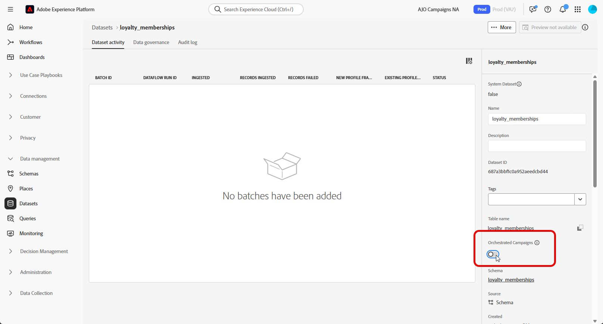

# 设置手动关系架构 {#manual-schema}

+++ 目录

| 欢迎使用编排的营销活动 | 启动第一个精心策划的营销活动 | 查询数据库 | 精心策划的营销活动 |
|---|---|---|---|
| [开始使用编排的营销活动](gs-orchestrated-campaigns.md)  创建和管理关系架构和数据集： <ul><li>[架构和数据集入门](gs-schemas.md)</li><li>[手动架构](manual-schema.md)</li><li>[文件上载架构](file-upload-schema.md)</li><li>[摄取数据](ingest-data.md)</li></ul>[访问和管理编排的营销活动](access-manage-orchestrated-campaigns.md)  [创建编排的营销活动的关键步骤](gs-campaign-creation.md) | [创建和计划营销活动](create-orchestrated-campaign.md)  [编排活动](orchestrate-activities.md)  [启动并监视营销活动](start-monitor-campaigns.md)  [报告](reporting-campaigns.md) | [使用规则生成器](orchestrated-rule-builder.md)  [生成您的第一个查询](build-query.md)  [编辑表达式](edit-expressions.md)  [重新定位](retarget.md) | [开始使用活动](activities/about-activities.md)  活动： [并加入](activities/and-join.md) - [生成受众](activities/build-audience.md) - [更改维度](activities/change-dimension.md) - [渠道活动](activities/channels.md) - [组合](activities/combine.md) - [重复数据删除](activities/deduplication.md) - [扩充](activities/enrichment.md) - [分支](activities/fork.md) - [协调](activities/reconciliation.md) - [保存受众](activities/save-audience.md) - [拆分](activities/split.md) - [等待](activities/wait.md) |

{style="table-layout:fixed"}

+++

 

>[!BEGINSHADEBOX]

 

此页面上的内容不是最终内容，可能会发生变化。

>[!ENDSHADEBOX]

关系模式可以直接通过用户界面创建，从而能够对属性、主键、版本控制字段和关系进行详细配置。

以下示例手动定义&#x200B;**忠诚度会员资格**&#x200B;架构，以说明编排的营销活动所需的结构。

1. [使用Adobe Experience Platform界面手动创建关系架构](#schema)。

1. [添加属性](#schema-attributes)，如客户ID、成员资格级别和状态字段。

1. [将您的架构](#link-schema)链接到内置架构，如用于营销活动定位的收件人。

1. [基于您的架构创建数据集](#dataset)，并将其启用以用于编排的营销活动。

1. [从支持的源将数据摄取](ingest-data.md)到您的数据集中。

## 创建您的架构 {#schema}

首先，在Adobe Experience Platform中手动创建新的关系架构。 此过程允许您从头开始定义架构结构，包括其名称和行为。

1. 登录到Adobe Experience Platform。

1. 导航到&#x200B;**[!UICONTROL 数据管理]** > **[!UICONTROL 架构]**&#x200B;菜单。

1. 单击&#x200B;**[!UICONTROL 创建架构]**。

1. 选择&#x200B;**[!UICONTROL 关系]**&#x200B;作为&#x200B;**架构类型**。

   {zoomable="yes"}

1. 选择&#x200B;**[!UICONTROL 手动创建]**&#x200B;以通过手动添加字段来构建架构。

1. 输入您的&#x200B;**[!UICONTROL 架构显示名称]**。

1. 选择&#x200B;**[!UICONTROL 记录]**&#x200B;作为您的&#x200B;**[!UICONTROL 架构行为]**。

   {zoomable="yes"}

1. 单击&#x200B;**完成**&#x200B;以继续创建架构。

您现在可以开始向架构添加属性以定义其结构。

## 将属性添加到架构 {#schema-attributes}

接下来，添加属性以定义架构的结构。 这些字段表示在编排的营销活动中使用的关键数据点，例如客户标识符、成员资格详细信息和活动日期。 精确地定义它们可确保可靠的个性化、分段和跟踪。

1. 在画布中，单击架构名称&#x200B;**旁边的**&#x200B;以开始添加属性。

   {zoomable="yes"}

1. 输入您的属性&#x200B;**[!UICONTROL 字段名]**、**[!UICONTROL 显示名称]**&#x200B;和&#x200B;**[!UICONTROL 类型]**。

   在此示例中，我们已将下表中详述的属性添加到&#x200B;**忠诚度会员资格**&#x200B;架构。

+++ 属性示例

   | 属性名称 | 数据类型 | 其他属性 |
   |-|-|-|
   | 客户 | 字符串 | 主键 |
   | membership_level | 字符串 | 必需 |
   | points_balance | 整数 | 必需 |
   | enrollment_date | 日期 | 必需 |
   | last_status_change | 日期 | 必需 |
   | expiration_date | 日期 | - |
   | is_active | 布尔型 | 必需 |
   | 上次修改时间 | 日期时间 | 必需 |

+++

1. 将相应的字段分配为&#x200B;**[!UICONTROL 主键]**&#x200B;和&#x200B;**[!UICONTROL 版本描述符]**。

   **[!UICONTROL 主键]**&#x200B;确保每个记录都唯一标识，而&#x200B;**[!UICONTROL 版本描述符]**&#x200B;将捕获随时间变化的更新，从而启用变更数据捕获并支持数据镜像。

   {zoomable="yes"}

1. 单击&#x200B;**[!UICONTROL 保存]**。

创建属性后，您需要将新创建的模式与内置模式链接到一起。

## 链接架构 {#link-schema}

通过在两个架构之间创建关系，您可以使用存储在主要用户档案架构之外的数据扩充编排的营销活动。

1. 从新创建的架构中，选择要用作链接的属性，然后单击&#x200B;**[!UICONTROL 添加关系]**。

   {zoomable="yes"}

1. 选择&#x200B;**[!UICONTROL 引用架构]**&#x200B;和&#x200B;**[!UICONTROL 引用字段]**&#x200B;以建立关系。

   在此示例中，`customer`属性链接到`recipients`架构。

   {zoomable="yes"}

1. 输入来自当前架构和引用架构的关系名称。

1. 配置后，单击&#x200B;**[!UICONTROL 应用]**。

建立关系后，您需要根据架构创建数据集。

## 为架构创建数据集 {#dataset}

定义架构后，下一步是根据该架构创建数据集。 此数据集存储您摄取的数据，必须为编排的营销活动启用此数据集，才能在Adobe Journey Optimizer中访问这些数据。 启用此选项可确保识别数据集，以便用于实时编排和个性化工作流。

1. 导航到&#x200B;**[!UICONTROL 数据管理]** > **[!UICONTROL 数据集]**&#x200B;菜单，然后单击&#x200B;**[!UICONTROL 创建数据集]**。

   {zoomable="yes"}

1. 选择&#x200B;**[!UICONTROL 从架构]**&#x200B;创建数据集。

1. 选择您之前创建的架构，此处&#x200B;**忠诚度会员资格**，然后单击&#x200B;**[!UICONTROL 下一步]**。

   {zoomable="yes"}

1. 为您的&#x200B;**[!UICONTROL 数据集]**&#x200B;输入&#x200B;**[!UICONTROL 名称]**&#x200B;并单击&#x200B;**[!UICONTROL 完成]**。

1. 启用&#x200B;**编排的营销活动**&#x200B;选项以使数据集可用于您的AJO营销活动。

   启用可能需要几分钟的时间。 只有在完全激活该选项后，才能摄取数据。

   {zoomable="yes"}

您现在可以使用选择的源开始将数据摄取到您的架构中。

➡️ [了解如何摄取数据](ingest-data.md)
