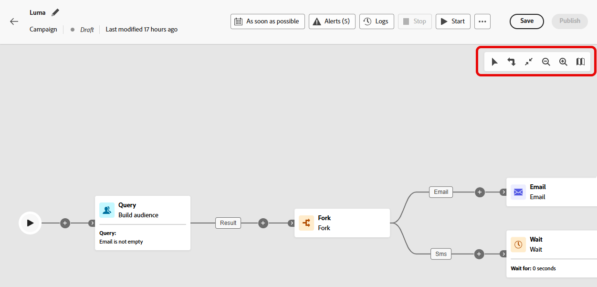

# 精心策划的营销活动 {#orchestrate}

+++ 目录

| 欢迎了解精心策划的营销活动 | 启动第一个精心策划的营销活动 | 查询数据库 | 精心策划的营销活动 |
|---|---|---|---|
| [开始使用编排的营销活动](gs-orchestrated-campaigns.md)  创建和管理关系架构和数据集：  <ul><li>[架构和数据集入门](gs-schemas.md)</li><li>[手动架构](manual-schema.md)</li><li>[文件上载架构](file-upload-schema.md)</li><li>[摄取数据](ingest-data.md)</li></ul>[访问和管理编排的营销活动](access-manage-orchestrated-campaigns.md)  [创建编排的营销活动的关键步骤](gs-campaign-creation.md) | [创建和计划营销活动](create-orchestrated-campaign.md)  <b>[精心策划活动](orchestrate-activities.md)</b>  [启动和监控营销活动](start-monitor-campaigns.md)  [报告](reporting-campaigns.md) | [使用规则生成器](orchestrated-rule-builder.md)  [生成您的第一个查询](build-query.md)  [编辑表达式](edit-expressions.md)  [重定向](retarget.md) | [活动快速入门](activities/about-activities.md)  活动： [并行汇聚](activities/and-join.md) - [生成受众](activities/build-audience.md) - [更改维度](activities/change-dimension.md) - [渠道活动](activities/channels.md) - [合并](activities/combine.md) - [重复数据删除](activities/deduplication.md) - [扩充](activities/enrichment.md) - [分叉](activities/fork.md) - [协调](activities/reconciliation.md) - [保存受众](activities/save-audience.md) - [拆分](activities/split.md) - [等待](activities/wait.md) |

{style="table-layout:fixed"}

+++

 

>[!BEGINSHADEBOX]

 

此页面上的内容不是最终内容，可能会发生变化。

>[!ENDSHADEBOX]

[创建精心策划的营销活动](gs-campaign-creation.md)后，您就可以开始策划它将要执行的不同任务。为此，系统提供了一个可视化画布，让您能够构建精心策划的营销活动流程图。您可以在此图中添加各种活动并按顺序关联它们。

## 添加活动 {#add}

在配置的这一阶段，该流程图会显示一个开始图标，代表您精心策划的营销活动的起始点。要添加您的第一个活动，请单击连接到开始图标的 **+** 按钮。

此时会显示可添加到图中的活动列表。可用的活动取决于您在精心策划的营销活动流程图中的位置。例如，添加第一个活动时，您可以通过以下方式启动精心策划的营销活动：受众目标选择、拆分精心策划的营销活动路径或设置&#x200B;**等待**&#x200B;活动以延迟精心策划的营销活动的执行。另一方面，在&#x200B;**生成受众**&#x200B;活动过后，您可以通过目标选择活动优化目标，通过渠道活动向受众发送投放，或通过流程控制活动来组织精心策划的营销活动流程。

{zoomable="yes"}

将活动添加到该图后，将显示右侧窗格，让您使用特定设置对其进行配置。[本节](activities/about-activities.md)提供了有关如何配置各个活动的详细信息。

{zoomable="yes"}

可根据精心策划的营销活动需要执行的任务，重复上述操作以添加任意数量的活动。请注意，您还可以在两个活动之间插入新活动。为此，请在活动之间的过渡上单击 **+** 按钮，选择所需的活动并在右侧窗格中对其进行配置。

您可以为每个活动之间的过渡自定义名称。要执行此操作，请选择过渡，然后在右窗格中更改其标签。

### 画布工具栏 {#toolbar}

画布工具栏提供了一些选项，用于轻松处理活动并在画布中导航：

 选择多个活动以批量删除它们，或执行复制粘贴操作。[了解如何复制粘贴活动](#copy)

 垂直切换画布。

 根据屏幕调整画布缩放级别。

  放大或缩小画布。

 打开显示您所在位置的画布快照。

### 管理活动 {#manage}

添加活动时，属性窗格中提供了操作按钮，便于您执行多项操作。

 从画布中删除活动。

  禁用/启用活动。执行精心策划的营销活动时，已禁用的活动及同一路径上的后续活动不会被执行，且整个精心策划的营销活动将停止运行。

  暂停/恢复活动。执行精心策划的活动时，它会在暂停的活动中暂停。相应的任务以及同一路径中后续的所有任务都不会执行。

    您可以将画布中的任何活动用作暂停活动执行的断点。 这意味着该营销活动将仅在此活动之前运行，然后暂停执行。 在暂停执行时，分段引擎会保留临时数据以供您预览。 您可以在暂停的活动之前选择集客过渡以查看传输的数据。 了解有关此部分的更多信息： [可视化流量监视](../orchestrated/start-monitor-campaigns.md#flow)。

 复制活动。[了解如何复制粘贴活动](#copy)

 访问活动的日志和任务。

若干&#x200B;**目标选择**&#x200B;活动（如&#x200B;**合并**&#x200B;或&#x200B;**重复数据删除**）用于处理剩余群体，并将其纳入额外出站过渡中。例如，如果您使用&#x200B;**拆分**&#x200B;活动，则补集包含与先前定义的任何子集都不匹配的群体。要使用此功能，请激活&#x200B;**[!UICONTROL 生成补集]**&#x200B;选项。

### 复制粘贴活动 {#copy}

您可以复制活动并将其粘贴到任何精心策划的营销活动画布中。目标营销活动可以位于不同的浏览器标签页中。

* 要复制一个活动，请单击活动属性窗格中的  按钮。
* 要复制多个活动，请单击画布工具栏中的  图标。

| 复制一个活动 | 复制多个活动 |
|  ---  |  ---  |
| {width="200" align="center" zoomable="yes"} | {width="200" align="center" zoomable="yes"} |

要粘贴活动，请单击过渡上的 **+** 按钮，然后选择“粘贴 x 活动”。

{zoomable="yes"}{width="50%"}

## 流程图示例 {#example}

这是一个精心策划的营销活动示例，旨在向所有购买金额在 100 美元及以上的客户发送电子邮件，但排除忠诚度低于 50 分的所有客户。

{zoomable="yes"}

为实现这一目标，需添加以下活动：

* **[!UICONTROL 分叉]**&#x200B;活动将精心策划的营销活动分为三个路径。
* **[!UICONTROL 生成受众]**&#x200B;活动针对以下三组客户：

   * 客户提供了电子邮件地址，
   * 客户购买金额在 100 美元及以上，
   * 客户忠诚度低于 50 分。

* **[!UICONTROL 合并]**&#x200B;活动将提供了电子邮件地址的客户和购买金额在 100 美元及以上的客户组合在一起，
* **[!UICONTROL 合并]**&#x200B;活动不包括忠诚度低于 50 分的客户，
* **[!UICONTROL 电子邮件投放]**&#x200B;活动向最终确定的客户发送电子邮件。

## 后续步骤 {#next}

在成功设计精心策划的营销活动的流程图之后，您可以执行精心策划的营销活动并跟踪其各种任务的进度。[了解如何启动精心策划的营销活动并监控其执行情况](start-monitor-campaigns.md)
