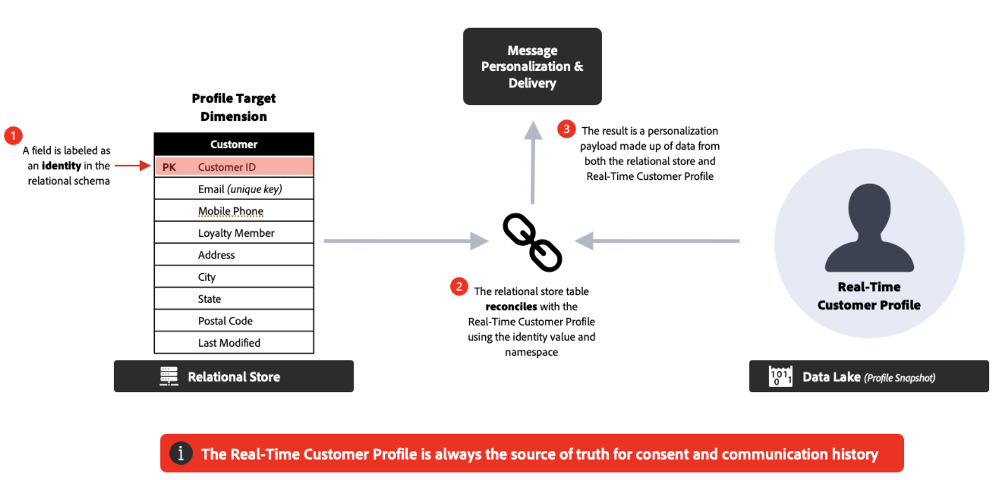

# 常见问题 {#faq-oc}

您将找到下面有关Adobe Journey Optimizer编排营销活动的常见问题解答。

需要更多信息？ 使用本页底部的反馈选项提出问题，或通过 [Adobe Journey Optimizer 社区](https://experienceleaguecommunities.adobe.com/t5/adobe-journey-optimizer/ct-p/journey-optimizer?profile.language=zh-hans){target="_blank"}进行联系。

+++ 什么是Campaign编排？

Campaign Orchestration是Journey Optimizer的一项功能，它支持单步或多步工作流，这些工作流利用关系数据存储来构建和细分受众以实现批量参与。

它为Journey Optimizer带来了新的营销活动类型：**编排的营销活动**。 编排的营销活动可帮助品牌大规模运行复杂的一对多营销活动。 它们专为品牌启动的参与而设计，例如促销活动、季节性活动或基于帐户的通信。

与单次发送/操作营销活动相比，它们为出站营销带来&#x200B;**编排和排序**：受众一起通过多步工作流程，而不是接收一次性的爆炸。

**了解详情**

* [编排的营销活动快速入门](gs-orchestrated-campaigns.md)
* [创建您的第一个编排的营销活动](gs-campaign-creation.md)

+++

+++ 我可以使用编排的营销活动做什么？

主要功能包括：

* **按需受众**：使用关系查询即时构建和优化目标组。
* **多实体分段**：通过连接客户数据与相关实体（例如，帐户、购买、预订）来创建精确受众。
* **发送前可见性**：在启动之前查看准确的受众规模以优化定位。
* **多步骤工作流**：运行排序的促销活动，如季节性促销活动、产品发布或忠诚度优惠。

**最佳实践**

* 在设计工作流之前定义&#x200B;**清除营销活动目标**。
* 从&#x200B;**引导受众**&#x200B;开始，在缩放之前验证计数和逻辑。
* 使分段规则&#x200B;**尽可能简单**&#x200B;以优化性能和透明度。
* 为受众和营销活动使用&#x200B;**一致的命名约定**&#x200B;以简化管理。

**了解详情**

* [创建编排的营销活动](create-orchestrated-campaign.md)
* [使用营销活动](activities/about-activities.md)
* [使用查询建模器构建规则](build-query.md)

+++

+++ 如何访问Campaign编排？

要访问营销活动编排，您的许可证必须包括 **Journey Optimizer – 营销活动和历程**&#x200B;或 **Journey Optimizer – 营销活动**&#x200B;包。 请联系 Adobe 代表，确认您的许可证并在需要时进行更新。

**了解详情**

* [编排的营销活动快速入门](gs-orchestrated-campaigns.md)
* [Adobe Journey Optimizer产品描述](https://helpx.adobe.com/cn/legal/product-descriptions/adobe-journey-optimizer.html){target="_blank"}

+++

+++ 编排的营销活动与历程有何不同？

* **协调的营销活动**：最适合&#x200B;**批次、一对多**&#x200B;营销活动。 受众按计划批量进度。
* **历程**：最适合&#x200B;**实时、一对一**&#x200B;参与。 每个客户都按照自己的速度在历程中前进，这由行为或事件触发。

**最佳实践**：将它们结合使用 — 针对已触发、反应式体验的历程，以及针对计划的、基于日历的计划而编排的营销活动。

**了解详情**

* [编排的营销活动快速入门](gs-orchestrated-campaigns.md)
* [创建您的第一个历程](../building-journeys/journey-gs.md)
* [营销活动快速入门](../campaigns/get-started-with-campaigns.md)

+++

+++ 什么是多实体分段？

Adobe Journey Optimizer中的Campaign Orchestration使用关系数据库。 此类型的数据模型具有通过1:1或1:many关系连接的单独的数据架构。 这使用户能够针对任何架构启动查询（不仅仅在收件人级别），然后来回切换至其他相关架构，例如购买、产品、预订或收件人详细信息，从而极大地灵活地决定如何创建和优化区段和受众。

**示例** — 定向订阅在未来30天内过期的所有收件人。 在Campaign Orchestration中，查询可以从“订阅”模式开始，仅搜索该模式的“到期日期”列，并返回所有到期的订阅，然后累计到与那些特定订阅ID相关的收件人数据，这些订阅ID会比在收件人级别开始每个查询的数据模型更快地返回结果，而且效率更高。

**了解详情**

* [架构和数据集快速入门](gs-schemas.md)
* [配置定向维度](target-dimension.md)
* [使用查询建模器构建规则](build-query.md)

+++

+++ 数据模型的工作原理是什么？

营销活动使用&#x200B;**关系数据库**。 这允许您跨不同的数据集（例如，客户、产品、订阅）进行查询，并灵活地连接它们以进行高级分段。

**最佳实践**

* 组织数据集，以便&#x200B;**关系（联接）**&#x200B;反映业务逻辑。
* 请避免不必要的连接，以保持查询性能。
* 在运行大规模提取之前验证示例结果。

**了解详情**

* [架构和数据集快速入门](gs-schemas.md)
* [手动创建架构](manual-schema.md)
* [摄取数据](ingest-data.md)

+++

+++ 我可以使用关系数据个性化邮件吗？

可以。 在Campaign Orchestration中，可以更新称为“人员实体”的收件人配置文件以及用于个性化的数据。 此外，关系数据库中链接实体的扩充数据也可用于个性化。 您可以使用客户配置文件以及链接的数据（如购买或订阅）在所有支持的渠道间个性化内容。

**推荐**

* 使用&#x200B;**事务数据和行为数据**&#x200B;使选件相关。
* 将&#x200B;**静态属性**（例如忠诚度级别）与&#x200B;**动态属性**（例如上次购买日期）相结合。
* 保持个性化简洁 — 使用数据重载消息可能会损害可读性。

**了解详情**

* [使用“扩充”活动](activities/enrichment.md)
* [在编排的营销活动中添加渠道活动](activities/channels.md)

+++

<!--
## Do Orchestrated campaigns integrate with other Adobe solutions? {#integrations}

Yes. Campaign orchestration is natively integrated with:

* **Customer Journey Analytics**: Campaign orchestration reports are available.  
* **Real-Time CDP**: Audiences built in Campaigns can be read in Real-Time CDP.  
* **Federated Audience Composition (FAC)**: Available as an add-on.  
-->

+++ 如何在发布之前测试信号触发的编排活动？

当促销活动处于&#x200B;**草稿**&#x200B;中时，您可以通过定义计划中的&#x200B;**参数**&#x200B;并为每个参数提供&#x200B;**测试值**&#x200B;来测试它。 启动工作流，然后调用触发器API（使用计划配置中的示例请求或您自己的具有相同端点的请求）以使用这些测试值运行活动。 [了解如何完成并测试信号触发的营销活动](trigger-orchestrated-campaign.md#build-and-test)。

+++

+++ 我能否将实时编排的活动恢复为草稿？

是的，在特定情况下。 **[!UICONTROL 返回草稿]**&#x200B;选项旨在作为一种恢复机制来取消发布并将营销活动恢复到草稿状态。

此选项适用于等待执行的计划营销活动，或者适用于具有执行错误的实时营销活动。 [了解如何将实时营销活动还原为草稿](start-monitor-campaigns.md#back-to-draft)

+++

+++ 在内部发布编排的活动时会发生什么？

单击&#x200B;**[!UICONTROL 发布]**&#x200B;时，将发生以下顺序：

1. **计划程序激活** — 如果配置了计划，计划程序将在定义的时间启动并触发执行。
1. **保存受众活动首先运行** — 任何保存受众活动在消息活动之前执行。 受众Shell将在受众门户中创建，并且符合条件的配置文件将开始引入。
1. **消息执行开始** — 开始处理工作流中第一个消息活动的渠道活动。
1. **配置文件快照查找** — 配置文件数据是根据发布时拍摄的快照解析的，而不是根据实时配置文件解析的，从而确保整个执行的一致性。
1. **同意评估** — 直接从配置文件记录中接受同意，在发送时不会重新评估。
1. **配置文件协调** — 在发送时根据Adobe Experience Platform配置文件对收件人进行协调。
1. **投放日志创建** — 投放事件记录在`ajo_message_feedback_event`数据集中。

**了解详情**

* [发布时间执行序列](start-monitor-campaigns.md#publication-sequence)
* [启动和监测精心编排的营销活动](start-monitor-campaigns.md)

+++

+++ 为什么在发布营销活动后未发送消息？

有几种情况可能会阻止在发布后发送消息。 按顺序检查以下各项：

1. **等待发送确认（最常见）** — 对于非循环活动，消息投放默认暂停，直到您从渠道活动的属性窗格中明确确认发送。 营销活动显示为&#x200B;**实时**，但在确认之前不会传出消息。 [了解详情](start-monitor-campaigns.md#confirm-sending)

1. **促销活动计划在将来的某个时间进行** — 如果配置了计划，则促销活动处于活动状态，但尚未开始执行。 检查计划设置并等待配置的开始时间。 [了解详情](create-orchestrated-campaign.md#schedule)

1. **保存受众活动仍在摄取** — 在发布消息时，保存受众活动在消息活动之前运行。 如果受众摄取仍在进行中，则消息执行尚未开始。 监视画布中的活动状态指示器。 [了解详情](start-monitor-campaigns.md#activities)

1. **受众为空** — 定位查询返回了零个配置文件。 在重新发布之前，请查看分段规则并验证受众规模。

1. **所有用户档案都选择退出** — 在发送时针对每个用户档案评估同意。 如果所有定向用户档案都选择退出了相关渠道，则不会发送消息。 [了解详情](../action/consent.md)

1. **处于错误状态的渠道活动** — 渠道活动上的橙色或红色状态指示器表示存在阻止问题。 打开&#x200B;**[!UICONTROL 日志]**&#x200B;以了解有关错误以及如何解决该错误的详细信息。 [了解详情](start-monitor-campaigns.md#logs-tasks)

1. **速率控制限制投放** — 如果对渠道活动启用了速率控制，则投放可能会比预期慢。 检查渠道活动属性窗格中的速率控制设置。 [了解详情](activities/channels.md#rate-control)

**了解详情**

* [启动和监测精心编排的营销活动](start-monitor-campaigns.md)
* [在编排的营销活动中添加渠道活动](activities/channels.md)

+++

+++ 发布使用的是实时配置文件还是快照？

在发布时，配置文件数据是针对在发布时间&#x200B;**拍摄的**&#x200B;快照解析的，而不是针对实时配置文件。 这可以确保在整个营销活动执行过程中保持一致 — 所有活动都会处理相同的配置文件状态，而不管营销活动运行了多长时间。

但是，始终从当前配置文件记录中授予同意，并且不会在发送时重新评估同意。

请注意，在编排的营销活动中对收件人（关系存储）执行分段，而邮件发送和同意检查是根据Adobe Experience Platform用户档案解析的。

**了解详情**

* [发布时间执行序列](start-monitor-campaigns.md#publication-sequence)
* [收件人与用户档案实体之间的关系是什么？](#faq-oc)
* [使用同意策略](../action/consent.md)

+++

+++ 支持哪些渠道？

您可以创建协调的营销活动以发送&#x200B;**电子邮件**、**短信**、**推送通知**&#x200B;和&#x200B;**直邮**。

**了解详情**

* [在编排的营销活动中添加渠道活动](activities/channels.md)
* [使用营销活动](activities/about-activities.md)

+++

+++ 能否在同一协调的活动中启动多个通信和不同的渠道？

是，编排的活动支持跨渠道编排。 您可以将电子邮件、短信、推送通知和直邮活动合并到多步骤活动画布中，以创建全面的客户体验。

**了解详情**

* [在编排的营销活动中添加渠道活动](activities/channels.md)
* [使用营销活动](activities/about-activities.md)

+++

+++ 是否可以使用编排的活动模板？

不能，您不能定义或使用活动模板，但您可以将内容模板用于通信。

**了解详情**

* [在编排的营销活动中添加渠道活动](activities/channels.md)
* [创建编排的营销活动](create-orchestrated-campaign.md)

+++

+++ 消息的内容设计器是否特定于编排的营销活动？

不需要，内容设计器（包括Email Designer）在所有Journey Optimizer功能中都是通用的。

**了解详情**

* [在编排的营销活动中添加渠道活动](activities/channels.md)
* [使用“扩充”活动](activities/enrichment.md)

+++

+++ 在编排的营销活动中，不同的渠道是如何连接的？

渠道组件和运行时对于所有Journey Optimizer营销活动都是通用的，但是，支持的渠道有所不同。 编排的活动支持电子邮件、短信、推送通知和直邮。

**了解详情**

* [在编排的营销活动中添加渠道活动](activities/channels.md)
* [护栏和限制](guardrails.md)

+++

+++ 编排的营销活动能否与出站渠道(Web、inApp)连接？

不会，编排的营销活动不支持Web和应用程序内等入站渠道。 仅支持出站渠道（电子邮件、短信、推送通知和直邮）。

**了解详情**

* [护栏和限制](guardrails.md)
* [在编排的营销活动中添加渠道活动](activities/channels.md)

+++

+++ 权限和同意呢？

编排的营销活动和历程的权限和同意在Adobe Experience Platform中集中管理。 在发送之前，这些设置将应用于每个收件人的两个解决方案。

**最佳实践**

* 应用&#x200B;**集中管理** — 避免在营销活动级别单独管理同意。
* 定期审核同意数据以检测不一致的情况。
* 遵守&#x200B;**特定于渠道的选择退出** — 不要假定全局同意涵盖所有渠道。

**了解详情**

* [编排的营销活动快速入门](gs-orchestrated-campaigns.md)
* [护栏和限制](guardrails.md)

+++

+++ 我可以在编排的营销活动中执行临时分段吗？

在Campaign Orchestration中，我们将临时分段称为“实时分段”，您可以实时访问关系存储中的所有可用数据，在其之上构建复杂的查询，并通过出站渠道（例如：电子邮件+短信）获得即时激活结果。

**提示**

* 对&#x200B;**时效性需求**（例如，Flash促销活动）使用临时分段。
* 保存并记录有用的查询，以便将来可在营销活动中重复使用。
* 在激活之前验证受众规模，以防止发送不足或发送过多。

**了解详情**

* [使用查询建模器构建规则](build-query.md)
* [使用“生成受众”活动](activities/build-audience.md)
* [配置定向维度](target-dimension.md)

+++

+++ Campaign Orchestration是仅访问通过批量加载的数据，还是还可以查询实时更新的表（如Analytics数据）？

Journey Optimizer Campaign Orchestration可以在关系架构之上构建临时查询。 关系架构目前仅支持批处理源。 此外，它还支持从任何类型的Adobe Experience Platform受众中读取受众活动。

**了解详情**

* [架构和数据集快速入门](gs-schemas.md)
* [摄取数据](ingest-data.md)
* [使用“读取受众”活动](activities/read-audience.md)

+++

+++ 编排的活动是否支持决策？

不会，编排的营销活动不支持决策功能。 对于决策功能，请改用标准Journey Optimizer历程或操作营销活动。

**了解详情**

* [体验决策入门](../experience-decisioning/gs-experience-decisioning.md)
* [创建您的第一个历程](../building-journeys/journey-gs.md)
* [营销活动快速入门](../campaigns/get-started-with-campaigns.md)

+++

+++ 跨环境部署如何工作？

在编排的营销活动中创建的对象（例如，受众和工作流）属于创建它们的沙盒。 要在另一个沙盒（例如，开发、暂存或生产）中重用编排的营销活动，请使用&#x200B;**沙盒工具**&#x200B;复制它：将营销活动添加到包，发布包，然后将其导入目标沙盒。 导入的副本在&#x200B;**草稿**&#x200B;中创建，而重新导入同一包将创建一个新的营销活动&#x200B;**，而不是更新现有的营销活动。**&#x200B;完整的移动通常需要&#x200B;**多个步骤**：您可能需要通过同一包或额外的包导入来调整&#x200B;**渠道配置**（目标中的匹配名称）、**架构**&#x200B;和&#x200B;**数据集**，因为渠道配置不会与营销活动一起复制。 UI中没有完整的预导出核对清单；请使用导入映射流程和&#x200B;**导入后警报**&#x200B;完成设置。 有关详细信息和限制，请参阅[在沙盒之间复制Journey Optimizer对象](../configuration/copy-objects-to-sandbox.md)。

**最佳实践**

* 维护&#x200B;**个单独的沙盒**&#x200B;以用于试验、QA和生产。
* 导入后，立即[复制营销活动](../campaigns/manage-campaigns.md#duplicate-a-campaign)并从副本开始工作，以便报告正确显示反馈和跟踪数据。
* 每次导入后，在发布之前验证营销活动是否在目标沙盒中端到端。
* 记录配置并与治理团队保持一致，以减少环境之间的配置漂移。

**了解详情**

* [在沙盒之间复制Journey Optimizer对象](../configuration/copy-objects-to-sandbox.md)
* [编排的营销活动快速入门](gs-orchestrated-campaigns.md)
* [护栏和限制](guardrails.md)

+++

<!--
## Are there recommended practices for running campaigns at scale? {#scale}

Yes, follow the best practices below:  

* **Plan campaigns around business calendars** (product launches, seasonal peaks) to align volume and resources.  
* Use **audience pre-views** before sending to confirm the expected size and avoid surprises.  
* Where possible, **stagger send times** to avoid overwhelming downstream systems (e.g., call centers, websites).  
* Establish a **monitoring routine**—track delivery logs, error rates, and opt-outs after each send.  
* Run **post-campaign analysis** in Customer Journey Analytics to refine targeting and orchestration for the next cycle.  
-->

+++ 收件人与用户档案实体之间的关系是什么？

根据Adobe Experience Platform配置文件进行发送时，会对收件人执行分段。 收件人目标维度使用用于在编排的营销活动中分段的其他数据来扩展统一用户档案，而收件人会在运行时与用户档案协调，以发送消息并检查同意策略和业务规则。 此协调有助于在配置文件级别统一业务规则和同意应用程序。

**了解详情**

* [配置定向维度](target-dimension.md)
* [架构和数据集快速入门](gs-schemas.md)
* [使用查询建模器构建规则](build-query.md)

+++

+++ 在哪些情况下，建议使用收件人与用户档案实体？

回答“是”表示最佳数据存储，但始终根据用例和限制条件向Adobe代表确认最佳方法。

| 关系存储 | 实时客户轮廓 |
|---------|----------|
| 源是否已与数据关联？ | 是数据流的来源吗？ |
| 您计划为营销用例摄取现成数据吗？ | 数据新鲜度是否是一项主要要求？ |
| 营销激活用例是否需要大量历史数据（`>` 2个月）？ | 是否有即时操作或决策需要数据的场景？ |
| 是否有创建、评估和激活受众的临时需求？ | 使用预计算聚合的行为数据能否限制为`<` 90天？ |
|  | 实时个性化消息是否需要数据？ |

**了解详情**

* [配置定向维度](target-dimension.md)
* [架构和数据集快速入门](gs-schemas.md)
* [使用查询建模器构建规则](build-query.md)

+++

+++ 每个编排的活动的最大活动数是多少？

适用两个不同的限制：

* **渠道活动** — 每个编排的活动最多10个渠道活动（电子邮件、短信、推送或直邮）。 定位和流量控制活动不重要。 保存或发布时超出此限制会导致操作失败。

* **画布大小** — 画布上最多&#x200B;**500个活动**。 为便于维护，请将工作流保留在实践中的&#x200B;**100个活动**&#x200B;之下。

**了解详情**

* [护栏和限制](guardrails.md)
* [使用营销活动](activities/about-activities.md)

+++

+++ 是否可以执行扩充以添加其他数据？

能，您可以扩充关系存储和Adobe Experience Platform受众中的数据。 使用扩充活动，通过相关架构中的其他属性增强受众数据。

**了解详情**

* [使用“扩充”活动](activities/enrichment.md)
* [使用“协调”活动](activities/reconciliation.md)

+++

+++ 是否必须通过受众定义所有过滤器，还是可以配置某种类型的过滤器？

编排的营销活动支持预定义过滤器：您可以定义查询并将其另存为过滤器，将其添加到收藏夹，并在进一步的分段任务中重复使用。 预定义过滤器可以包含参数，以便您在使用时输入值。 [了解如何使用预定义过滤器](predefined-filters.md)。

**了解详情**

* [使用查询建模器构建规则](build-query.md)
* [使用“生成受众”活动](activities/build-audience.md)
* [使用预定义过滤器](orchestrated-rule-builder.md)

+++

## 其他资源

有关更多学习和更新，请浏览以下资源：

* [编排的营销活动护栏和限制](guardrails.md)
* [开始使用编排的营销活动中的架构和数据集](gs-schemas.md)
* [创建您的第一个编排的营销活动](gs-campaign-creation.md)
* [Journey Optimizer产品描述](https://helpx.adobe.com/cn/legal/product-descriptions/adobe-journey-optimizer.html){target="_blank"}
