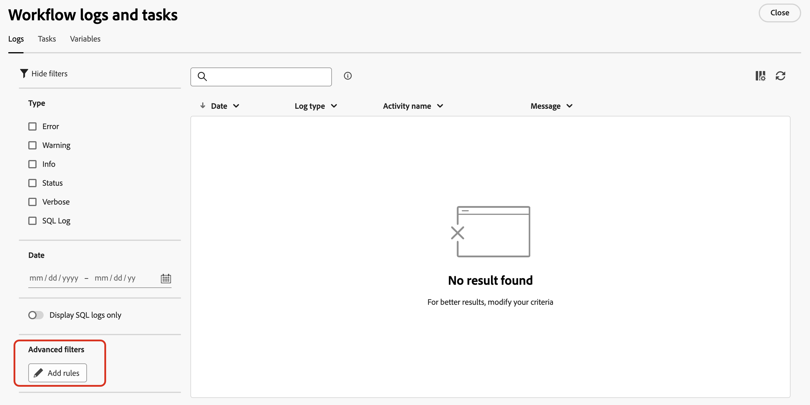

# 使用规则生成器 {#orchestrated-rule-builder}

+++ 目录

| 欢迎使用编排的营销活动 | 启动第一个精心策划的营销活动 | 查询数据库 | 精心策划的营销活动 |
|---|---|---|---|
| [开始使用协调的营销活动](gs-orchestrated-campaigns.md)  [配置步骤](configuration-steps.md)  [访问和管理协调的营销活动](access-manage-orchestrated-campaigns.md) | [创建编排营销活动的关键步骤](gs-campaign-creation.md)  [创建和计划营销活动](create-orchestrated-campaign.md)  [编排活动](orchestrate-activities.md)  [发送包含编排营销活动的消息](send-messages.md)  [开始和监控营销活动](start-monitor-campaigns.md)  [报告](reporting-campaigns.md) | <b>[使用规则生成器](orchestrated-rule-builder.md)</b>  [生成您的第一个查询](build-query.md)  [编辑表达式](edit-expressions.md) | [开始使用活动](activities/about-activities.md)  活动： [And-join](activities/and-join.md) - [生成受众](activities/build-audience.md) - [更改维度](activities/change-dimension.md) - [组合](activities/combine.md) - [重复数据删除](activities/deduplication.md) - [扩充](activities/enrichment.md) - [分支](activities/fork.md) - [协调](activities/reconciliation.md) - [拆分](activities/split.md) - [等待](activities/wait.md) |

{style="table-layout:fixed"}

+++

 

编排的营销活动附带规则生成器，可简化根据各种标准筛选数据库的过程。 规则生成器可以高效地管理非常复杂和长的查询，从而提供增强的灵活性和精确度。

它还支持条件中的预定义过滤器，使您能够轻松优化查询，同时利用高级表达式和运算符实现全面的受众定位和分段策略。

## 访问规则生成器

在每个需要定义规则以过滤数据的环境下都有查询建模器可用。

| 使用情况 | 示例 |
|  ---  |  ---  |
| **构建受众**：使用&#x200B;**[!UICONTROL 构建受众]**&#x200B;活动指定要在编排的营销活动中定位的群体，并轻松创建根据您的需求定制的新受众。 [了解如何构建受众](../orchestrated/activities/build-audience.md) | {width="200" align="center" zoomable="yes"} |
| **在营销活动画布中创建条件**：使用&#x200B;**[!UICONTROL 拆分]**&#x200B;活动在营销活动画布中应用规则，以满足您的特定要求。 [了解如何使用拆分活动](../orchestrated/activities/split.md) | {width="200" align="center" zoomable="yes"} |
| **创建高级过滤器**：生成规则以过滤列表中显示的数据，如工作流日志或定向维度。 | {width="200" align="center" zoomable="yes"} |

## 规则生成器界面 {#interface}

规则生成器提供了一个中央画布（可在其中生成查询）和一个属性窗格（提供有关规则的信息）。

* **中央画布**&#x200B;是您添加和组合不同组件以构建规则的地方。 [了解如何构建规则](../orchestrated/build-query.md)

* **[!UICONTROL 规则属性]**&#x200B;窗格提供有关规则的信息。 它允许您执行各种操作来检查规则并确保它符合您的需求。

  构建查询以创建受众时，显示此窗格。 [了解如何检查和验证您的查询](build-query.md#check-and-validate-your-query)
