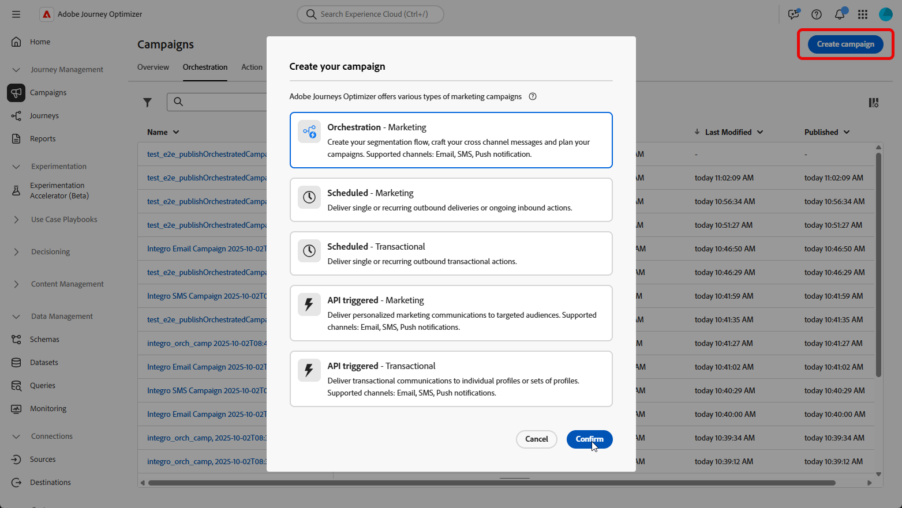
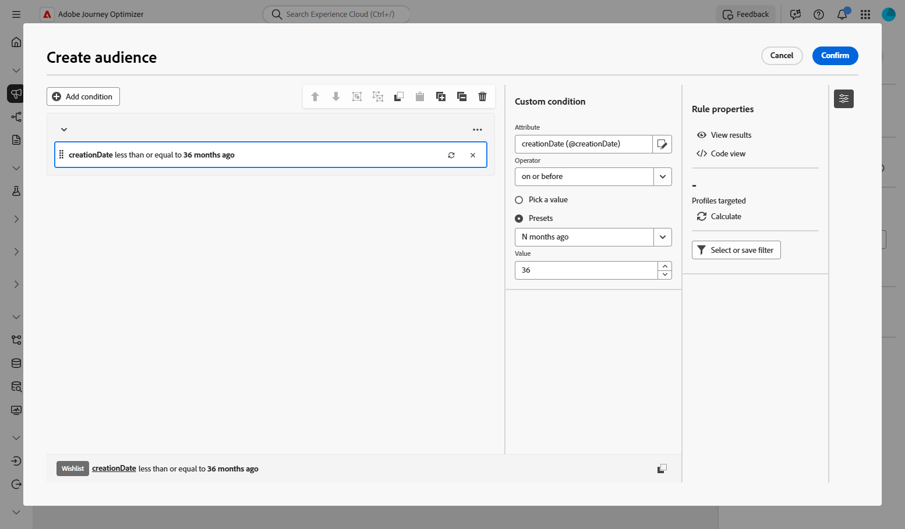
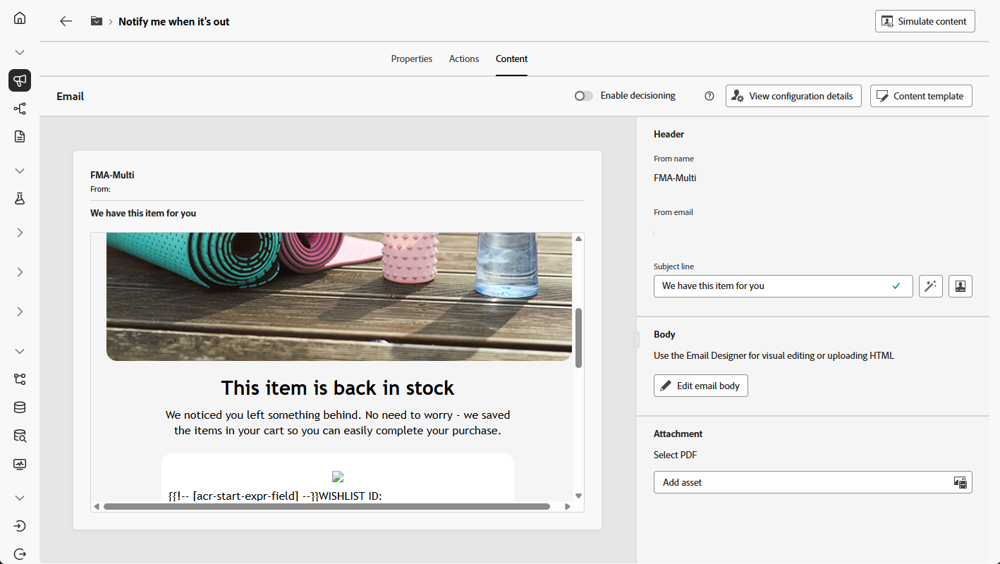

# 通知用户商品库存状态 {#product-availability-uc}

>[!BEGINSHADEBOX]

此用例展示了多级发送：使用与单个项目一起存储的电子邮件地址而不是收件人记录为每个愿望清单项目生成单独的电子邮件。 这样，即使客户对不同的项目使用不同的电子邮件地址，他们仍可收到愿望清单上每个产品的单独通知。

>[!ENDSHADEBOX]

{zoomable="yes"}

设计后备库存通知以告知客户其愿望清单中的商品何时再次可用。 此消息有助于重新吸引感兴趣的客户，并鼓励他们在补充库存的同时完成购买。

1. 首先，发起一项专门针对希望列表重新参与的新活动。 这可确保您的消息聚焦于已通过将产品保存到愿望清单而显示购买意图的客户。

   {zoomable="yes"}

1. 填写您的&#x200B;**[!UICONTROL 促销活动设置]**，如促销活动名称、描述、开始和结束日期以及相关标记。

1. 添加一个&#x200B;**[!UICONTROL 生成受众]**&#x200B;活动，其愿望清单为&#x200B;**[!UICONTROL 定向维度]**。

   {zoomable="yes"}

1. 添加您的条件以仅包含过去36个月内创建的愿望清单。

   {zoomable="yes"}

1. 添加&#x200B;**[!UICONTROL 更改维度]**&#x200B;活动，将愿望清单切换回相应的客户集以进行定位。

   {zoomable="yes"}

1. 启动草稿模式后，使用愿望清单详细信息预览受众。 要获得更深入的见解，请单击输出结果，然后选择&#x200B;**[!UICONTROL 预览结果]**。

   此处，数据既显示收件人，也显示其愿望清单项目。 某些客户具有多个愿望清单项目，并通过多级发送，为每个项目接收单独的电子邮件。 在某些情况下，客户会使用不同的电子邮件地址来分别申请补货。

   {zoomable="yes"}

1. 若要为每个项目发送单独的电子邮件，请确保[您的电子邮件配置](../orchestrated/target-dimension.md)设置为`Recipients - email`作为&#x200B;**[!UICONTROL 配置文件目标Dimension]**，`Wishlistitems`作为&#x200B;**[!UICONTROL 次要维度]**。

   然后，从&#x200B;**[!UICONTROL 执行地址]**&#x200B;菜单中，选择`wishlist.email`作为&#x200B;**[!UICONTROL 辅助维度]**。 每个愿望清单项目都会触发单独的电子邮件，使用愿望清单数据中存储的电子邮件地址作为次要维度。

   {zoomable="yes"}

1. 添加&#x200B;**[!UICONTROL 电子邮件]**&#x200B;活动以创建产品可用性消息。 单击&#x200B;**[!UICONTROL 编辑内容]**&#x200B;开始设计内容。

   ➡️ [了解有关电子邮件个性化的更多信息](../email/content-from-scratch.md)

   {zoomable="yes"}

1. 营销活动测试完成并准备就绪后，单击&#x200B;**[!UICONTROL 发布]**&#x200B;即可使其上线。

通过这项精心设计的活动，客户将收到一封单独的电子邮件，分别用于其愿望清单项目。 每个消息被发送到与该愿望清单相关联的特定电子邮件地址，其中从特定愿望清单项目的详情中提取个性化内容。
