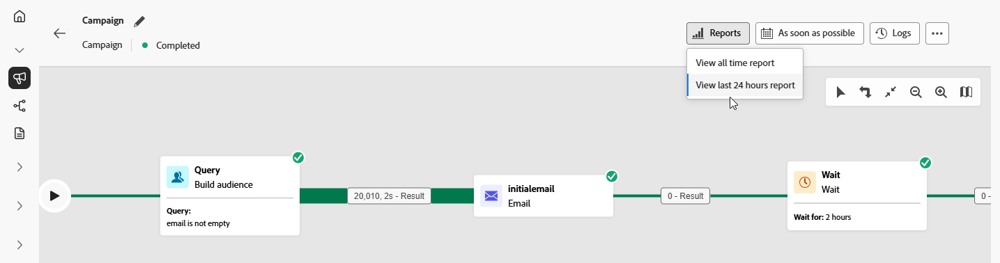

# 精心策划的营销活动报告 {#report-campaigns}

+++ 目录

| 欢迎使用编排的营销活动 | 启动第一个精心策划的营销活动 | 查询数据库 | 精心策划的营销活动 |
|---|---|---|---|
| [开始使用协调的营销活动](gs-orchestrated-campaigns.md)  [配置步骤](configuration-steps.md)  [访问和管理协调的营销活动](access-manage-orchestrated-campaigns.md) | [创建编排营销活动的关键步骤](gs-campaign-creation.md)  [创建和计划营销活动](create-orchestrated-campaign.md)  [编排活动](orchestrate-activities.md)  [启动和监控营销活动](start-monitor-campaigns.md)  <b>[报告](reporting-campaigns.md)</b> | [使用规则生成器](orchestrated-rule-builder.md)  [生成您的第一个查询](build-query.md)  [编辑表达式](edit-expressions.md) | [开始使用活动](activities/about-activities.md)  活动： [并加入](activities/and-join.md) - [生成受众](activities/build-audience.md) - [更改维度](activities/change-dimension.md) - [渠道活动](activities/channels.md) - [组合](activities/combine.md) - [重复数据删除](activities/deduplication.md) - [扩充](activities/enrichment.md) - [分支](activities/fork.md) - [协调](activities/reconciliation.md) - [拆分](activities/split.md) - [等待](activities/wait.md) |

{style="table-layout:fixed"}

+++

 

编排的营销活动通过其强大的报告功能为您提供可操作的见解。 这些见解可帮助您更好地了解受众行为，衡量客户历程中每个步骤的表现，并做出数据驱动型决策以优化未来的促销活动。 通过详细的量度和可视化图表，您可以跟踪参与情况并调整定位策略以发挥最大影响。

## 报告类型 {#reporting-types}

<table style="table-layout:auto; width: 100%; border-collapse: collapse;">
  <tbody>
    <tr>
      <td></td>
      <td>
        使用<b>实时报告</b>在内置仪表板中实时衡量和可视化编排营销活动的影响和表现。 从<b>查看过去24小时报告</b>菜单执行编排的活动后，<b>实时报告</b>中即有数据可用。 在本节<a href="../reports/live-report.md">中了解有关实时报告</a>的更多信息。
      </td>
         
    </tr>
    <tr style="background-color: #FFFFFF;">
      <td></td>
      <td>
        <b>所有时间报表</b>与Customer Journey Analytics功能完全集成，实现了两个平台报表的标准化，并提高了数据一致性和可靠性。 在本节<a href="../reports/report-gs-cja.md">中了解有关所有时间报表</a>的更多信息。
      </td>
    </tr>
  </tbody>
</table>

## 深入了解渠道报表

<table style="table-layout:fixed"><tr style="border: 0; text-align: center;" >
<td> <a href="../reports/campaign-global-report-cja-email.md"><strong>通过电子邮件发送报告</strong></a></td>
<td> <a href="../reports/campaign-global-report-cja-sms.md"><strong>短信报告</strong></a></td>
<td><a href="../reports/campaign-global-report-cja-push.md"><strong>推送报告</strong></a></td>
</tr></table>

