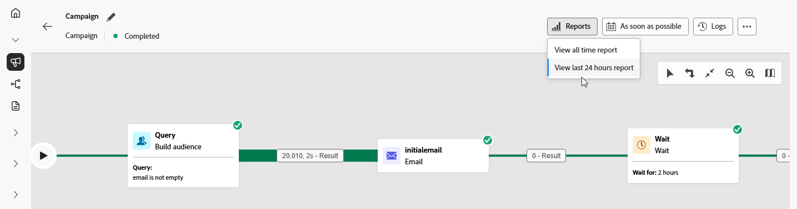

# 精心策划的营销活动报告 {#report-campaigns}

编排的营销活动通过其强大的报告功能为您提供可操作的洞察。 这些洞察可帮助您更好地了解受众行为，衡量客户历程中每个步骤的表现，并做出数据驱动型决策以优化未来的营销活动。 通过详细的指标和可视化信息，您可以跟踪参与度并调整目标选择策略以充分提高影响力。

## 报告类型 {#reporting-types}

<table style="table-layout:auto; width: 100%; border-collapse: collapse;">
  <tbody>
    <tr>
      <td></td>
      <td>
        使用<b>实时报告</b>在内置仪表板中实时衡量和可视化编排营销活动的影响和表现。从<b>查看过去24小时报告</b>菜单执行您的编排营销活动后，<b>实时报告</b>中即有数据可用。在本节</a>中了解有关实时报告<a href="../reports/live-report.md">的更多信息。
      </td>
         
    </tr>
    <tr style="background-color: #FFFFFF;">
      <td></td>
      <td>
        <b>所有时间报表</b>与Customer Journey Analytics功能完全集成，实现了两个平台报表的标准化，并提高了数据一致性和可靠性。在本节</a>中了解有关所有时间报表<a href="../reports/report-gs-cja.md">的更多信息。
      </td>
    </tr>
  </tbody>
</table>

## 深入了解渠道报告

<table style="table-layout:fixed"><tr style="border: 0; text-align: center;" >
<td> <a href="../reports/campaign-global-report-cja-email.md"><strong>电子邮件报告</strong></a></td>
<td> <a href="../reports/campaign-global-report-cja-sms.md"><strong>短信报告</strong></a></td>
<td><a href="../reports/campaign-global-report-cja-push.md"><strong>推送报告</strong></a></td><td><a href="../reports/campaign-global-report-cja-direct.md"><strong>直邮报表</strong></a></td>
</tr></table>

