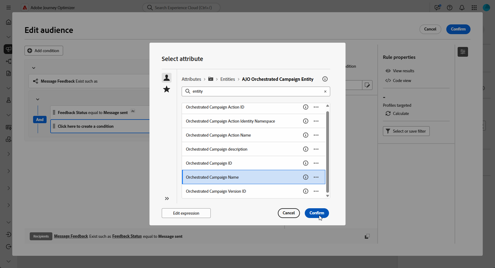

# 构建重定位查询 {#retarget}

+++ 目录

| 欢迎使用编排的营销活动 | 启动第一个精心策划的营销活动 | 查询数据库 | 精心策划的营销活动 |
|---|---|---|---|
| [开始使用编排的营销活动](gs-orchestrated-campaigns.md)  [配置步骤](configuration-steps.md)  [访问和管理编排的营销活动](access-manage-orchestrated-campaigns.md)  [创建编排的营销活动的关键步骤](gs-campaign-creation.md) | [创建和计划营销活动](create-orchestrated-campaign.md)  [编排活动](orchestrate-activities.md)  [启动并监视营销活动](start-monitor-campaigns.md)  [报告](reporting-campaigns.md) | [使用规则生成器](orchestrated-rule-builder.md)  [生成您的第一个查询](build-query.md)  [编辑表达式](edit-expressions.md)  <b>[重新定位](retarget.md)</b> | [开始使用活动](activities/about-activities.md)  活动： [并加入](activities/and-join.md) - [生成受众](activities/build-audience.md) - [更改维度](activities/change-dimension.md) - [渠道活动](activities/channels.md) - [组合](activities/combine.md) - [重复数据删除](activities/deduplication.md) - [扩充](activities/enrichment.md) - [分支](activities/fork.md) - [协调](activities/reconciliation.md) - [保存受众](activities/save-audience.md) - [拆分](activities/split.md) - [等待](activities/wait.md) |

{style="table-layout:fixed"}

+++

 

>[!BEGINSHADEBOX]

正在进行文档

>[!ENDSHADEBOX]

通过重新定位，可根据收件人对之前编排的营销活动的响应方式与其进行跟踪。 例如，您可以向已收到但未单击第一封邮件的用户档案发送第二封电子邮件。

**[!UICONTROL 协调的营销活动]**&#x200B;为此提供了两个主要数据源：

* **[!UICONTROL 邮件反馈]**：捕获与投放相关的事件，例如已发送的邮件、已打开的邮件、已退回的邮件等。
* **[!UICONTROL 电子邮件跟踪]**：捕获用户操作，例如点击和打开。

## 创建基于反馈的重定位规则 {#feedback-retarget}

基于反馈的重定位规则允许您根据&#x200B;**消息反馈**&#x200B;数据集中捕获的消息投放事件重定位收件人。 这些事件包括发送、打开、退回或标记为垃圾邮件的邮件。

利用此数据，您可以定义规则来识别收到上一封邮件的收件人，从而启用基于特定投放状态的跟进通信。

1. 创建新的&#x200B;**[!UICONTROL 编排的营销活动]**。

1. 添加&#x200B;**[!UICONTROL 生成受众]**&#x200B;活动并将定向维度设置为&#x200B;**[!UICONTROL 收件人(caas)]**。

1. 在&#x200B;**[!UICONTROL 规则生成器]**&#x200B;中，单击&#x200B;**[!UICONTROL 添加条件]**，然后从&#x200B;**[!UICONTROL 属性选取器]**&#x200B;中选择&#x200B;**[!UICONTROL 消息反馈]**。 单击&#x200B;**[!UICONTROL 确认]**&#x200B;创建&#x200B;**存在消息反馈，如**&#x200B;条件。

   

1. 选择&#x200B;**[!UICONTROL 反馈状态]**&#x200B;属性以定位邮件投放事件。

+++ 详细的分步说明

   1. 添加链接到&#x200B;**[!UICONTROL 消息反馈]**&#x200B;属性的其他条件。

   1. 搜索&#x200B;**[!UICONTROL 反馈状态]**&#x200B;属性，然后单击&#x200B;**[!UICONTROL 确认]**。

      

   1. 在&#x200B;**[!UICONTROL 自定义条件]**&#x200B;菜单中，在&#x200B;**[!UICONTROL 值]**&#x200B;下拉列表中选择要跟踪的投放状态。

      

+++

1. 选择&#x200B;**[!UICONTROL 协调的活动名称]**&#x200B;属性，以定位特定的协调活动。

+++ 详细的分步说明

   1. 添加链接到&#x200B;**[!UICONTROL 消息反馈]**&#x200B;属性的其他条件，搜索&#x200B;**[!UICONTROL 实体]**，并导航到：

      `_experience > CustomerJourneyManagement > Entities > AJO Orchestrated Campaign entity`。

   1. 选择&#x200B;**[!UICONTROL 编排的活动名称]**。

      

   1. 在&#x200B;**[!UICONTROL 自定义条件]**&#x200B;菜单中，在&#x200B;**[!UICONTROL 值]**&#x200B;字段中指定促销活动名称。

+++

1. 选择&#x200B;**[!UICONTROL 协调的营销活动操作名称]**&#x200B;属性，以针对协调的营销活动中的特定消息或活动。

+++ 详细的分步说明

   1. 添加链接到&#x200B;**[!UICONTROL 消息反馈]**&#x200B;属性的其他条件，搜索&#x200B;**[!UICONTROL 实体]**，并导航到：

      `_experience > CustomerJourneyManagement > Entities > AJO Orchestrated Campaign entity`。

   1. 选择&#x200B;**[!UICONTROL 协调的活动操作名称]**。

      

   1. 在&#x200B;**[!UICONTROL 自定义条件]**&#x200B;菜单中，在&#x200B;**[!UICONTROL 值]**&#x200B;字段中指定促销活动操作名称。

      单击画布中活动旁边的可以找到操作名称。

   ++

1. 或者，您也可以按&#x200B;**[!UICONTROL 促销活动ID]** (UUID)进行筛选，您可在促销活动属性中找到该ID。

## 创建基于跟踪的重定位规则

基于跟踪的重定位规则使用&#x200B;**[!UICONTROL 电子邮件跟踪]**&#x200B;数据集中的数据，根据收件人与消息的交互情况来定位收件人。 它捕获用户操作，如电子邮件打开和链接点击。

要根据邮件交互（例如，打开或单击）重新定位收件人，请按如下方式使用&#x200B;**[!UICONTROL 电子邮件跟踪]**&#x200B;实体：

1. 创建新的&#x200B;**[!UICONTROL 编排的营销活动]**。

1. 添加&#x200B;**[!UICONTROL 构建受众]**&#x200B;活动并将定向维度设置为&#x200B;**[!UICONTROL 收件人(caas)]**，以重点关注以前编排的活动收件人。

1. 在&#x200B;**[!UICONTROL 规则生成器]**&#x200B;中，单击&#x200B;**[!UICONTROL 添加条件]**，然后从&#x200B;**[!UICONTROL 属性选取器]**&#x200B;中选择&#x200B;**[!UICONTROL 电子邮件跟踪]**。

   单击&#x200B;**[!UICONTROL 确认]**&#x200B;创建&#x200B;**电子邮件跟踪存在，如**&#x200B;条件。

   

1. 要将用户档案与消息的交互作为目标，请添加另一个链接到&#x200B;**[!UICONTROL 电子邮件跟踪]**&#x200B;属性的条件，并搜索&#x200B;**[!UICONTROL 交互类型]**&#x200B;属性。

   

1. 从自定义条件选项中，使用&#x200B;**[!UICONTROL 包含在]**&#x200B;中作为运算符，并根据您的用例选择一个或多个值，例如&#x200B;**[!UICONTROL 打开的消息]**&#x200B;或&#x200B;**[!UICONTROL 点击的消息链接]**。

   

1. 要将跟踪数据与特定营销活动关联，请添加新的&#x200B;**[!UICONTROL 消息反馈]**&#x200B;条件，并按照此部分[中详述的步骤](#feedback-retarget)操作。
