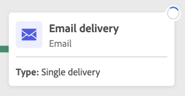
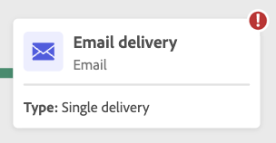

# 启动和监测精心编排的营销活动 {#start-monitor}

>[!CONTEXTUALHELP]
>id="ajo_campaign_publication"
>title="发布精心编排的营销活动"
>abstract="要开始您的营销活动，您必须发布它。 请确保在发布前清除所有错误。"

在创建编排的活动并设计要在画布中执行的任务后，您可以发布该活动并监控其执行方式。 您还可以在测试模式下执行营销活动，以检查其执行情况和不同活动的结果。

## Campaign生命周期概览 {#lifecycle}

编排的营销活动可在定义的状态集中移动。 发布工作流程的关键阶段包括：

| 状态 | 它的含义 |
|---|---|
| **草稿** | 营销活动正在构建和测试 — 尚未激活。 |
| **实时** | 营销活动已发布并正在执行。 |
| **已关闭** | 循环营销活动对新条目关闭，但活动用户档案会一直继续，直到所有活动完成。 |
| **已完成** | 活动执行已完成。 |

>[!NOTE]
>
>有关每个阶段的所有状态（包括已计划、已停止、已存档）和可用操作，请参阅[了解促销活动状态](../campaigns/manage-campaigns.md#statuses)。

## 发布前测试营销活动 {#test}

[!DNL Journey Optimizer]允许您在启动之前测试编排的营销活动。 创建营销策划后，其默认处于&#x200B;**草稿**&#x200B;状态。 在此状态下，您可以手动执行营销活动以测试流量。

>[!IMPORTANT]
>
>除&#x200B;**[!UICONTROL 保存受众]**&#x200B;活动和渠道活动外，画布中的所有活动都会执行。 这不会对您的数据或受众产生任何功能上的影响。

要测试编排的营销活动，请打开该营销活动并选择&#x200B;**[!UICONTROL 开始]**。 营销活动中的每个活动都按顺序执行，直到到达画布结尾为止。

活动画布工具栏中的{zoomable="yes"}

对于&#x200B;**触发的编排活动**，系统会等待API调用启动该活动。 您需要发送信号以继续测试。 [了解如何测试信号触发的营销活动](trigger-orchestrated-campaign.md#complete-and-test)。

在测试期间，您可以使用画布中的操作栏控制活动执行。 从那里，您可以：

* 随时&#x200B;**停止**&#x200B;执行。
* 再次&#x200B;**开始**&#x200B;执行。
* **重新启动**&#x200B;执行以重置工作流并在单个操作中重新运行该工作流。 当您要在进行修改后快速重新测试营销活动流程时，这尤其有用。
* **恢复**&#x200B;先前暂停的执行。

画布工具栏中的&#x200B;**[!UICONTROL 警报]** / **[!UICONTROL 警告]**&#x200B;图标会通知您问题，包括在执行之前可能主动出现的警告以及在执行期间或执行之后发生的错误。

{zoomable="yes"}

您还可以使用直接显示在每个活动上的[可视化状态指示器](#activities)快速识别失败的活动。 有关详细的故障排除信息，请打开[营销活动的日志](#logs-tasks)，其中提供了有关错误及其上下文的深入信息。

如果您在画布中添加了渠道活动，则可以预览和测试消息的内容。 [了解如何使用渠道活动和模拟内容](activities/channels.md#simulate-content-test-profiles)。

>[!TIP]
>
>在单击&#x200B;**[!UICONTROL 发布]**&#x200B;之前，请确认以下事项：
>* 营销活动在测试模式下成功运行，[日志](#logs-tasks)中没有错误。
>* 已使用&#x200B;**[!UICONTROL 模拟内容]**&#x200B;预览消息内容。
>* 如果这是计划的活动，则配置[计划](create-orchestrated-campaign.md#schedule)。
>* 您已查看[发送确认](#confirm-sending)行为 — 对于非循环营销活动，在您明确批准发布后的发送之前，不会发送任何消息。

## 发布营销活动 {#publish}

营销活动测试完成并准备就绪后，单击&#x200B;**[!UICONTROL 发布]**&#x200B;即可使其上线。

营销活动画布中的{zoomable="yes"}

>[!NOTE]
>
>如果&#x200B;**[!UICONTROL Publish]**&#x200B;按钮已禁用（灰显），请从操作栏访问日志并检查错误消息。 必须修复所有错误，然后才能发布营销活动。

可视化流程会重新启动，真实轮廓开始实时进入历程流转。

如果发布操作失败（例如，由于缺少消息内容），您将收到警报，必须在重试之前修复问题。 成功发布后，营销活动即开始执行（立即或按计划），从&#x200B;**草稿**&#x200B;状态移动到&#x200B;**实时**&#x200B;状态，并变为“只读”。

>[!IMPORTANT]
>
>对于非循环活动，消息投放会在发布后暂停，直到您从渠道活动的属性窗格中明确确认发送为止。 营销活动将显示为&#x200B;**实时**，但在确认之前不会发送任何消息。 [了解详情](#confirm-sending)

### 发布时间执行序列 {#publication-sequence}

单击&#x200B;**[!UICONTROL 发布]**&#x200B;后，将在内部出现以下顺序：

1. **计划程序激活** — 如果活动配置了[计划](create-orchestrated-campaign.md#schedule)，则计划程序将在定义的时间启动并触发执行。
1. **保存受众活动首先运行** — 工作流中的任何[保存受众](activities/save-audience.md)活动在消息活动之前执行。 在[受众门户](../audience/about-audiences.md#browse)中创建受众shell，并开始摄取符合条件的配置文件。
1. **消息执行开始** — [渠道活动](activities/channels.md)开始处理工作流中的第一个消息活动。
1. **配置文件快照查找** — 配置文件数据是针对发布时拍摄的快照解析的，而不是针对实时配置文件解析的。 这可确保整个执行过程的一致性。
1. **同意评估** — 对于匹配的用户档案，将直接从用户档案记录授予同意。 在发送时不会重新评估同意。 [了解有关同意管理的更多信息](../action/consent.md)
1. **动态配置文件创建** — 在执行期间动态创建与现有记录不匹配的配置文件。
1. **投放日志创建** — 投放事件记录在[`ajo_message_feedback_event`](../data/datasets-query-examples.md#message-feedback-event-dataset)数据集中，该数据集是投放日志和发送后验证的主要来源。

要在执行后验证结果，请使用Journey Optimizer报表功能。 [了解更多有关协调营销活动报告的信息](reporting-campaigns.md)

## 将营销活动恢复为草稿 {#back-to-draft}

**[!UICONTROL 返回草稿]**&#x200B;功能允许您取消发布并还原编排的活动以在特定情况下草稿状态。 这是作为一种恢复机制，用于在发送任何消息之前修复问题，同时保持Campaign生命周期的完整性。

此选项在以下两种情况下可用：

* **等待执行的计划营销活动**：如果计划在特定时间执行营销活动，但尚未达到该时间，则可以使用返回到草稿以在开始执行之前查看和修改营销活动。 但是，如果营销活动是定期的（例如每日计划的营销活动），并且已发生至少一次执行，则该选项不再可用。 在这种情况下，您应该[改为复制营销活动](../campaigns/manage-campaigns.md#duplicate-a-campaign)。

* **存在执行错误的实时营销活动**：如果营销活动在执行期间遇到错误并暂停，但尚未完成任何营销活动执行，则可以使用返回草稿修复错误并重新发布营销活动。

要将营销活动切换回草稿状态，请打开编排好的营销活动，然后单击营销活动画布工具栏中的&#x200B;**[!UICONTROL 返回草稿]**&#x200B;按钮。

将取消发布营销活动，并停止工作流。 营销活动返回到&#x200B;**草稿**&#x200B;状态。 您现在可以修复识别的问题，然后[测试营销活动](#test)并在准备就绪后重新[发布它](#publish)。

## 确认消息发送 {#confirm-sending}

默认情况下，对于非循环编排的活动，消息投放会暂停，直到您明确批准发送为止。 发布营销活动后，从渠道活动的属性窗格中确认发送请求。 在确认之前，渠道活动将保持挂起状态，并且不会发送消息。

发布之前，您可以从渠道活动属性窗格中禁用发送确认功能。 有关详细信息，请参阅[确认消息发送](activities/channels.md#confirm-message-sending)。

## 监控营销活动执行情况 {#monitor}

### 可视化流程监控 {#flow}

在运行时（在测试或实时模式下），可视流量会显示用户档案如何实时在历程中移动。 此时会显示在任务之间过渡的轮廓数。

{zoomable="yes"}

通过过渡在活动之间传递的数据将暂存于临时工作表中。 可以为每个过渡显示此数据。 要检查在活动之间传递的数据，请执行以下操作：

1. 选择过渡。
1. 在属性窗格中，单击&#x200B;**[!UICONTROL 预览架构]**&#x200B;以查看工作表架构。 选择&#x200B;**[!UICONTROL 预览结果]**&#x200B;以查看传输的数据。

   {zoomable="yes"}

您现在可以检查在活动之间传递的数据，以验证营销活动流，并确认每个活动都在处理预期的用户档案。

### 活动执行指示器 {#activities}

可视化状态指示器可帮助您了解每个活动的执行情况：

| 可视化指示器 | 描述 |
|-----|------------|
| {zoomable="yes"}{width="70%"} | 当前正在执行活动。 |
| {zoomable="yes"}{width="70%"} | 该活动需要您注意。 这可能涉及确认发送投放或执行必要操作。 |
| {zoomable="yes"}{width="70%"} | 活动遇到错误。 要解决此问题，请打开编排的活动日志以了解更多信息。 |
| {zoomable="yes"}{width="70%"} | 已成功执行活动。 |

### 日志和任务 {#logs-tasks}

>[!CONTEXTUALHELP]
>id="ajo_campaign_logs"
>title="日志和任务"
>abstract="**日志和任务**&#x200B;屏幕提供编排的营销活动执行历史记录，记录所有用户操作和遇到的错误。"

监测日志和任务是分析编排的营销活动并确保其正常运行的关键步骤。 可从画布工具栏的测试模式和实时模式下的&#x200B;**[!UICONTROL 日志]**&#x200B;按钮访问日志和任务。

营销活动画布工具栏中的{zoomable="yes"}

**[!UICONTROL 日志和任务]**&#x200B;屏幕提供营销活动执行的完整历史记录，记录了所有用户操作和遇到的错误。

{zoomable="yes"}

有两种类型的信息可用：

* **[!UICONTROL 日志]**&#x200B;选项卡包含按时间顺序记录的所有操作和错误的历史记录。
* **[!UICONTROL 任务]**&#x200B;选项卡详细列出了活动的逐步执行顺序。

在这两个选项卡中，您可以选择显示的列及其顺序，应用过滤器，并使用搜索字段快速查找所需信息。

## 后续步骤 {#next}

开始编排的活动画布后，您可以使用Journey Optimizer报表功能获得见解，例如了解受众行为并衡量客户历程中每个步骤的表现。 [了解更多有关协调营销活动报告的信息](../orchestrated/reporting-campaigns.md)

是否有关于编排营销活动的问题？ 请查看[编排的营销活动常见问题解答](orchestrated-campaigns-faq.md)，以获取从业者最常见问题的解答。
