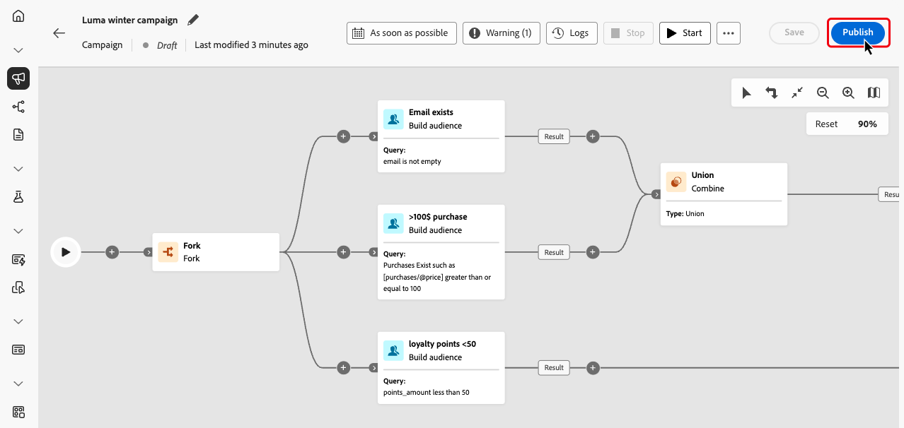

# 启动和监测精心策划的营销活动 {#start-monitor}

>[!CONTEXTUALHELP]
>id="ajo_campaign_publication"
>title="发布精心策划的营销活动"
>abstract="要开始您的营销活动，您必须发布它。请确保在发布前清除所有错误。"

+++ 目录

| 欢迎使用编排的营销活动 | 启动第一个精心策划的营销活动 | 查询数据库 | 精心策划的营销活动 |
|---|---|---|---|
| [开始使用编排的营销活动](gs-orchestrated-campaigns.md)  创建和管理关系架构和数据集：  <ul><li>[手动架构](manual-schema.md)</li><li>[文件上载架构](file-upload-schema.md)</li><li>[摄取数据](ingest-data.md)</li></ul>  [访问和管理编排的营销活动](access-manage-orchestrated-campaigns.md)  [创建编排的营销活动的关键步骤](gs-campaign-creation.md) | [创建和计划营销活动](create-orchestrated-campaign.md)  [编排活动](orchestrate-activities.md)  <b>[启动并监视营销活动](start-monitor-campaigns.md)</b>  [报告](reporting-campaigns.md) | [使用规则生成器](orchestrated-rule-builder.md)  [生成您的第一个查询](build-query.md)  [编辑表达式](edit-expressions.md)  [重新定位](retarget.md) | [开始使用活动](activities/about-activities.md)  活动： [并加入](activities/and-join.md) - [生成受众](activities/build-audience.md) - [更改维度](activities/change-dimension.md) - [渠道活动](activities/channels.md) - [组合](activities/combine.md) - [重复数据删除](activities/deduplication.md) - [扩充](activities/enrichment.md) - [分支](activities/fork.md) - [协调](activities/reconciliation.md) - [保存受众](activities/save-audience.md) - [拆分](activities/split.md) - [等待](activities/wait.md) |

{style="table-layout:fixed"}

+++

 

>[!BEGINSHADEBOX]

此页面上的内容不是最终内容，可能会发生变化。

>[!ENDSHADEBOX]

创建经过编排的任务并设计好要在画布中执行的任务后，您就可以发布它并监控其执行方式。

您还可以在测试模式下执行营销活动，以检查其执行和不同活动的结果。

## 发布前测试活动 {#test}

[!DNL Journey Optimizer]允许您在启动之前测试编排的营销活动。 创建营销策划后，其默认处于&#x200B;**草稿**&#x200B;状态。 在此状态下，您可以手动执行营销活动以测试流量。

除&#x200B;**[!UICONTROL 保存受众]**&#x200B;活动和渠道活动外，画布中的所有活动都会执行。 不会对您的数据或受众产生功能影响。

要测试活动，请执行以下操作：

1. 打开编排的营销活动。
2. 单击&#x200B;**[!UICONTROL 开始]**。

{zoomable="yes"}

营销活动中的每个活动都按顺序执行，直到到达图表末尾。

在测试期间，您可以使用画布中的操作栏控制活动执行。 从那里，您可以：

* 随时停止&#x200B;**执行**。
* **再次开始**&#x200B;执行。
* **恢复**&#x200B;执行（如果先前由于问题而暂停）。

如果在执行过程中出现错误或警告，您会通过画布工具栏中的&#x200B;**[!UICONTROL 警报]** / **[!UICONTROL 警告]**&#x200B;图标收到通知。

{zoomable="yes"}

您还可以使用直接显示在每个活动上的[可视状态指示器](#activities)快速识别失败的活动。 有关详细的疑难解答，请打开[营销活动的日志](#logs-tasks)，其中提供了有关错误及其上下文的深入信息。

验证后，即可发布营销活动。

## 发布营销活动 {#publish}

测试营销活动并准备就绪后，单击&#x200B;**[!UICONTROL 发布]**&#x200B;以使其上线。

{zoomable="yes"}

>[!NOTE]
>
>如果&#x200B;**[!UICONTROL Publish]**&#x200B;按钮已禁用（灰显），请从操作栏访问日志并检查错误消息。 必须修复所有错误，然后才能发布营销活动。

视觉流量重新启动，并且真实配置文件开始实时流过历程。

如果发布操作失败（例如，由于缺少消息内容），您将收到警报，必须在重试之前修复问题。 成功发布后，营销活动将开始执行（立即或按计划），从&#x200B;**草稿**&#x200B;状态移动到&#x200B;**实时**&#x200B;状态，并变为“只读”。

## 监测活动执行 {#monitor}

### 可视流量监控 {#flow}

在运行时（在测试或实时模式下），可视流量会显示用户档案如何实时在历程中移动。 此时会显示任务之间转换的配置文件数。

{zoomable="yes"}

通过过渡从一个活动传输到另一个活动的数据存储在临时工作表中。 可以为每个过渡显示此数据。 要检查在活动之间传递的数据，请执行以下操作：

1. 选择过渡。
1. 在属性窗格中，单击&#x200B;**[!UICONTROL 预览架构]**&#x200B;以查看工作表架构。 选择&#x200B;**[!UICONTROL 预览结果]**&#x200B;以查看传输的数据。

{zoomable="yes"}

### 活动执行指示器 {#activities}

视觉状态指示器可帮助您了解每个活动的执行情况：

| 视觉指示器 | 描述 |
|-----|------------|
| {zoomable="yes"}{width="70%"} | 当前正在执行活动。 |
| {zoomable="yes"}{width="70%"} | 该活动需要您注意。 这可能涉及确认发送投放或采取必要操作。 |
| {zoomable="yes"}{width="70%"} | 活动遇到错误。 要解决此问题，请打开编排的活动日志以了解更多信息。 |
| {zoomable="yes"}{width="70%"} | 已成功执行活动。 |

### 日志和任务 {#logs-tasks}

>[!CONTEXTUALHELP]
>id="ajo_campaign_logs"
>title="日志和任务"
>abstract="**日志和任务**&#x200B;屏幕提供了执行编排的营销活动的历史记录，记录了所有用户操作和遇到的错误。"

监测日志和任务是分析编排的营销活动并确保其正常运行的关键步骤。 日志和任务可从&#x200B;**[!UICONTROL 日志]**&#x200B;按钮访问，该按钮在画布工具栏或每个活动的属性窗格中的测试和实时模式下均可用。

**[!UICONTROL 日志和任务]**&#x200B;屏幕提供了活动执行的完整历史记录，记录了所有用户操作和遇到的错误。

{zoomable="yes"}

提供了两种类型的信息：

* **[!UICONTROL 日志]**&#x200B;选项卡包含所有操作和错误的时间顺序历史记录。
* **[!UICONTROL 任务]**&#x200B;选项卡详细列出了活动的逐步执行顺序。

在这两个选项卡中，您可以选择显示的列及其顺序，应用过滤器，并使用搜索字段快速查找所需信息。
